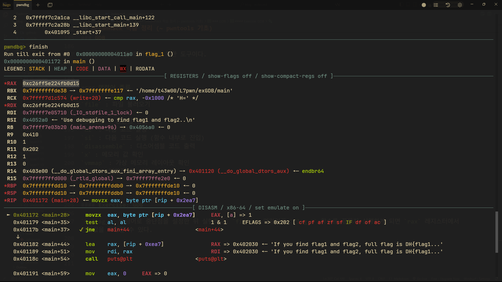
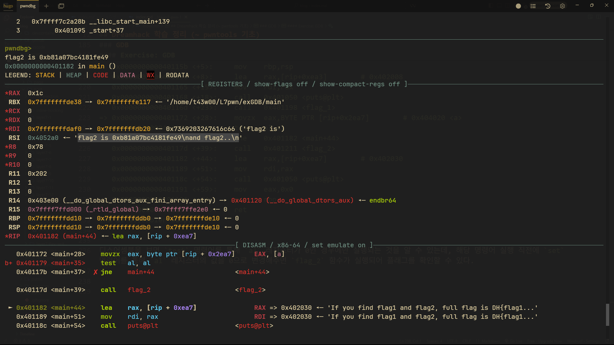

## Dreamhack 학습 정리 (~ pwntools 기초)

---

### 컴퓨터 아키텍처

컴퓨터 아키텍처는 컴퓨터에 관한 설계를 뜻한다.  

컴퓨터 아키텍처는 명령어적 설계인 명령어 집합구조(Instruction Set Architecture)와 하드웨어적 설계인 마이크로 아키텍처(Micro Architecture)로 나뉜다.  

특히 CPU가 컴퓨터의 동작에 핵심적인 역할을 하기 때문에, 명령어 집합구조를 알 필요가 있다.  

---

### 폰 노이만 구조

근대의 컴퓨터는 폰 노이만 구조에 기반을 둔다.  

폰 노이만 구조는 **연산**, **제어**, **저장**의 세 가지 핵심 기능이 필요로 한다.

근대의 컴퓨터는 CPU가 **연산**과 **제어**를, 메모리가 **저장**을 담당한다.  

또한 버스(Bus)라는 전자 통로가 추가적으로 존재하는데, 장치간 데이터나 제어 신호를 교환하기 위해 사용한다.

---

### 명령어 집합 구조

명령어 집합 구조는 크게 **CISC**와 **RISC** 두 가지로 나눈다.

- `CISC` : 70년대에 메모리 효율성에 맞춰 개발된 명령어 집합 구조이다. 예로는 x86-64가 이를 사용한다.
- `RISC` : 80년대에 CISC 구조의 단점을 개선하여 나온 명령어 집합 구조이며, 명령어 길이가 짧고 고정된 길이의 명령어만 사용한다. 예로는 ARM과 MIPS가 이를 사용한다.

아직 x86-64 아키텍처를 PC에서 가장 보편적으로 사용하기 때문에 이를 깊게 공부할 필요가 있다.

x86-64의 이름을 봐도 알 수 있듯이 32비트와 64비트를 모두 호환하여 지원하는 아키텍처인데, 여기서 말하는 n비트는 cpu가 한번에 처리할 수 있는 데이터의 크기를 말한다.

또한 WORD라는 표현은 16비트를 말하는데, WORD 또한 CPU로 한 번에 처리할 수 있는 데이터의 크기를 이르는 말이었지만, 16비트를 사용할 때 쓰던 WORD가 굳어져 쓰이게 되었다.

---

### x86-64: 레지스터

---

#### 범용 레지스터

주로 데이터 연산을 위해 사용하는 레지스터이다.  

특정 레지스터의 경우 주로 사용하는 용도가 있다.

- `rax` : 함수의 반환값
- `rcx` : 반복문 카운터
- `rsi` : 데이터 원본 포인터
- `rdi` : 데이터 목적지 포인터
- `rsp` : 스택 포인터
- `rbp` : 스택 베이스 포인터

---

#### 세그먼트 레지스터

메모리를 세그먼트 단위로 접근할 때 사용하는 특수한 레지스터이다.  

- `CS` : 실행할 코드의 시작 주소 저장
- `DS` : 데이터 영역의 시작 주소 저장
- `SS` : 스택 영역의 시작 주소 저장
- `ES`, `FS`, `GS` : 범용적인 용도로 사용

---

#### 명령어 포인터 레지스터

명령어 포인터 레지스터는 CPU가 어느 부분의 코드를 실행할지 가리키는 역할을 한다.  

x64 아키텍처에서의 명령어 포인터 레지스터는 `rip`이다.

---

#### 플래그 레지스터

플래그 레지스터는 CPU가 연산을 수행한 후 결과의 상태를 저장하는 레지스터이다.  

대표적으로는 ZF, CF, SF, OF 등이 있다.

- `ZF` : 연산 결과가 0인 경우 설정
- `CF` : 올림수가 있는 경우 설정
- `SF` : 연산 결과가 음수인 경우 설정
- `OF` : 오버플로우 발생 시 설정

---

### 메모리 레이아웃

리눅스에서 프로세스의 메모리는 크게 5가지 세그먼트로 구분한다.  

코드, 데이터, BSS, 힙, 스택이 있다.  

--- 

#### 코드 세그먼트 (R - X)

실행 가능한 기계어 코드가 위치하는 영역이다. 가장 낮은 주소에 위치한다.  

쓰기 권한이 주어지지 않는 이유는 취약점을 통해 악의적인 공격이 가능하기 때문이다.

---

#### 데이터 세그먼트 (R W - / R - -)

컴파일 시점에서 값이 정해진 전역 변수 및 전역 상수들이 위치하는 영역이다.  

데이터 세그먼트의 경우에는 쓰기 가능한 영역과 불가능한 영역으로 다시 나뉜다.  

rodata 영역은 쓰기 불가능한 읽기 전용 영역이다.

---

#### BSS 세그먼트 (R W -)

컴파일 시점에 값이 정해지지 않은 전역 변수가 위치하는 영역이다.  

초기화되지 않은 값은 프로그램이 시작될 때 0으로 초기화된다.

---

#### 스택 세그먼트 (R W -)

프로세스의 스택이 위치하는 영역이다.  

함수의 매개변수나 지역 변수와 같은 임시 변수들이 이곳에 저장된다.  

---

#### 힙 세그먼트 (R - X)

동적으로 할당받는 메모리가 위치하는 영역이다.  

힙 세그먼트는 스택 세그먼트와 반대 방향으로 자란다. (낮은 주소에서 높은 주소로)

---

### 어셈블리어

어셈블리어는 기계어와 1대1 대응되는 저수준 언어이다.  

기계어를 보다 쉽게 이해하고 분석하기 위해 사용한다.   

---

#### 문법 구조

어셈블리어의 기본 문법 구조는 명령어(Opcode)와 피연산자(Operand)로 구성된다.

예를 들어, `mov rax, 0x30`에서 명령어는 `mov`이고, 피연산자는 `rax`와 `0x30`이다.

---

#### 명령어 종류

어셈블리어에는 매우 많은 명령어가 존재하지만 자주 사용되는 것은 저절로 알게 된다.  

- 데이터 이동 : `mov`, `lea`
- 산술 연산 : `inc`, `dec`, `add`, `sub`
- 논리 연산 : `and`, `or`, `xor`, `not`
- 비교 : `cmp`, `test`
- 분기 : `jmp`, `je`, `jg`
- 스택 : `pop`, `push`
- 프로시저 : `call`, `ret`, `leave`
- 시스템 콜 : `syscall`

---

### GDB

GDB는 바이너리를 디버깅하기 위한 도구이다.  

---

#### 명령어 종류

`file` : 파일 불러오기
`run` : 실행
`break` : 중단점 설정
`ni` : 다음 코드 실행
`si` : 다음 코드 실행 (함수 내부로 진입)
`disassemble` : 디스어셈블 코드 출력
`x` : 메모리 값 확인
`vmmap` : 가상 메모리 레이아웃 확인
`set` : 메모리 값 설정

---

#### Exercise: GDB

`b flag_1` 명령어로 중단점을 설정한 뒤 실행하고, `finish` 명령어로 `flag_1` 함수를 끝까지 실행하게 되면 `rax` 레지스터에서 반환값을 확인할 수 있다.



<br>

```plaintext
pwndbg> disassemble 
Dump of assembler code for function main:
   0x0000000000401156 <+0>:     endbr64
   0x000000000040115a <+4>:     push   rbp
   0x000000000040115b <+5>:     mov    rbp,rsp
   0x000000000040115e <+8>:     lea    rax,[rip+0xea3]        # 0x402008
   0x0000000000401165 <+15>:    mov    rdi,rax
   0x0000000000401168 <+18>:    call   0x401050 <puts@plt>
   0x000000000040116d <+23>:    call   0x401198 <flag_1>
=> 0x0000000000401172 <+28>:    movzx  eax,BYTE PTR [rip+0x2ea7]        # 0x404020 <a>
   0x0000000000401179 <+35>:    test   al,al
   0x000000000040117b <+37>:    jne    0x401182 <main+44>
   0x000000000040117d <+39>:    call   0x401211 <flag_2>
   0x0000000000401182 <+44>:    lea    rax,[rip+0xea7]        # 0x402030
   0x0000000000401189 <+51>:    mov    rdi,rax
   0x000000000040118c <+54>:    call   0x401050 <puts@plt>
   0x0000000000401191 <+59>:    mov    eax,0x0
   0x0000000000401196 <+64>:    pop    rbp
   0x0000000000401197 <+65>:    ret
End of assembler dump.
```

디스어셈블을 보면 `test` 명령어를 통해 `al` 레지스터가 0인 경우에만 실행되는 것을 알 수 있는데, 해당 명령어 실행 직전에 `set $al = 0` 명령어를 통해 `al` 레지스터의 값을 0으로 변경해주면 `flag_2` 함수가 실행되어 플래그를 확인할 수 있다.  



---

### pwntools

pwntools는 pwnable 분야의 CTF 문제를 푸는 데 도움을 주는 프레임워크이다.  

파이썬에서 사용할 수 있다.

--- 

#### 함수 종류

- `process()` : 로컬 바이너리 연결
- `remote()` : 원격 서버 연결
- `send()` : 데이터 송신
- `recv()` : 데이터 수신
- `close()` : 연결 종료

이 외에도 다양한 함수가 존재한다.

--- 

#### addition-quiz

파이썬으로 주어진 문제를 파싱하여 더한 값을 전송하는 코드를 작성하였다.  

```python
from pwn import * 

# io = process('./chall')
io = remote('host8.dreamhack.games', 15434)

for i in range(50):
    q = io.recvline().decode()
    x, y = q.split('+')
    y = y[:-3]
    a = int(x) + int(y)
    io.sendline(str(a))

io.interactive()
```

---

#### flag-shop

파이썬으로 flag에 해당하는 번호를 전송하도록 코드를 작성하였다.

```python
from pwn import *

io = remote("host8.dreamhack.games", 16567)

for i in range(50):
    items = []
    cnt = 0
    for i in range(10):
        io.recvuntil(b". ")
        items.append(io.recvline().decode().strip())

    for i in range(len(fruit)):
        if items[i] == "flag":
            break
        num +=1

    io.recvuntil(b"> ")
    io.sendline(str(num).encode())

io.interactive()
```