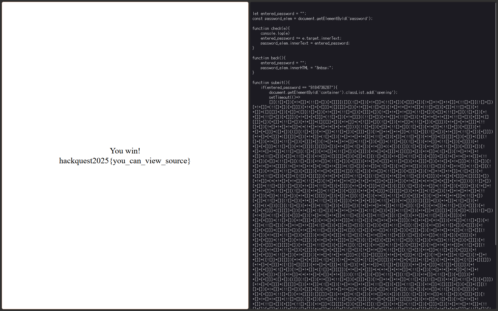

## 웹 심화 문제

### Open the door


패스워드를 입력받고 맞는 패스워드인지 검증하는 웹 사이트로 보인다.

<br>
<br>


개발자 도구를 열어 html 코드를 보면 `ljsdgoiqyokn.js`라는 이름의 자바스크립트 파일을 불러오는 것을 알 수 있다.

<br>
<br>


해당 파일을 확인해보면 조건문을 통해 입력된 패스워드가 `9184736287`인지 비교하여 검증하는 것을 알 수 있다.

<br>
<br>



패스워드를 입력하면 플래그를 획득할 수 있다. 소스 코드를 볼 수 있는지 확인하는 문제였던 것 같다.

<br>
<br>

### Image Downloader


URL 필터를 우회하여 서버 내의 flag 파일을 다운로드 해야하는 문제이다.

비슷한 공격 기법들을 찾아보니, 이러한 공격을 SSRF라고 하는 듯하다.

<br>
<br>


먼저 서버 내의 파일에 접근하려면 서버가 실행되는 `localhost`의 정해진 포트에 접속해야 한다고 생각했고, 이는 소스 코드에서 `127.0.0.1:3000`이 테스트 서버라는 정보를 알 수 있었다.

<br>
<br>


`SSRF bypass`를 찾아보니 URL의 로컬 호스트는 `127.1`로 간단히 우회할 수 있었다.

<br>

하지만 `/flag`는 금지된 경로라고 한다.

<br>
<br>


이후에도 다양한 방법을 시도해보았지만 에러가 났고, 인터넷에서 `CTF SSRF write-up`이라고 검색을 해보았더니 `,`를 사용한 우회를 확인할 수 있었다.

<br>
<br>


다운로드에 성공하였다.

<br>
<br>


이미지를 새 탭으로 열면 파일을 다운로드 받을 수 있고, 플래그를 확인할 수 있다.

<br>

---

<br>

## 리버싱 심화 문제

### blackbox


문제 파일을 `IDA`로 열어 디컴파일 해보니 `sbox` 배열에서 입력값의 `i`번째 인덱스에 위치한 값을 `s1` 배열로 저장하고, 이를 `answer`에 위치한 `32byte`와 비교하는 것을 확인할 수 있다.

<br>
<br>

따라서 `sbox[i] == answer[j] (i : 0~255, j : 0~31)`일 때 `i`가 플래그의 `j`번째 인덱스의 값이 된다.

<br>

Python으로 전체 플래그를 구하는 코드를 작성하였다.

```py
answer = [
    0x45, 0xEF, 0xFB, 0x7F, 0xA3, 0x9D, 0x4D, 0x8F, 0x92, 0x23, 0x04, 0x23, 0x96, 0x21, 0x8F, 0xAA, 
    0xA8, 0xBC, 0xCF, 0x33, 0x40, 0xA8, 0x3C, 0xCF, 0xEF, 0x4D, 0x8F, 0xCF, 0x58, 0xCF, 0x58, 0xFF
]

sbox = [
    0x63, 0x7C, 0x77, 0x7B, 0xF2, 0x6B, 0x6F, 0xC5, 0x30, 0x01, 0x67, 0x2B, 0xFE, 0xD7, 0xAB, 0x76, 
    0xCA, 0x82, 0xC9, 0x7D, 0xFA, 0x59, 0x47, 0xF0, 0xAD, 0xD4, 0xA2, 0xAF, 0x9C, 0xA4, 0x72, 0xC0, 
    0xB7, 0xFD, 0x93, 0x26, 0x36, 0x3F, 0xF7, 0xCC, 0x34, 0xA5, 0xE5, 0xF1, 0x71, 0xD8, 0x31, 0x15, 
    0x04, 0xC7, 0x23, 0xC3, 0x18, 0x96, 0x05, 0x9A, 0x07, 0x12, 0x80, 0xE2, 0xEB, 0x27, 0xB2, 0x75, 
    0x09, 0x83, 0x2C, 0x1A, 0x1B, 0x6E, 0x5A, 0xA0, 0x52, 0x3B, 0xD6, 0xB3, 0x29, 0xE3, 0x2F, 0x84, 
    0x53, 0xD1, 0x00, 0xED, 0x20, 0xFC, 0xB1, 0x5B, 0x6A, 0xCB, 0xBE, 0x39, 0x4A, 0x4C, 0x58, 0xCF, 
    0xD0, 0xEF, 0xAA, 0xFB, 0x43, 0x4D, 0x33, 0x85, 0x45, 0xF9, 0x02, 0x7F, 0x50, 0x3C, 0x9F, 0xA8, 
    0x51, 0xA3, 0x40, 0x8F, 0x92, 0x9D, 0x38, 0xF5, 0xBC, 0xB6, 0xDA, 0x21, 0x10, 0xFF, 0xF3, 0xD2, 
    0xCD, 0x0C, 0x13, 0xEC, 0x5F, 0x97, 0x44, 0x17, 0xC4, 0xA7, 0x7E, 0x3D, 0x64, 0x5D, 0x19, 0x73, 
    0x60, 0x81, 0x4F, 0xDC, 0x22, 0x2A, 0x90, 0x88, 0x46, 0xEE, 0xB8, 0x14, 0xDE, 0x5E, 0x0B, 0xDB, 
    0xE0, 0x32, 0x3A, 0x0A, 0x49, 0x06, 0x24, 0x5C, 0xC2, 0xD3, 0xAC, 0x62, 0x91, 0x95, 0xE4, 0x79, 
    0xE7, 0xC8, 0x37, 0x6D, 0x8D, 0xD5, 0x4E, 0xA9, 0x6C, 0x56, 0xF4, 0xEA, 0x65, 0x7A, 0xAE, 0x08, 
    0xBA, 0x78, 0x25, 0x2E, 0x1C, 0xA6, 0xB4, 0xC6, 0xE8, 0xDD, 0x74, 0x1F, 0x4B, 0xBD, 0x8B, 0x8A, 
    0x70, 0x3E, 0xB5, 0x66, 0x48, 0x03, 0xF6, 0x0E, 0x61, 0x35, 0x57, 0xB9, 0x86, 0xC1, 0x1D, 0x9E, 
    0xE1, 0xF8, 0x98, 0x11, 0x69, 0xD9, 0x8E, 0x94, 0x9B, 0x1E, 0x87, 0xE9, 0xCE, 0x55, 0x28, 0xDF, 
    0x8C, 0xA1, 0x89, 0x0D, 0xBF, 0xE6, 0x42, 0x68, 0x41, 0x99, 0x2D, 0x0F, 0xB0, 0x54, 0xBB, 0x16
]

flag = [0] * 32

for i in range(256):
    for j in range(32):
        if sbox[i] == answer[j]:
            flag[j] = i

for i in range(32):
    print(chr(flag[i]), end='')
```

<br>

```
t43w00/Downloads/rev-blackbox.711375bad41e6b3ca6cda0c4d0beccb0 via 🐍 v3.12.3 took 7s
❯ python3 solve.py
hackquest2025{sbox_from_aes_^_^}
```

---

## 암호학 심화 문제

## CTR

```py
from Crypto.Cipher import AES
import os

key = os.urandom(16)
nonce = os.urandom(12)

cipher = AES.new(key, AES.MODE_CTR, nonce=nonce)
print(cipher.encrypt(b"Lorem ipsum dolor sit amet, consectetur adipiscing elit, sed do eiusmod tempor incididunt ut labore et dolore magna aliqua.").hex())

cipher = AES.new(key, AES.MODE_CTR, nonce=nonce)
print(cipher.encrypt(open("flag.txt", 'rb').read()).hex())
```

코드를 보면 AES의 CTR(카운터 방식) 모드로 두 평문을 **같은 nonce**로 암호화 하는 것을 확인할 수 있다.

<br>
<br>


CTR 모드를 보면 `Nonce`와 `Counter`를 `AES` 암호화를 통해 키스트림을 생성하고, 이를 평문과 `XOR` 연산하여 암호문을 만든다.

<br>

따라서 하나의 평문과 암호문이 있다면, 같은 Nonce를 사용한 암호문을 아래와 같은 방법으로 복호화할 수 있다.

```
암호문1 = 평문1 ⊕ 키스트림
암호문2 = 평문2 ⊕ 키스트림

 ↓  ↓  ↓  ↓  ↓  ↓  ↓  ↓ 

키스트림 = 암호문1 ⊕ 평문1
평문2 = 암호문2 ⊕ 키스트림
```

<br>
<br>

Python으로 위 방법으로 암호화된 플래그를 복호화하는 코드를 작성하였다.

```
Cipher1 = "481b616b48d74a997a8a5d3be871de64a6bf91cf0d8b7fa795643b61803ca66858604e4eef13ffb99fef62a871599b85154d531f822029a2f5c9822c08df719312dc3d838e816173e386d185427ff39a7c2f0da7f7519e047bd5df9257af9e8305d431453e2ed042771d261f07fb16a1c6bfa9c86238979dc7656b"
Cipher2 = "471b7d695796579c659e4472e370c12af4d98ec71e913ea291737c309636bb6f0f33081ee008e2f79dee54b16b75969916481608b13c2eebb1e5d7264bde63"

Cipher1 = bytes.fromhex(Cipher1)
Cipher2 = bytes.fromhex(Cipher2)

Plain1 = b"Lorem ipsum dolor sit amet, consectetur adipiscing elit, sed do eiusmod tempor incididunt ut labore et dolore magna aliqua."

keystream = bytes(a ^ b for a, b in zip(Cipher1, Plain1))

flag = bytes(a ^ b for a, b in zip(Cipher2, keystream))

print(flag.decode())
```

<br>

```
t43w00/Downloads/crypto-ctr.0fb3a839fadcbd2ff7091d60291d7d1e via 🐍 v3.12.3
❯ python3 decrypt.py
Congratulations! Flag: hackquest2025{nonce_is_number_used_0nce}
```

<br>

---

<br>

## 인상 깊은 내용

리버스 엔지니어링은 평소에 간단한 역연산 문제들을 풀어본 경험이 있기 때문에 순조롭게 진행할 수 있었지만, 포너블의 경우에는 처음 공부하는 분야였기에 굉장히 흥미롭게 느껴졌던 것 같다.

<br>

### ROP

ROP(Return-oriented programming)는 정말 처음 공부했을 땐 '어떻게 이런 공격 방법을 생각해낼 수 있지?' 하는 생각이 들 정도로 참신한 공격이었다.

어셈블리어 코드에서 `pop rdi; ret`과 같은 코드 조각들을 모아 이를 `jmp` 명령어처럼 이용하는 것이 너무 인상적이었다.

또한 단일로 쓰이지 않고 BOF를 비롯한 다양한 공격과 연계되어 쓰여서 문제 풀이에 자주 사용되어 기억에 남았다.

<br>

### Bypass ASLR (연계된 문제)

이 문제를 풀기 전까지는 그냥 주어진 주소를 가지고 ROP를 통해 익스플로잇하면 되기 때문에 순조롭게 풀이할 수 있었다.

하지만 이 문제는 다르게 ASLR이 활성화되어 있어서 주소를 오프셋을 통해 동적으로 구해야했다.

처음에는 그냥 빈 배열에 있는 값들을 출력해주는 걸 보고 '잘못 출제된 문제인가?' 싶었지만, 주소의 형식으로 출력된 것을 보고 하나하나 `gdb`로 확인해보니 전 함수에서 쓰인 함수의 주소가 스택에 남아있어, 해당 함수의 주소가 출력된 것을 알 수 있었고, 이를 통해 libc base 주소를 구할 수 있었다.

이 문제를 통해 느낀 점은, 포너블은 바이너리가 의도한 사항이 아니더라도, 어떻게든 악용할 수 있는 정보들을 모아 익스플로잇을 해야한다는 것이었다. 내가 평소에 풀던 리버싱 역연산 문제들은 바이너리를 보고 주어진 정보들을 계산만 하면 그만이었지만, 포너블의 경우에는 작은 가능성도 놓치지 않고 다양한 시도를 해야하는 것 같다. 그만큼 숨겨진 취약점을 찾는 과정이 재미있고,  성공했을 때의 성취감이 더 높은 것 같다는 생각이 들었다.

