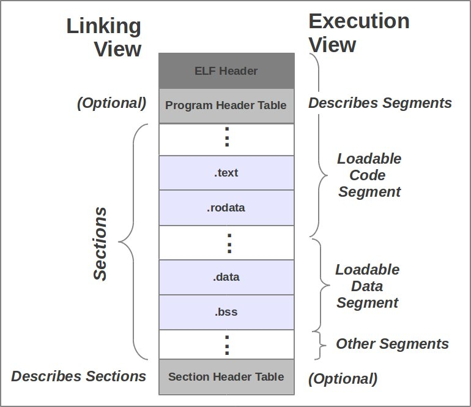
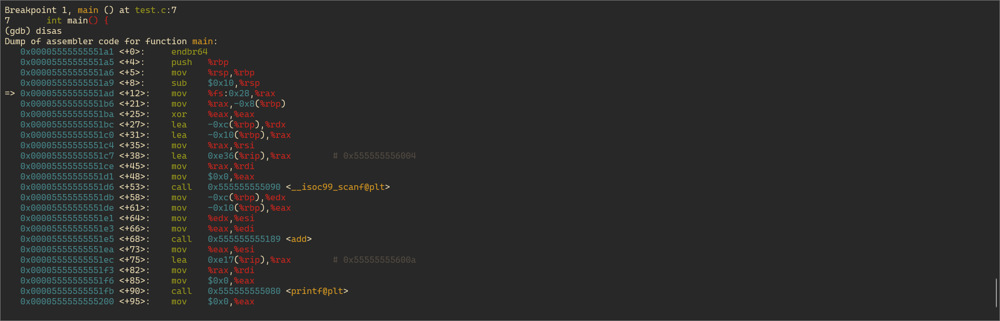
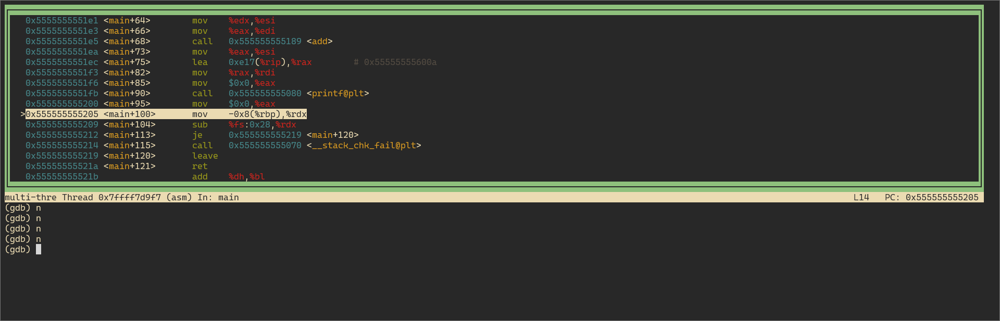

## 수업 내용 정리

### gdb란?

Gnu DeBugger의 약자로, 프로그램을 런타임에서 디버깅하는 도구다.

다양한 유닉스 기반 시스템에서 동작하며 `C`, `C++`, `Java`, `Go`, `Rust` 등 다양한 언어를 지원한다.

### gdb 명령어

#### 시작과 종료

- gdb [프로그램명] : 프로그램 시작
- quit, q : GDB 종료 

#### 소스 보기

- list : main 함수를 기점으로 소스 출력
- list [라인 번호] : 특정 라인을 기준으로 출력
- list [함수명] : 함수의 소스를 출력
- list - : 출력된 행의 이전 행을 출력
- list [파일명]:[함수명] : 파일의 특정 함수 소스를 출력
- layout asm : 어셈블리 코드를 보여주는 창 추가

#### 브레이크 포인트 설정:

- break [함수명] : 특정 함수 시작 부분에 브레이크 포인트 설정
- break [라인 번호] : 특정 라인에 브레이크 포인트 설정
- info break : 설정된 브레이크 포인트 확인
- delete [브레이크 포인트 번호] : 브레이크 포인트 삭제
- disable/enable [브레이크 포인트 번호] : 브레이크 포인트 활성화/비활성화 

#### 프로그램 실행:

- run, r : 프로그램 실행
- continue, c : 브레이크 포인트에서 실행을 다시 시작
- step : 한 라인씩 실행
- next : 한 라인씩 실행 (함수 호출 시에는 함수 안으로 들어가지 않고, 다음 라인으로 넘어감)
- finish : 현재 함수를 완료할 때까지 실행
- return [값] : 함수를 강제로 종료하고 값을 반환
- advance [라인 번호] : 특정 라인까지 프로그램 실행
- advance [파일:라인 번호] : 특정 파일의 특정 라인까지 프로그램 실행 

#### 변수 확인

- print [변수명] : 변수 값 출력
- info variables : 모든 변수 출력
- watch [변수명] : 변수가 변경될 때 브레이크 포인트 설정 

#### 메모리 확인

- x/n [형식] [주소] : 특정 메모리 주소의 내용을 특정 형식으로 출력
- info address [변수명] : 변수의 메모리 주소 확인
- info stack : 스택 상태 확인 
- info frame : 현재 함수의 프레임 정보를 출력 

<br>

### ELF 파일 구조

`ELF` 파일은 유닉스 계열 운영체제에서 사용되는 표준 바이너리 파일 포맷이다.

<br>



`ELF` 파일은 위와 같이 크게 `ELF Header`, `Program Header Table`, `Section Header Table`로 구성된다.

<br>

#### ELF Header

ELF 파일의 시작 부분에 위치하며, 파일의 구조 및 속성을 정의한다.

```
ELF Header:
  Magic:   7f 45 4c 46 02 01 01 00 00 00 00 00 00 00 00 00
  Class:                             ELF64
  Data:                              2's complement, little endian
  Version:                           1 (current)
  OS/ABI:                            UNIX - System V
  ABI Version:                       0
  Type:                              DYN (Position-Independent Executable file)
  Machine:                           Advanced Micro Devices X86-64
  Version:                           0x1
  Entry point address:               0x10c0
  Start of program headers:          64 (bytes into file)
  Start of section headers:          14616 (bytes into file)
  Flags:                             0x0
  Size of this header:               64 (bytes)
  Size of program headers:           56 (bytes)
  Number of program headers:         13
  Size of section headers:           64 (bytes)
  Number of section headers:         31
  Section header string table index: 30
```

파일의 종류를 나타내는 매직넘버와 데이터 저장 방식, OS, 아키텍처, 헤더의 크기 등 파일에 관한 정보들이 담겨있다.

<br>

#### Program Header Table

실행에 필요한 정보를 담고 있으며, 커널이 ELF 파일을 실행할 때 이 정보를 참고해서 메모리에 어떻게 적재할지를 결정한다.

```
Program Headers:
  Type           Offset             VirtAddr           PhysAddr
                 FileSiz            MemSiz              Flags  Align
  PHDR           0x0000000000000040 0x0000000000000040 0x0000000000000040
                 0x00000000000002d8 0x00000000000002d8  R      0x8
  INTERP         0x0000000000000318 0x0000000000000318 0x0000000000000318
                 0x000000000000001c 0x000000000000001c  R      0x1
      [Requesting program interpreter: /lib64/ld-linux-x86-64.so.2]
  LOAD           0x0000000000000000 0x0000000000000000 0x0000000000000000
                 0x0000000000000888 0x0000000000000888  R      0x1000
  LOAD           0x0000000000001000 0x0000000000001000 0x0000000000001000
                 0x00000000000002e9 0x00000000000002e9  R E    0x1000
  LOAD           0x0000000000002000 0x0000000000002000 0x0000000000002000
                 0x00000000000000ec 0x00000000000000ec  R      0x1000
  LOAD           0x0000000000002d88 0x0000000000003d88 0x0000000000003d88
                 0x0000000000000288 0x00000000000004f8  RW     0x1000
  DYNAMIC        0x0000000000002d98 0x0000000000003d98 0x0000000000003d98
                 0x0000000000000200 0x0000000000000200  RW     0x8
  NOTE           0x0000000000000338 0x0000000000000338 0x0000000000000338
                 0x0000000000000030 0x0000000000000030  R      0x8
  NOTE           0x0000000000000368 0x0000000000000368 0x0000000000000368
                 0x0000000000000044 0x0000000000000044  R      0x4
  GNU_PROPERTY   0x0000000000000338 0x0000000000000338 0x0000000000000338
                 0x0000000000000030 0x0000000000000030  R      0x8
  GNU_EH_FRAME   0x0000000000002008 0x0000000000002008 0x0000000000002008
                 0x0000000000000034 0x0000000000000034  R      0x4
  GNU_STACK      0x0000000000000000 0x0000000000000000 0x0000000000000000
                 0x0000000000000000 0x0000000000000000  RW     0x10
  GNU_RELRO      0x0000000000002d88 0x0000000000003d88 0x0000000000003d88
                 0x0000000000000278 0x0000000000000278  R      0x1

 Section to Segment mapping:
  Segment Sections...
   00
   01     .interp
   02     .interp .note.gnu.property .note.gnu.build-id .note.ABI-tag .gnu.hash .dynsym .dynstr .gnu.version .gnu.version_r .rela.dyn .rela.plt
   03     .init .plt .plt.got .plt.sec .text .fini
   04     .rodata .eh_frame_hdr .eh_frame
   05     .init_array .fini_array .dynamic .got .data .bss
   06     .dynamic
   07     .note.gnu.property
   08     .note.gnu.build-id .note.ABI-tag
   09     .note.gnu.property
   10     .eh_frame_hdr
   11
   12     .init_array .fini_array .dynamic .got
```

<br>

구조체에는 아래와 같은 필드들이 저장되어 있다.

```
struct Elf64_Phdr {
    Elf64_Word p_type;   
    Elf64_Word p_flags;  
    Elf64_Off p_offset;  
    Elf64_Addr p_vaddr;  
    Elf64_Addr p_paddr;  
    Elf64_Xword p_filesz;
    Elf64_Xword p_memsz; 
    Elf64_Xword p_align; 
};
```

- p_type   : 세그먼트의 타입 (ex. PT_LOAD, PT_DYNAMIC 등)
- p_flags  : 세그먼트 접근 권한 (읽기, 쓰기, 실행)
- p_offset : 파일 내 세그먼트 시작 오프셋
- p_vaddr  : 메모리에 로드될 가상 주소
- p_paddr  : 물리 주소 (대부분 시스템에선 무시됨)
- p_filesz : 파일에 존재하는 세그먼트 크기
- p_memsz  : 메모리에 할당될 세그먼트 크기
- p_align  : 정렬 조건 (페이지 단위 정렬 등)

<br>

#### Section Header Table

`.text`, `.data`와 같은 섹션들에 관한 정보들이 저장된다. 

```
Section Headers:
  [Nr] Name              Type             Address           Offset
       Size              EntSize          Flags  Link  Info  Align
  [ 0]                   NULL             0000000000000000  00000000
       0000000000000000  0000000000000000           0     0     0
  [ 1] .interp           PROGBITS         0000000000000318  00000318
       000000000000001c  0000000000000000   A       0     0     1
  [ 2] .note.gnu.pr[...] NOTE             0000000000000338  00000338
       0000000000000030  0000000000000000   A       0     0     8
  [ 3] .note.gnu.bu[...] NOTE             0000000000000368  00000368
       0000000000000024  0000000000000000   A       0     0     4
  [ 4] .note.ABI-tag     NOTE             000000000000038c  0000038c
       0000000000000020  0000000000000000   A       0     0     4
  [ 5] .gnu.hash         GNU_HASH         00000000000003b0  000003b0
       0000000000000030  0000000000000000   A       6     0     8
  [ 6] .dynsym           DYNSYM           00000000000003e0  000003e0
       0000000000000150  0000000000000018   A       7     1     8
  [ 7] .dynstr           STRTAB           0000000000000530  00000530
       000000000000015e  0000000000000000   A       0     0     1
  [ 8] .gnu.version      VERSYM           000000000000068e  0000068e
       000000000000001c  0000000000000002   A       6     0     2
  [ 9] .gnu.version_r    VERNEED          00000000000006b0  000006b0
       0000000000000070  0000000000000000   A       7     2     8
  [10] .rela.dyn         RELA             0000000000000720  00000720
       0000000000000108  0000000000000018   A       6     0     8
  [11] .rela.plt         RELA             0000000000000828  00000828
       0000000000000060  0000000000000018  AI       6    24     8
  [12] .init             PROGBITS         0000000000001000  00001000
       000000000000001b  0000000000000000  AX       0     0     4
  [13] .plt              PROGBITS         0000000000001020  00001020
       0000000000000050  0000000000000010  AX       0     0     16
  [14] .plt.got          PROGBITS         0000000000001070  00001070
       0000000000000010  0000000000000010  AX       0     0     16
  [15] .plt.sec          PROGBITS         0000000000001080  00001080
       0000000000000040  0000000000000010  AX       0     0     16
  [16] .text             PROGBITS         00000000000010c0  000010c0
       000000000000021c  0000000000000000  AX       0     0     16
  [17] .fini             PROGBITS         00000000000012dc  000012dc
       000000000000000d  0000000000000000  AX       0     0     4
  [18] .rodata           PROGBITS         0000000000002000  00002000
       0000000000000007  0000000000000000   A       0     0     4
  [19] .eh_frame_hdr     PROGBITS         0000000000002008  00002008
       0000000000000034  0000000000000000   A       0     0     4
  [20] .eh_frame         PROGBITS         0000000000002040  00002040
       00000000000000ac  0000000000000000   A       0     0     8
  [21] .init_array       INIT_ARRAY       0000000000003d88  00002d88
       0000000000000008  0000000000000008  WA       0     0     8
  [22] .fini_array       FINI_ARRAY       0000000000003d90  00002d90
       0000000000000008  0000000000000008  WA       0     0     8
  [23] .dynamic          DYNAMIC          0000000000003d98  00002d98
       0000000000000200  0000000000000010  WA       7     0     8
  [24] .got              PROGBITS         0000000000003f98  00002f98
       0000000000000068  0000000000000008  WA       0     0     8
  [25] .data             PROGBITS         0000000000004000  00003000
       0000000000000010  0000000000000000  WA       0     0     8
  [26] .bss              NOBITS           0000000000004040  00003010
       0000000000000240  0000000000000000  WA       0     0     64
  [27] .comment          PROGBITS         0000000000000000  00003010
       000000000000002b  0000000000000001  MS       0     0     1
  [28] .symtab           SYMTAB           0000000000000000  00003040
       0000000000000450  0000000000000018          29    21     8
  [29] .strtab           STRTAB           0000000000000000  00003490
       0000000000000367  0000000000000000           0     0     1
  [30] .shstrtab         STRTAB           0000000000000000  000037f7
       000000000000011a  0000000000000000           0     0     1
Key to Flags:
  W (write), A (alloc), X (execute), M (merge), S (strings), I (info),
  L (link order), O (extra OS processing required), G (group), T (TLS),
  C (compressed), x (unknown), o (OS specific), E (exclude),
  D (mbind), l (large), p (processor specific)
  ```

<br>

각 구조체에는 아래와 같은 필드들이 저장되어 있다.

```
typedef struct {
  Elf64_Word	sh_name;        
  Elf64_Word	sh_type;        
  Elf64_Xword	sh_flags;       
  Elf64_Addr	sh_addr;        
  Elf64_Off	sh_offset;      
  Elf64_Xword	sh_size;        
  Elf64_Word	sh_link;        
  Elf64_Word	sh_info;        
  Elf64_Xword	sh_addralign;   
  Elf64_Xword	sh_entsize;     
} Elf64_Shdr;
```

- sh_name      : 섹션 이름 (문자열 테이블의 인덱스)
- sh_type      : 섹션 타입 (ex. SHT_PROGBITS, SHT_SYMTAB 등)
- sh_flags     : 섹션 속성 (읽기/쓰기/실행 등)
- sh_addr      : 실행 시 메모리에서의 가상 주소
- sh_offset    : 파일 내 섹션 시작 오프셋
- sh_size      : 섹션 크기 (바이트 단위)
- sh_link      : 관련된 다른 섹션의 인덱스
- sh_info      : 섹션에 대한 부가 정보
- sh_addralign : 섹션 정렬 조건
- sh_entsize   : 항목 크기 (테이블 형식일 경우)

<br>

---

<br>

## 실습용 코드 작성 후 명령어 실습 후 정리

#### 실습용 코드

두 정수 값을 입력받고, 두 정수를 더하는 함수를 통해 더한 값을 출력하는 코드를 작성하였다.

```c
#include <stdio.h>

int add(int a, int b) {
    return a + b;
}

int main() {
    int x, y;

    scanf("%d %d", &x, &y);
    printf("%d", add(x, y));

    return 0;
}
```

<br>

#### 명령어 실습


`gcc test.c -o test -g` 명령어로 컴파일한 뒤 `gdb ./test` 명령어로 gdb를 실행하였다.

<br>


`list` 명령어를 통해 심볼이 남아있는 것을 확인할 수 있다.  
`b main` 명령어로 main 함수에 브레이크 포인트를 설정하였다.

<br>



`disas` 명령어로 어셈블리어 코드를 확인할 수 있다.

<br>



`layout asm` 명령어로 어셈블리어 코드 창을 띄워 코드를 실행하면서 확인할 수도 있다.

<br>


`n` 명령어로 한 줄씩 실행해볼 수 있다. `x`, `y`에 각각 3과 7을 입력한 뒤, add 함수에 브레이크 포인트를 설정하여 함수 안으로 진입해보았다.

<br>


`info stack`과 `info frame` 명령어로 함수가 호출된 것을 확인할 수 있고, 매개변수들과 지역변수의 정보들을 확인할 수 있다.

<br>


`print` 명령어로 변수의 주소를 확인하고 이를 `x/w [주소]` 명령어를 통해 메모리 상에 위치한 값을 직접 확인할 수 있다.

<br>


스택 프레임의 포인터인 `rbp`를 통해서도 매개변수가 위치한 메모리를 확인할 수 있다.

<br>


`return 0` 명령어를 통해 add 함수를 강제로 0으로 반환해보았다. 원래라면 10(3 + 7)이 출력되어야 하지만 0이 출력되는 것을 확인할 수 있다.