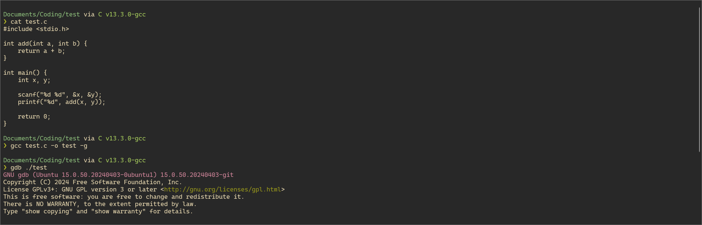
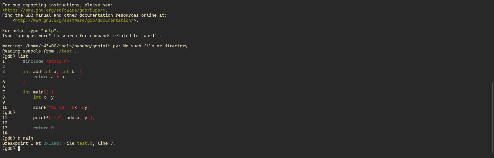
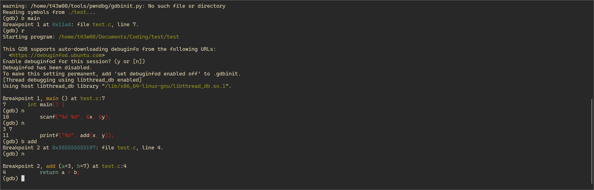
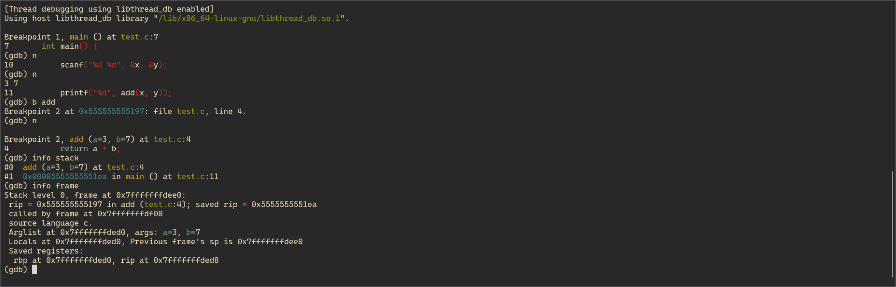
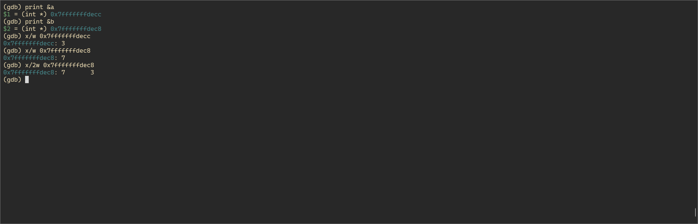
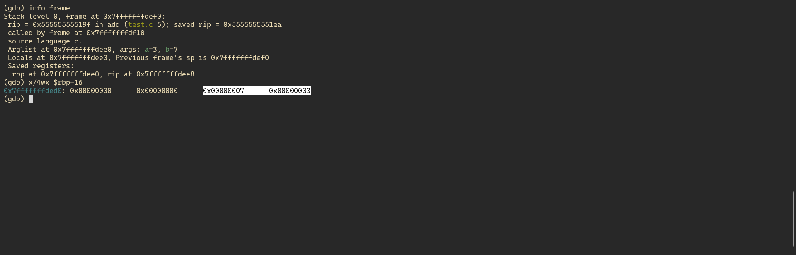
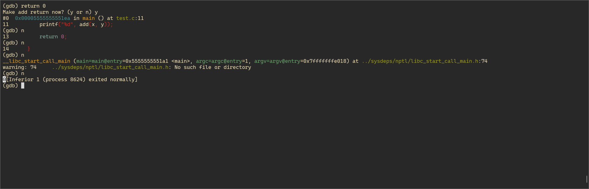

## 수업 내용 정리

### gdb란?

Gnu DeBugger의 약자로, 프로그램을 런타임에서 디버깅하는 도구다.

다양한 유닉스 기반 시스템에서 동작하며 `C`, `C++`, `Java`, `Go`, `Rust` 등 다양한 언어를 지원한다.

### gdb 명령어

#### 시작과 종료

- gdb [프로그램명] : 프로그램 시작
- quit, q : GDB 종료 

#### 소스 보기

- list : main 함수를 기점으로 소스 출력
- list [라인 번호] : 특정 라인을 기준으로 출력
- list [함수명] : 함수의 소스를 출력
- list - : 출력된 행의 이전 행을 출력
- list [파일명]:[함수명] : 파일의 특정 함수 소스를 출력
- layout asm : 어셈블리 코드를 보여주는 창 추가

#### 브레이크 포인트 설정:

- break [함수명] : 특정 함수 시작 부분에 브레이크 포인트 설정
- break [라인 번호] : 특정 라인에 브레이크 포인트 설정
- info break : 설정된 브레이크 포인트 확인
- delete [브레이크 포인트 번호] : 브레이크 포인트 삭제
- disable/enable [브레이크 포인트 번호] : 브레이크 포인트 활성화/비활성화 

#### 프로그램 실행:

- run, r : 프로그램 실행
- continue, c : 브레이크 포인트에서 실행을 다시 시작
- step : 한 라인씩 실행
- next : 한 라인씩 실행 (함수 호출 시에는 함수 안으로 들어가지 않고, 다음 라인으로 넘어감)
- finish : 현재 함수를 완료할 때까지 실행
- return [값] : 함수를 강제로 종료하고 값을 반환
- advance [라인 번호] : 특정 라인까지 프로그램 실행
- advance [파일:라인 번호] : 특정 파일의 특정 라인까지 프로그램 실행 

#### 변수 확인

- print [변수명] : 변수 값 출력
- info variables : 모든 변수 출력
- watch [변수명] : 변수가 변경될 때 브레이크 포인트 설정 

#### 메모리 확인

- x/n [형식] [주소] : 특정 메모리 주소의 내용을 특정 형식으로 출력
- info address [변수명] : 변수의 메모리 주소 확인
- info stack : 스택 상태 확인 
- info frame : 현재 함수의 프레임 정보를 출력 

<br>

---

<br>

## 실습용 코드 작성 후 명령어 실습 후 정리

#### 실습용 코드

두 정수 값을 입력받고, 두 정수를 더하는 함수를 통해 더한 값을 출력하는 코드를 작성하였다.

```c
#include <stdio.h>

int add(int a, int b) {
    return a + b;
}

int main() {
    int x, y;

    scanf("%d %d", &x, &y);
    printf("%d", add(x, y));

    return 0;
}
```

<br>

#### 명령어 실습



`gcc test.c -o test -g` 명령어로 컴파일한 뒤 `gdb ./test` 명령어로 gdb를 실행하였다.

<br>



`list` 명령어를 통해 심볼이 남아있는 것을 확인할 수 있다.  
`b main` 명령어로 main 함수에 브레이크 포인트를 설정하였다.

<br>



`n` 명령어로 한 줄씩 실행해볼 수 있다. `x`, `y`에 각각 3과 7을 입력한 뒤, add 함수에 브레이크 포인트를 설정하여 함수 안으로 진입해보았다.

<br>



`info stack`과 `info frame` 명령어로 함수가 호출된 것을 확인할 수 있고, 매개변수들과 지역변수의 정보들을 확인할 수 있다.

<br>



`print` 명령어로 변수의 주소를 확인하고 이를 `x/w [주소]` 명령어를 통해 메모리 상에 위치한 값을 직접 확인할 수 있다.

<br>



스택 프레임의 포인터인 `rbp`를 통해서도 매개변수가 위치한 메모리를 확인할 수 있다.

<br>



`return 0` 명령어를 통해 add 함수를 강제로 0으로 반환해보았다. 원래라면 10(3 + 7)이 출력되어야 하지만 0이 출력되는 것을 확인할 수 있다.