## GDB Handray 실습 정리

### 실습 예제 코드 1

```c
#include <stdio.h>

int divide(int a, int b) {

  if (b == 0) return -1;

  return a / b;
}

int main() {

  int x = 12;
  int y = 0;
  int z = divide(x, y);

  printf("Result: %d\n", z);

  return 0;
}
```

<br>

### 풀이 정리

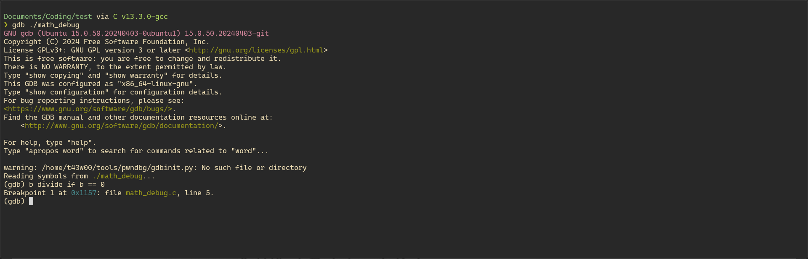

`gdb`를 실행하고 `b divide if b == 0` 명령어를 통해 `divide` 함수에서 나누는 값이 `0`일 때 중단하도록 설정하였다.

<br>

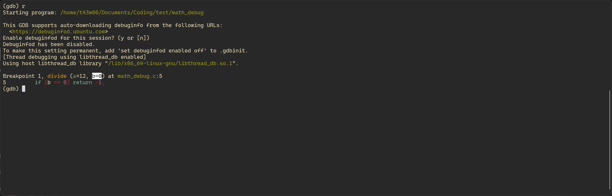

실행을 해보니 `divide` 함수의 나누는 값인 두 번째 인자인 `b`가 `0`이므로 중단된 것을 확인할 수 있다.

<br>

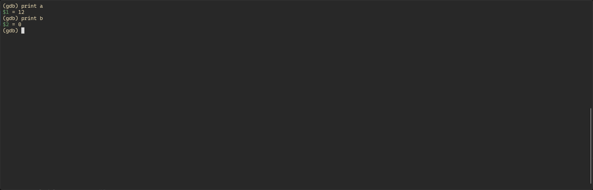

`print` 명령어로 인자인 `a`와 `b`의 값을 확인할 수 있다.

<br>

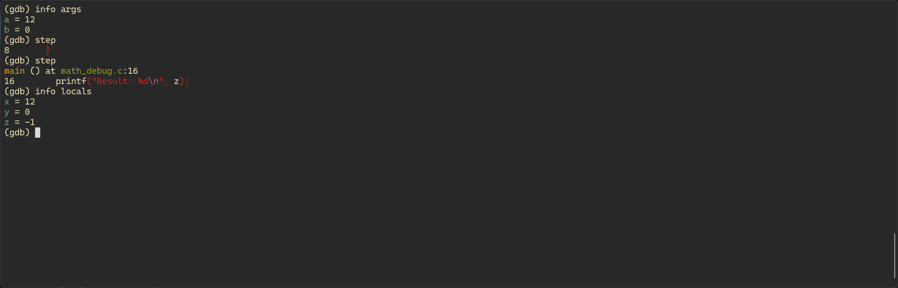

`info args` 명령어로 `divide` 함수의 인자 값을 확인할 수 있고, `step` 명령어로 함수를 빠져나와 `info locals` 명령어로 `divide` 함수의 반환값이 저장된 `z` 변수를 비롯한 지역 변수들을 확인할 수 있다.

<br>

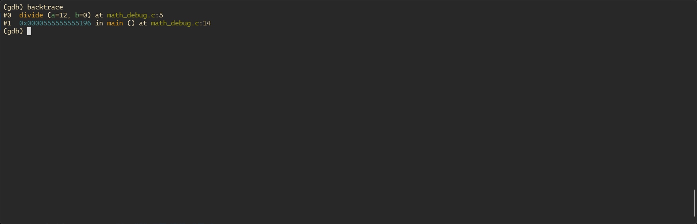

`backtrace` 명령어로 스택에 쌓인 호출된 함수를 확인할 수 있다.

<br>

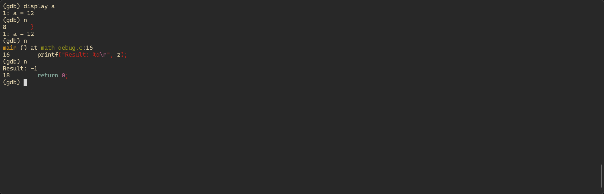

`display a` 명령어로 매 실행마다 변수의 값을 출력하도록 설정할 수 있다.

<br>

### 실습 예제 코드 2

```c
#include <stdio.h>

void print_message(const char *msg) {
  printf("%s\n", msg);
}

void call_wrapper() {
  print_message("tracing into function");
}

int main() {
  call_wrapper();
  return 0;
}
```

<br>

### 풀이 정리

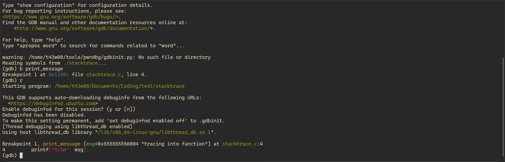

`gdb`를 실행하고 `b print_message` 명령어로 중단점을 설정하고 실행하였다.

<br>

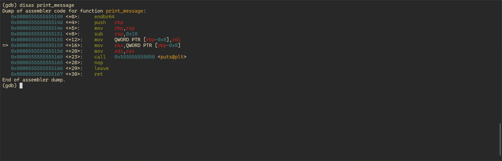

`disas print_message` 명령어로 `print_message` 함수의 어셈블리어 코드를 확인해볼 수 있다.

<br>

```s
   0x0000555555555149 <+0>:     endbr64                         ; ROT 공격 방지
   0x000055555555514d <+4>:     push   rbp                      ; 베이스 포인터 저장
   0x000055555555514e <+5>:     mov    rbp,rsp                  ; 스택 프레임 설정
   0x0000555555555151 <+8>:     sub    rsp,0x10                 ; 스택 16byte 할당
```

함수의 프롤로그다. 베이스 포인터를 저장하고, 새 스택 프레임을 설정해주는 것을 확인할 수 있다. `16byte`의 공간을 할당하는 이유는 인자인 문자열 포인터를 저장하기 위해 `8byte`를 필요로 하는데, 스택 포인터를 `16byte`의 배수인 주소에 위치하여 정렬해야 하기 때문이다.

<br>

```s
   0x0000555555555155 <+12>:    mov    QWORD PTR [rbp-0x8],rdi  ; 인자 스택에 저장 
   0x0000555555555159 <+16>:    mov    rax,QWORD PTR [rbp-0x8]  ; 인자 rax에 복사 
   0x000055555555515d <+20>:    mov    rdi,rax                  ; 인자 rdi에     
   0x0000555555555160 <+23>:    call   0x555555555050 <puts@plt>; put 함수 호출
   0x0000555555555165 <+28>:    nop                             ; 패딩
```

인자를 스택에 저장한 뒤, `rax` 레지스터에 복사하고 다시 `rdi` 레지스터에 복사한다. 그리고 `rdi` 레지스터를 인자로 `puts` 함수를 호출한다. 사실상 위 세 줄은 필요가 없는데, 컴파일 최적화가 되지 않아서 그렇다. `-O2`나 `-O3` 옵션을 사용하면 최적화하여 컴파일할 수 있다. 마지막 패딩은 위에서 설명한 스택 정렬 때문이다.

<br>

```s
   0x0000555555555166 <+29>:    leave                           ; 스택 프레임 정리
   0x0000555555555167 <+30>:    ret                             ; 반환
```

함수의 에필로그다. 함수의 스택 프레임을 정리한 뒤 반환한다.

<br>

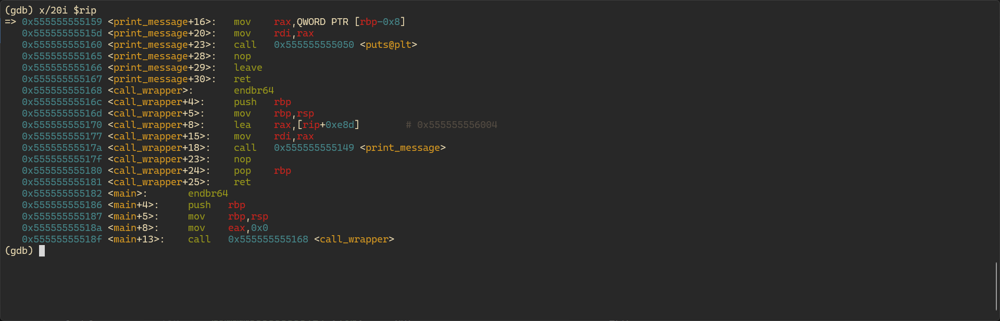
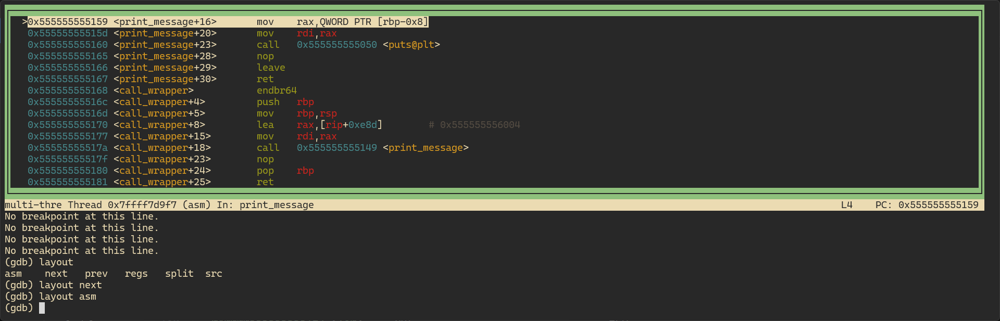

`x/i $rip` 명령어나 `layout` 명령어를 통해 어셈블리어를 실행하며 확인해볼 수 있다.

<br>

---

<br>

## 직접 예제 만들고 실습

<br>

### 예제 코드

```c
#include <stdio.h>

void print(char* str, int n) {
    for (int i = 0; i < n; i++) {
        printf("%s\n", str);
    }
}

int main() {

    int n;

    scanf("%d", &n);

    if (n > 0) print("과제하기귀찮다", n);
    else printf("출력 횟수 음수 불가능");

    return 0;
}
```

<br>

### 실습 정리

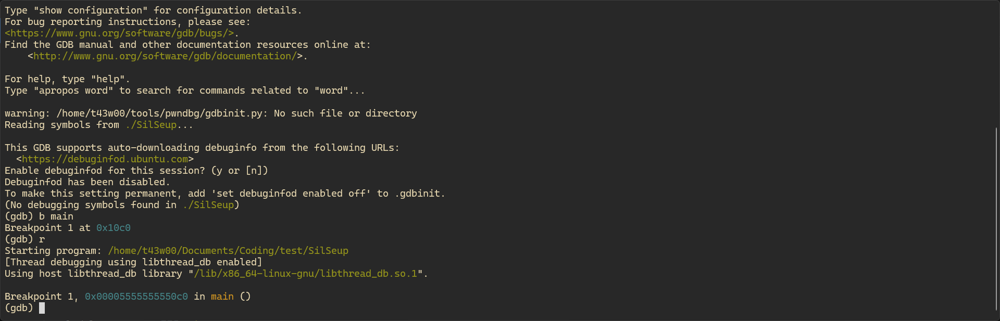

`b main` 명령어로 `main` 함수에 중단점을 설정하고 실행하였다.

<br>

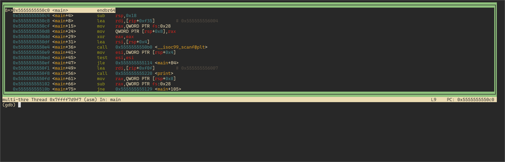

`layout asm` 명령어로 한 줄씩 분석해보았다. (분석하는 모든 과정을 캡쳐하긴 어려워 설명이 중요한 부분만 사진을 삽입하였다.)

<br>

```s
   0x5555555550c0 <main>:       endbr64
   0x5555555550c4 <main+4>:     sub    rsp,0x18
   0x5555555550c8 <main+8>:     lea    rdi,[rip+0xf35]        # 0x555555556004
   0x5555555550cf <main+15>:    mov    rax,QWORD PTR fs:0x28
   0x5555555550d8 <main+24>:    mov    QWORD PTR [rsp+0x8],rax
   0x5555555550dd <main+29>:    xor    eax,eax
```

스택 공간을 할당하고 스택 카나리를 설정한다. 카나리는 BOF 공격으로 스택이 변조되었는지 확인하기 위한 값이다.

세 번째 줄은 `scanf`의 첫 번째 인자인 서식 지정자 `%d` 문자열을 복사하는 코드이다.

<br>

```s
   0x5555555550df <main+31>:    lea    rsi,[rsp+0x4]
   0x5555555550e4 <main+36>:    call   0x5555555550b0 <__isoc99_scanf@plt>
   0x5555555550e9 <main+41>:    mov    esi,DWORD PTR [rsp+0x4]
   0x5555555550ed <main+45>:    test   esi,esi
   0x5555555550ef <main+47>:    jle    0x555555555114 <main+84>
   0x5555555550f1 <main+49>:    lea    rdi,[rip+0xf0f]        # 0x555555556007
   0x5555555550f8 <main+56>:    call   0x555555555220 <print>
```

`[rsp+0x4]`에 숫자를 입력받고, 이 값이 0보다 작으면 `<main+84>`로 분기하고 아니면 `[rip+0xf0f]`값("과제하기귀찮다")을 인자로 `print` 함수를 호출한다.

<br>

```s
   0x555555555220 <print>:      endbr64
   0x555555555224 <print+4>:    test   esi,esi
   0x555555555226 <print+6>:    jle    0x555555555250 <print+48>
   0x555555555228 <print+8>:    push   r12
   0x55555555522a <print+10>:   mov    r12,rdi
   0x55555555522d <print+13>:   push   rbp
   0x55555555522e <print+14>:   mov    ebp,esi
   0x555555555230 <print+16>:   push   rbx
   0x555555555231 <print+17>:   xor    ebx,ebx
   0x555555555233 <print+19>:   nop    DWORD PTR [rax+rax*1+0x0]    ; 정렬용 패딩
   0x555555555238 <print+24>:   mov    rdi,r12
   0x55555555523b <print+27>:   add    ebx,0x1
   0x55555555523e <print+30>:   call   0x555555555080 <puts@plt>
   0x555555555243 <print+35>:   cmp    ebp,ebx
   0x555555555245 <print+37>:   jne    0x555555555238 <print+24>
   0x555555555247 <print+39>:   pop    rbx
   0x555555555248 <print+40>:   pop    rbp
   0x555555555249 <print+41>:   pop    r12
   0x55555555524b <print+43>:   ret
   0x55555555524c <print+44>:   nop    DWORD PTR [rax+0x0]          ; 정렬용 패딩
   0x555555555250 <print+48>:   ret
```

입력받은 `n`이 저장된 `esi` 레지스터의 값이 0이 될 때까지 `puts` 함수를 호출하고 `esi` 레지스터 값을 `ebp` 레지스터에 저장하여 `ebx` 레지스터를 카운터로 사용해 두 레지스터의 값이 같을 때까지 반복하여 호출한다.

<br>

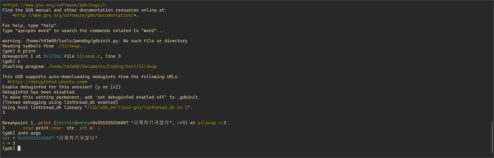

`info args` 명령어로 인자를 확인해보면 잘 불러와진 것을 확인할 수 있다.

<br>

```s
   0x5555555550fd <main+61>:    mov    rax,QWORD PTR [rsp+0x8]
   0x555555555102 <main+66>:    sub    rax,QWORD PTR fs:0x28
   0x55555555510b <main+75>:    jne    0x555555555129 <main+105>
   0x55555555510d <main+77>:    xor    eax,eax
   0x55555555510f <main+79>:    add    rsp,0x18
   0x555555555113 <main+83>:    ret
```

`print` 함수가 반환되면, 스택 카나리를 검사하고 `eax` 레지스터를 `0`으로 초기화하여 종료 코드 `0`으로 반환한다.