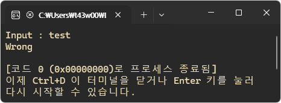
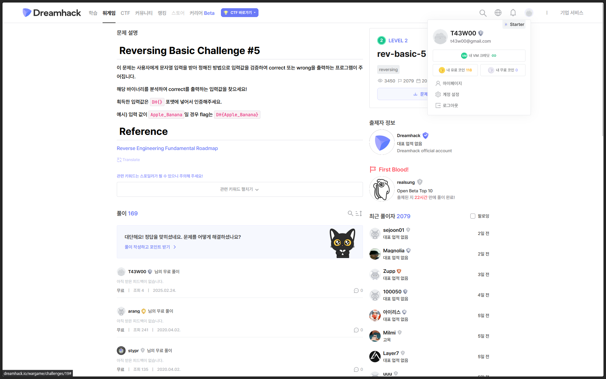
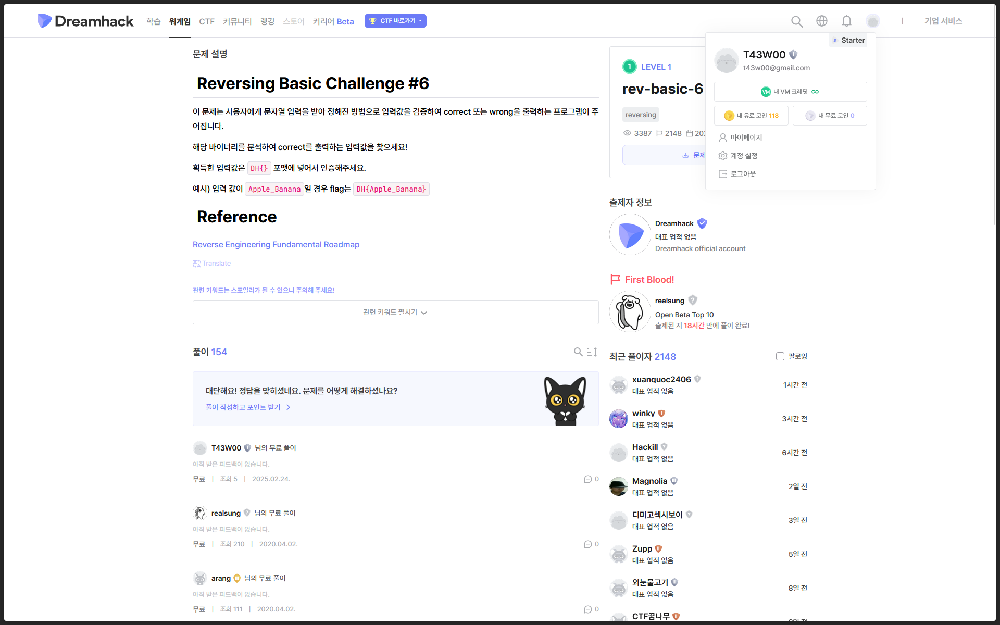

## 수업 내용 정리

### IDA란?

Interactive DisAssembler의 약자로, 기계어를 어셈블리어로 변환해주는 프로그램이다.

디컴파일러가 매우 강력하다. 하지만 그만큼 비싸다.

<br>

#### 주요 탭

##### Function

함수들의 목록을 보여준다. 클릭 시 해당 함수의 주소로 이동할 수 있다.

보라색은 외부 라이브러리의 함수이고, 나머지는 사용자가 정의한 함수이다.


<br>

##### Graph view

어셈블리어 코드의 흐름을 그래프로 보여준다. 분기문이 많은 어셈블리어 코드를 볼 때 매우 효과적이다.


<br>

##### Text view

텍스트로만 되어있는 어셈블리어 코드이다. 주소 순으로 섹션과 코드를 볼 수 있어 원하는 값을 찾기에 편리하다.


<br >

##### Hex view

Text view에서 볼 수 있는 어셈블리어 코드를 Hex(16진수)값으로 볼 수 있다. 값을 복사해오거나 오른쪽 아스키로 변환된 값을 참고할 때 자주 쓰인다.


<br>

#### 주요 단축키 

##### Shift + F12

프로그램 내 문자열들의 정보들을 알려주는 Strings 탭을 열 수 있다.


<br>

##### N

변수나 함수의 이름을 리네임 할 수 있다.


<br>

##### Y

함수의 프로토타입을 수정할 수 있다. 함수나 매개변수의 이름을 바꾸거나 자료형을 바꿀 때 사용된다.


<br>

---

<br>

### Dreamhack rev-basic-1~6

#### rev-basic-1

실행을 해보니 입력을 받고 판별 후 결과를 출력하는 것으로 보인다.



<br>

분석을 위해 IDA로 프로그램을 열어보았다.


<br>

```s
lea     rcx, aInput     ; "Input : "
call    sub_1400013E0
lea     rdx, [rsp+138h+var_118]
lea     rcx, a256s      ; "%256s"
call    sub_140001440
lea     rcx, [rsp+138h+var_118]
call    sub_140001000
test    eax, eax
jz      short loc_1400013B6
```

위 코드를 보면, 사용자에게 `[rsp+138h+var_118]`에 입력을 받고, 이를 인자로 `sub_140001000` 함수를 호출하여 그 값이 `0`인지 아닌지에 따라 분기하는 것을 확인할 수 있다.

<br>

`sub_140001000` 함수를 확인해보았다.


<br>


같은 구조의 여러 코드가 있고, 끝까지 조건에 맞게 분기하면 `1`을 반환하고 아닌 경우에는 `0`을 반환하도록 되어있다.

<br>


첫 블럭부터 네 번째 블럭까지 확인해보니, `n`번째 블럭에서 인자의 `n`번째 인덱스 값을 특정 문자와 비교하여 같은 경우에 분기하는 것을 확인할 수 있다.

<br>

첫 번째 블럭부터 마지막 블럭까지 각각 비교하는 문자를 조합하면 전체 문자열이 나온다.

<br>


<br>

#### rev-basic-2

전 문제와 똑같이 입력값을 검증하는 프로그램이므로 입력값을 검증하는 함수만 분석하도록 하겠다.


<br>

코드를 보면 `[rsp+18h+var_18]`이 `12`가 될 때까지 `rax`를 카운터로 `1`씩 증가시키며 `aC[rax * 4]`와 입력받은 문자열의 인덱스를 비교하여 같은지 비교하는 것을 알 수 있다.

<br>

따라서 `aC` 배열의 4의 배수 인덱스에 해당하는 값을 가져와 조합하면 알맞은 입력값을 알아낼 수 있다.


<br>


<br>

#### rev-basic-3


전 문제와 똑같이 `rax`를 카운터로 사용하고 `18`이 될 때까지 특정 연산 후에 비교하는 것을 확인할 수 있다.

<br>

```s
movsxd  rax, [rsp+18h+var_18]   ; rax = i (카운터로 사용)
lea     rcx, byte_140003000     ; rcx = *bytes
movzx   eax, byte ptr [rcx+rax] ; eax = bytes[i]
movsxd  rcx, [rsp+18h+var_18]   ; rcx = i
mov     rdx, [rsp+18h+arg_0]    ; rdx = input
movzx   ecx, byte ptr [rdx+rcx] ; ecx = input[i]
xor     ecx, [rsp+18h+var_18]   ; ecx = input[i] ^ i
mov     edx, [rsp+18h+var_18]   ; edx = i
lea     ecx, [rcx+rdx*2]        ; ecx = input[i] ^ i + i * 2
cmp     eax, ecx                ; bytes[i] - (input[i] ^ i + i * 2)
jz      short loc_140001051     
```

`bytes[i]`와 `input[i] ^ i + i * 2`를 비교하여 같으면 `inc eax` 후에 계속 반복하고, 다르다면 `0`을 반환시킨다. `[rsp+18h+var_18]`가 `0x18`이 될 때까지 두 값이 같으면 `1`을 반환한다.

따라서 식을 정리하여 `input[i]`의 값을 구하면 될 것 같다.

<br>

`bytes[i] = input[i] ^ i + i * 2` 식을 `input[i]` 항만 남기고 나머지를 이항하면 `input[i] = (bytes[i] - i * 2) ^ i`와 같이 나타낼 수 있다. 따라서 `(bytes[i] - i * 2) ^ i` 값에 `i`를 `0`부터 `0x18`까지 대입하여 출력하면 올바른 입력값이 출력될 것이다.

<br>

C++을 이용해 입력값을 구하는 코드를 작성하였다.

```cpp
#include <bits/stdc++.h>
using namespace std;

int main() {

  unsigned char bytes[0x18] = {
    0x49, 0x60, 0x67, 0x74, 0x63, 0x67, 0x42, 0x66, 0x80, 0x78, 0x69, 0x69, 
    0x7B, 0x99, 0x6D, 0x88, 0x68, 0x94, 0x9F, 0x8D, 0x4D, 0xA5, 0x9D, 0x45
  };

  for (int i = 0; i < 0x18; i++) {
    cout << (bytes[i] - i * 2) ^ i;
  }

  return 0;
}
```

<br>


<br>

#### rev-basic-4


이전 문제들과 같은 구조이기 때문에 값을 비교하는 부분만 분석하도록 하겠다.

<br>

```s
movsxd  rax, [rsp+18h+var_18]   ; rax = i
mov     rcx, [rsp+18h+arg_0]    ; rcx = input
movzx   eax, byte ptr [rcx+rax] ; eax = input[i]
sar     eax, 4                  ; eax = input[i] >> 4
movsxd  rcx, [rsp+18h+var_18]   ; rcx = i
mov     rdx, [rsp+18h+arg_0]    ; rdx = input
movzx   ecx, byte ptr [rdx+rcx] ; ecx = input[i]
shl     ecx, 4                  ; ecx = input[i] << 4
and     ecx, 0F0h               ; ecx = ecx & 0xF0
or      eax, ecx                ; eax = (input[i] >> 4) | (input << 4) 
movsxd  rcx, [rsp+18h+var_18]   ; rcx = i
lea     rdx, unk_140003000      ; rdx = bytes
movzx   ecx, byte ptr [rdx+rcx] ; ecx = bytes[i]
cmp     eax, ecx                ; (input[i] >> 4) | (input[i] << 4) - bytes[i]
jz      short loc_140001063
```

`(input[i] >> 4) | (input[i] << 4)` 식은 `input[i]`의 상위 4비트와 하위 4비트를 서로 바꾸는 연산이다. 따라서 이 값이 `bytes[i]`와 같으니 원래 값인 `input[i]`를 구하려면 `bytes[i]`의 상위 4비트와 하위 4비트 값을 바꿔주면 된다.

<br>

C++을 이용해 입력값을 구하는 코드를 작성하였다.

```cpp
#include <bits/stdc++.h>
using namespace std;

int main() {

  unsigned char bytes[0x1C] = {
    0x24, 0x27, 0x13, 0xC6, 0xC6, 0x13, 0x16, 0xE6, 0x47, 0xF5, 0x26, 0x96, 0x47, 0xF5, 
    0x46, 0x27, 0x13, 0x26, 0x26, 0xC6, 0x56, 0xF5, 0xC3, 0xC3, 0xF5, 0xE3, 0xE3, 0x00
  };

  for (int i = 0; i < 0x1C; i++) {
  cout << (bytes[i] >> 4) | (bytes[i] << 4);
  }

  return 0;
}
```

<br>


<br>

#### rev-basic-5


```s
movsxd  rax, [rsp+18h+var_18]   ; rax = i
mov     rcx, [rsp+18h+arg_0]    ; rcx = input
movzx   eax, byte ptr [rcx+rax] ; eax = input[i]
mov     ecx, [rsp+18h+var_18]   ; ecx = i
inc     ecx                     ; ecx = i + 1
movsxd  rcx, ecx                ; rcx = i + 1
mov     rdx, [rsp+18h+arg_0]    ; rdx = input
movzx   ecx, byte ptr [rdx+rcx] ; ecx = input[i + 1]
add     eax, ecx                ; eax = input[i] + input[i + 1]
movsxd  rcx, [rsp+18h+var_18]   ; rcx = i
lea     rdx, unk_140003000      ; rdx = bytes
movzx   ecx, byte ptr [rdx+rcx] ; ecx = bytes[i]
cmp     eax, ecx                ; (input[i] + input[i + 1]) - bytes[i]
jz      short loc_14000105B
```

`input[i] + input[i + 1]`의 연산 결과가 `bytes[i]`와 같아야 한다. 하지만 `input[i]`를 구하려면 `input[i+1]`을 구해야 해서 단순히 역연산으로 동시에 구하는 것은 불가능하다.

`bytes`에 해당하는 `unk_140003000`의 값을 확인해보면 아래와 같다.

```
AD D8 CB CB 9D 97 CB C4  92 A1 D2 D7 D2 D6 A8 A5
DC C7 AD A3 A1 98 4C 00  
```

여기서 마지막 값이 널 문자인 것을 확인할 수 있는데, 이를 통해 `input` 배열의 마지막 값이 `4C - 0`으로 `4C`인 것을 알 수 있다. 따라서 마지막 값의 바로 전 값도 같은 방식으로 구할 수 있고, 이를 통해 전체 문자열을 거꾸로 한 문자씩 구할 수 있다.

<br>

C++을 이용해 입력값을 구하는 코드를 작성하였다.

```cpp
#include <bits/stdc++.h>
using namespace std;

int main() {

  unsigned char bytes[0x18] = {
    0xAD, 0xD8, 0xCB, 0xCB, 0x9D, 0x97, 0xCB, 0xC4, 0x92, 0xA1, 0xD2, 0xD7, 
    0xD2, 0xD6, 0xA8, 0xA5, 0xDC, 0xC7, 0xAD, 0xA3, 0xA1, 0x98, 0x4C, 0x00
  };

  unsigned char res[0x19] = {0};

  for (int i = 0x17; i > -1; i--) {
    res[i] = bytes[i] - res[i + 1];
  }

  for (int i = 0; i< 0x18; i++) {
    cout << res[i];
  }
 
  return 0;
}
```

<br>



<br>

#### rev-basic-6


```s
movsxd  rax, [rsp+18h+var_18]   ; rax = i
mov     rcx, [rsp+18h+arg_0]    ; rcx = input
movzx   eax, byte ptr [rcx+rax] ; eax = input[i]
lea     rcx, unk_140003020      ; rcx = table
movzx   eax, byte ptr [rcx+rax] ; eax = table[input[i]]
movsxd  rcx, [rsp+18h+var_18]   ; rcx = i
lea     rdx, unk_140003000      ; rdx = bytes
movzx   ecx, byte ptr [rdx+rcx] ; ecx = bytes[i]
cmp     eax, ecx                ; table[input[i]] - bytes[i]
jz      short loc_140001053
```

따라서 `table` 배열에서 `bytes[i]`과 같은 값의 인덱스가 `input[i]`인 것이다.

<br>

C++을 이용해 입력값을 구하는 코드를 작성하였다.

```cpp
#include <bits/stdc++.h>
using namespace std;

int main() {

  unsigned char bytes[0x12] = {
    0x00, 0x4D, 0x51, 0x50, 0xEF, 0xFB, 0xC3, 0xCF, 0x92, 0x45, 0x4D, 0xCF, 0xF5, 0x04, 0x40, 0x50, 
    0x43, 0x63
  };

  unsigned char table[0x100] = {
    0x63, 0x7C, 0x77, 0x7B, 0xF2, 0x6B, 0x6F, 0xC5, 0x30, 0x01, 0x67, 0x2B, 0xFE, 0xD7, 0xAB, 0x76, 
    0xCA, 0x82, 0xC9, 0x7D, 0xFA, 0x59, 0x47, 0xF0, 0xAD, 0xD4, 0xA2, 0xAF, 0x9C, 0xA4, 0x72, 0xC0, 
    0xB7, 0xFD, 0x93, 0x26, 0x36, 0x3F, 0xF7, 0xCC, 0x34, 0xA5, 0xE5, 0xF1, 0x71, 0xD8, 0x31, 0x15, 
    0x04, 0xC7, 0x23, 0xC3, 0x18, 0x96, 0x05, 0x9A, 0x07, 0x12, 0x80, 0xE2, 0xEB, 0x27, 0xB2, 0x75, 
    0x09, 0x83, 0x2C, 0x1A, 0x1B, 0x6E, 0x5A, 0xA0, 0x52, 0x3B, 0xD6, 0xB3, 0x29, 0xE3, 0x2F, 0x84, 
    0x53, 0xD1, 0x00, 0xED, 0x20, 0xFC, 0xB1, 0x5B, 0x6A, 0xCB, 0xBE, 0x39, 0x4A, 0x4C, 0x58, 0xCF, 
    0xD0, 0xEF, 0xAA, 0xFB, 0x43, 0x4D, 0x33, 0x85, 0x45, 0xF9, 0x02, 0x7F, 0x50, 0x3C, 0x9F, 0xA8, 
    0x51, 0xA3, 0x40, 0x8F, 0x92, 0x9D, 0x38, 0xF5, 0xBC, 0xB6, 0xDA, 0x21, 0x10, 0xFF, 0xF3, 0xD2, 
    0xCD, 0x0C, 0x13, 0xEC, 0x5F, 0x97, 0x44, 0x17, 0xC4, 0xA7, 0x7E, 0x3D, 0x64, 0x5D, 0x19, 0x73, 
    0x60, 0x81, 0x4F, 0xDC, 0x22, 0x2A, 0x90, 0x88, 0x46, 0xEE, 0xB8, 0x14, 0xDE, 0x5E, 0x0B, 0xDB, 
    0xE0, 0x32, 0x3A, 0x0A, 0x49, 0x06, 0x24, 0x5C, 0xC2, 0xD3, 0xAC, 0x62, 0x91, 0x95, 0xE4, 0x79, 
    0xE7, 0xC8, 0x37, 0x6D, 0x8D, 0xD5, 0x4E, 0xA9, 0x6C, 0x56, 0xF4, 0xEA, 0x65, 0x7A, 0xAE, 0x08, 
    0xBA, 0x78, 0x25, 0x2E, 0x1C, 0xA6, 0xB4, 0xC6, 0xE8, 0xDD, 0x74, 0x1F, 0x4B, 0xBD, 0x8B, 0x8A, 
    0x70, 0x3E, 0xB5, 0x66, 0x48, 0x03, 0xF6, 0x0E, 0x61, 0x35, 0x57, 0xB9, 0x86, 0xC1, 0x1D, 0x9E, 
    0xE1, 0xF8, 0x98, 0x11, 0x69, 0xD9, 0x8E, 0x94, 0x9B, 0x1E, 0x87, 0xE9, 0xCE, 0x55, 0x28, 0xDF, 
    0x8C, 0xA1, 0x89, 0x0D, 0xBF, 0xE6, 0x42, 0x68, 0x41, 0x99, 0x2D, 0x0F, 0xB0, 0x54, 0xBB, 0x16
  };

  for (int i = 0; i < 0x12; i++) {
    for (int j = 0; j < 0x90; j++) {
      if (bytes[i] == table[j])
        cout << static_cast<char>(j);
    }
  }

  return 0;
}
```

<br>



<br>

---

<br>

### CTFd R5


<br>

#### Custom 1


입력받은 문자열과 `s2` 문자열을 비교하여 같으면 `Correct`를 출력한다. 따라서 `s2` 문자열이 플래그가 되는데, `s2`의 문자열은 `HIBYTE(v5) ^ *((_BYTE *)v10 + i)`와 같다. 

여기서 `v5`의 값은 `66`이고, `v10`과 `s2`의 크기가 다른데, `v10[32]`는 `v11`과 같다.

<br>

C++을 이용해 입력값을 구하는 코드를 작성하였다.

```cpp
#include <bits/stdc++.h>
using namespace std;

int main() {
    
    long long v10[4];
    
    v10[0] = 0x31397530273B230ELL;
    v10[1] = 0x292B2E1D27302336LL;
    v10[2] = 0x2B2A213623351D27LL;
    v10[3] = 0x31302336311D252CLL;
    
    unsigned char v11 = 63;

    unsigned char *ptr = (unsigned char*)v10;

    for (int i = 0; i < 32; ++i) {
        cout << static_cast<char>(66 ^ ptr[i]);
    }

    cout << static_cast<char>(66 ^ v11);

    return 0;
}
```

<br>

#### Custom 2


`check2` 함수의 반환값이 `1`이 되도록 하는 입력값 `v5`가 플래그인 것 같다.

<br>


`check2` 함수를 확인해보면 인자인 `a1`에 특정 연산을 거쳐 `v3`의 값과 비교하여 검증하는 것으로 보인다.

`(unsigned __int8)rol(*(unsigned __int8 *)(i + a1), (unsigned int)(i % 8 + 1)) + 5 != *((_BYTE *)v3 + i)` 식을 정리해보면 `rol(a1[i], i % 8 + 1) + 5 != v3[i]`와 같다.

<br>

따라서 `a1[i]`은    과 같다.

`rol` 함수는 첫 번째 인자의 값을 두 번째 인자의 값만큼 왼쪽으로 비트 쉬프트 연산을 하고, 잘린 값이 오른쪽으로 다시 돌아오는 비트 순환 연산이다. 이를 반대로 하는 `ror` 함수를 구현하여 역연산을 할 수 있다.

<br>

C++을 이용해 입력값을 구하는 코드를 작성하였다.

```cpp
#include <bits/stdc++.h>
using namespace std;

int ror (int x, int n) {
  return (x >> n) | ((x << (8 - n)) & 0xFF);
}

int main() {

  long long v3[7];
  
  v3[0] = 0x59C2D2535BD08A9DLL;
  v3[1] = 0x66B85AB29AAE1EB3LL;
  v3[2] = 0x661D95343B784AB5LL;
  v3[3] = 0x661E53ED2B405A93LL;
  v3[4] = 0x4EBF20ED9978D9B3LL;
  v3[5] = 0x5FB857104BB8B695LL;
  v3[6] = 0x82A354F33B68B6B5LL;

  unsigned char *ptr = (unsigned char*)v3;

  for (int i = 0; i < 56; i++) {
    cout << static_cast<char>(ror(ptr[i] - 5, i % 8 + 1));
  }

  return 0;
}
```

<br>

#### Custom 3


이 문제 또한 입력받은 문자열을 `check3` 함수로 전달하여 검증하는 것으로 보인다.

<br>


검증하는 식은 `*(_BYTE *)(i + a1) + *((_BYTE *)&v3 + i % 5) != *((_BYTE *)v5 + i)`이다.

`v5`는 `"Mc|iw8}Tr[1KKp{eUErg4Sjf\\Vi]rOwdVFyfUEs_XHnMMSxLK66KJ^q[ZTkVX7nMJlpeWGz\\ZJpfUE4g"` 문자열에 뒤에 `0x806E5B5D656E447ALL`를 더한 값이고, `v3`는 hex로 변환하면 `0x4030201`인데, 여기에 `v4`의 값인 `5`를 더하면 `1 ~ 5`로 구성된 배열이 된다.

<br>

C++을 이용해 입력값을 구하는 코드를 작성하였다.

```cpp
#include <bits/stdc++.h>
using namespace std;

int main() {

  char v5[88] = "Mc|iw8}Tr[1KKp{eUErg4Sjf\\Vi]rOwdVFyfUEs_XHnMMSxLK66KJ^q[ZTkVX7nMJlpeWGz\\ZJpfUE4g";
  *(long long*)(v5 + 80) = 0x806E5B5D656E447ALL;
  unsigned char v3[5] = {0x01, 0x02, 0x03, 0x04, 0x05};

  unsigned char *ptr = (unsigned char*)v5;

  for (int i = 0; i < 88; i++) {
    cout << static_cast<char>(ptr[i] - v3[i % 5]);
  }

  return 0;
}
```

<br>

#### [PicoCTF] file-run1

```
Documents/Coding/test via C v13.3.0-gcc via 🐍 v3.12.3
❯ ./Pico_run1
The flag is: picoCTF{U51N6_Y0Ur_F1r57_F113_9bc52b6b}
```

실행하니까 그냥 플래그를 준다.

<br>

#### [PicoCTF] file-run2

```
Documents/Coding/test via C v13.3.0-gcc via 🐍 v3.12.3
❯ ./Pico_run2
Run this file with only one argument.

Documents/Coding/test via C v13.3.0-gcc via 🐍 v3.12.3
❯ ./Pico_run2 a
Won't you say 'Hello!' to me first?

Documents/Coding/test via C v13.3.0-gcc via 🐍 v3.12.3
❯ ./Pico_run2 Hello!
The flag is: picoCTF{F1r57_4rgum3n7_96f2195f}
```

인사하라고 해서 인사해줬더니 플래그를 준다.

<br>

#### Merong


`aEae41779bdf799` 값이 플래그인 것 같다.

<br>


Text view에서 확인할 수 있다.