## 드림핵 워게임 풀이 정리

### Secure Mail


문제 파일을 열어보니 생년월일을 입력받는 웹 페이지다. 특정 생년월일을 입력해야 플래그를 획득할 수 있는 것 같다.

<br>

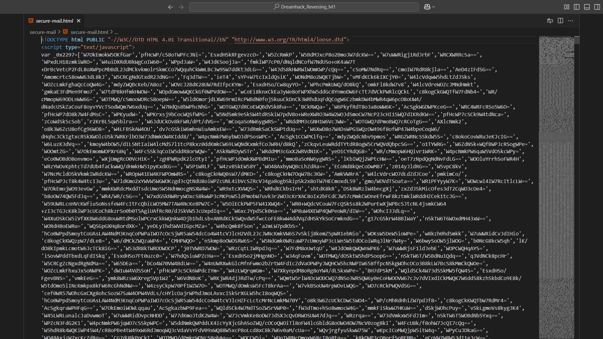

소스 코드를 확인해보았는데 코드가 난독화 되어있어 알아보기 어렵다. 

<br>

```js
<button type="submit" onclick="_0x9a220(pass.value);">Confirm</button>
```

아래 부분에 위 코드를 보면, 버튼을 클릭했을 때 입력받은 값을 인자로 `_0x9a220` 함수를 호출하는 것을 확인할 수 있다.

따라서 `_0x9a220` 함수의 인자에 생년월일 형식의 값을 무차별 대입하면 될 것 같다.

<br>

개발자 도구의 콘솔을 통해 자바스크립트 코드를 실행하였다.

```js
window.alert = function () {} // alert override

var date = 991231;
var result = 0;

while (date > 0) {
    if (result == true) {break;}
    else if ((date % 10000) <= 101) {date -= 8870;}
    else if ((date % 100) <= 1) {date -= 70;}
    else {date -= 1;}

    result = _0x9a220(date);
    console.log(date);
}
```

<br>


<br>

### fake

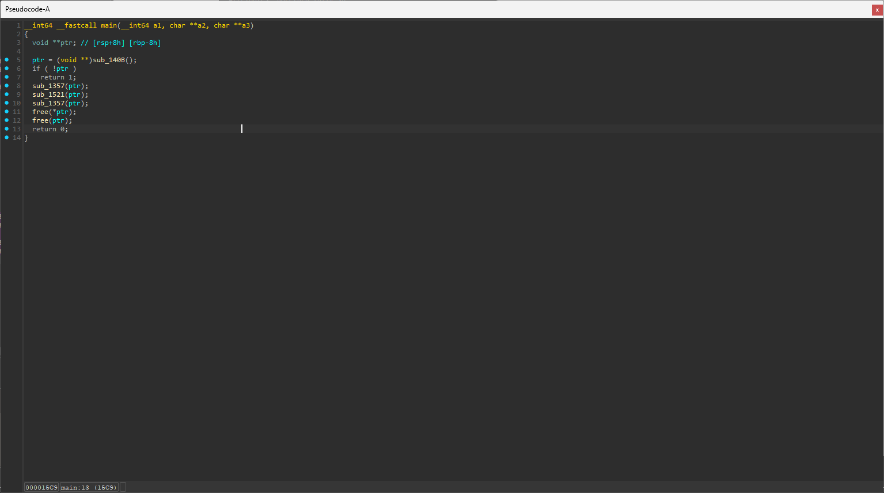

여러 함수가 있는데 `ptr`의 값이 저장되는 `sub_140B` 함수부터 확인해보았다.

<br>

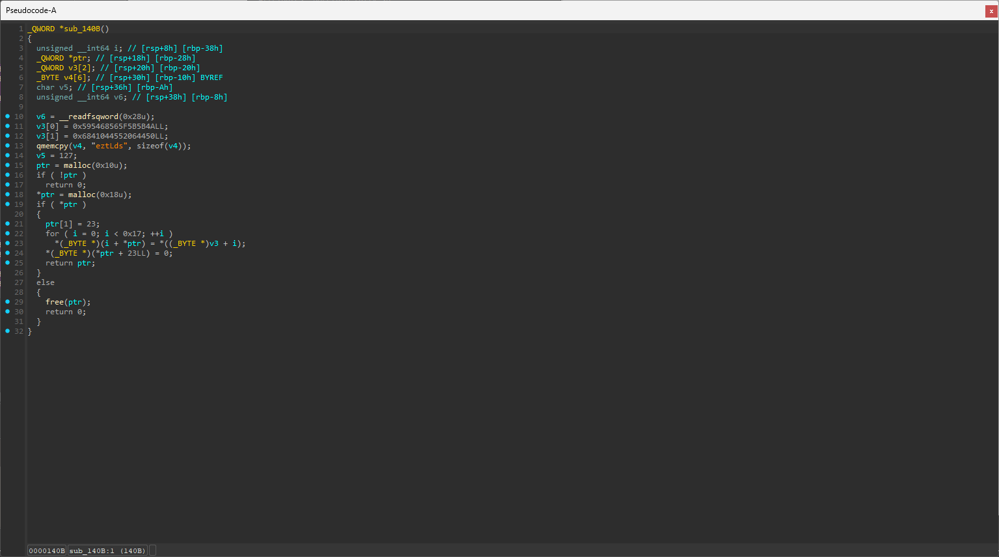

`v3` 배열과 `v4`의 문자열, `v5` 값이 저장되어 있는 값을 이어서 `ptr` 변수의 위치부터 차례대로 저장한다.

<br>

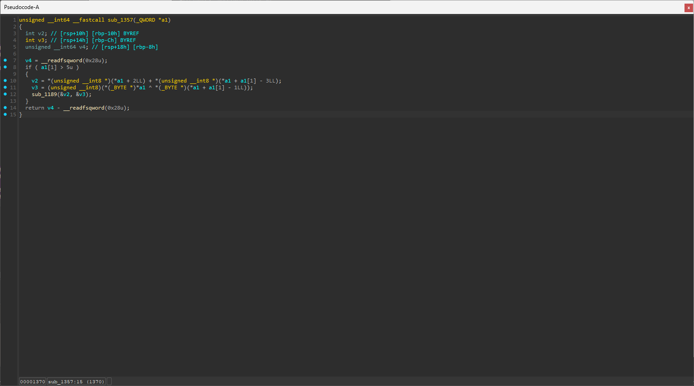

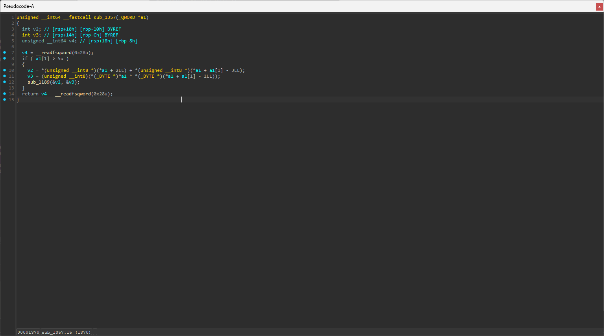

나머지 세 함수 중 두 함수는 `ptr` 포인터의 위치와 연관이 없는 값들이라 볼 필요가 없다.

<br>

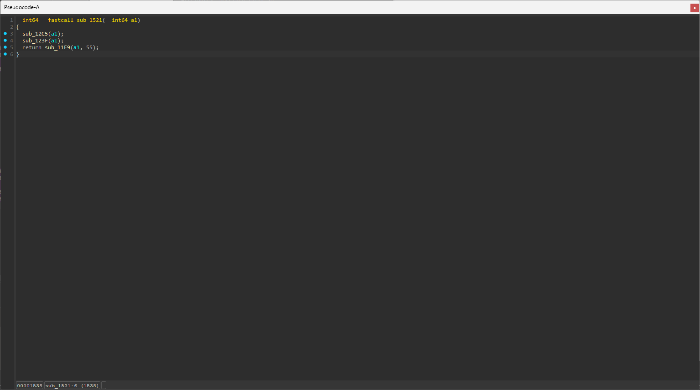

두 번째 함수를 보면 `ptr`에 직접적인 연산이 되는 세 함수가 있는데, 하나씩 확인해보겠다.

<br>

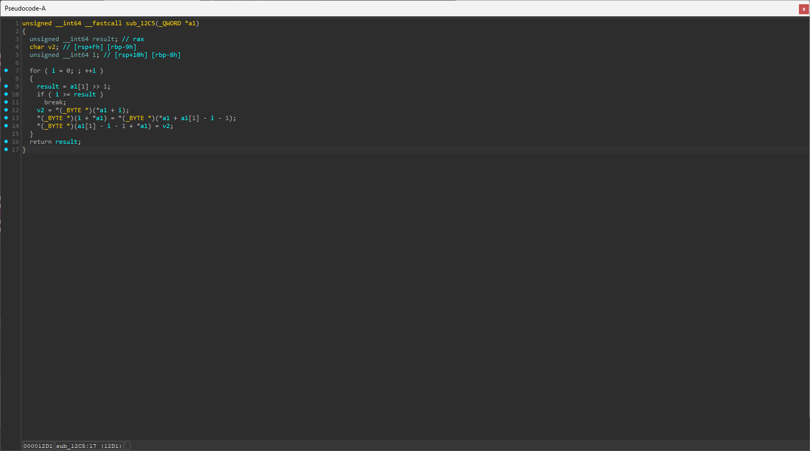

첫 번째 함수는 `a1[i]`와 `a1[a1[1] - i - 1]`의 값을 바꾸는 코드를 반복하는 함수인데, `a1[1]`에는 문자열의 길이인 `0x17`이 저장되어 있다.

<br>

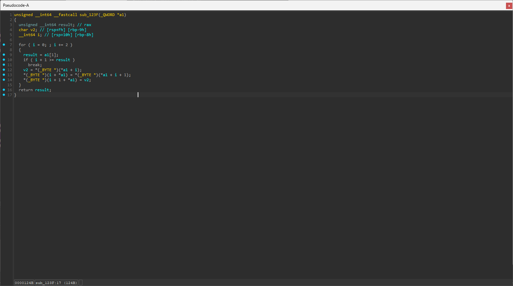

두 번째 함수는 `a1[i]`와 `a1[i+1]`의 값을 바꾸는 함수이다.

<br>

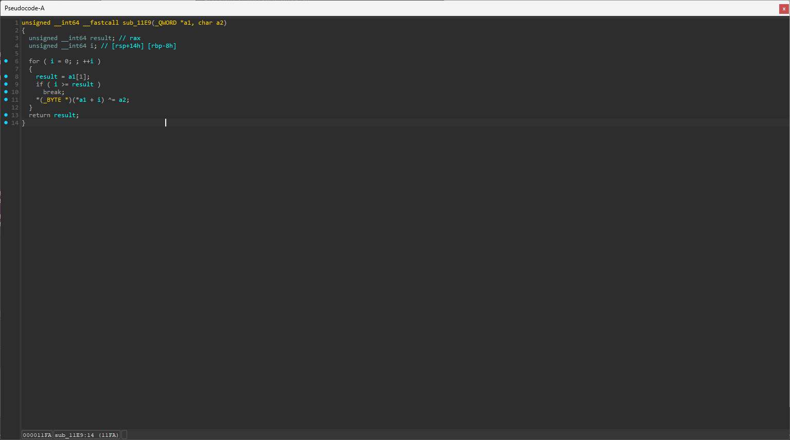

세 번째 함수는 `a1[i]`에 `a2`와 `xor` 연산을 한 값을 저장한다.

<br>

위 과정을 cpp을 이용하여 코드로 구현하였다.

```cpp
#include <iostream>
using namespace std;

int main() {

  long long v3[3];
  v3[0] = 0x595468565F5B5B4ALL;
  v3[1] = 0x6841044552064450LL;
  v3[2] = 0;

  unsigned char *ptr = (unsigned char*)v3;

  ptr[0x10] = 'e';
  ptr[0x11] = 'z';
  ptr[0x12] = 't';
  ptr[0x13] = 'L';
  ptr[0x14] = 'd';
  ptr[0x15] = 's';
  ptr[0x16] = 127;
  ptr[0x17] = 0;

  unsigned char tmp;

  for (int i = 0; i < 23 / 2; i++) {
      tmp = ptr[i];
      ptr[i] = ptr[23 - 1 - i];
      ptr[23 - 1 - i] = tmp;
  }

  for (int i = 0; i + 1 < 23; i += 2) {
      unsigned char tmp = ptr[i];
      ptr[i] = ptr[i + 1];
      ptr[i + 1] = tmp;
  }

  for (int i = 0; i < 23; i++) {
      ptr[i] ^= 55;
  }

  for (int i = 0; i < 0x17; i++) {
    cout << static_cast<char>(ptr[i]);
  }

  return 0;
}
```

<br>

### please, please, please

```
❯ strings ./chall | grep DH{
DH{***}
```

문자열을 추출하면 플래그가 나온다.

<br>

---

<br>

## CTFd 문제 풀이 정리

### Custom 1

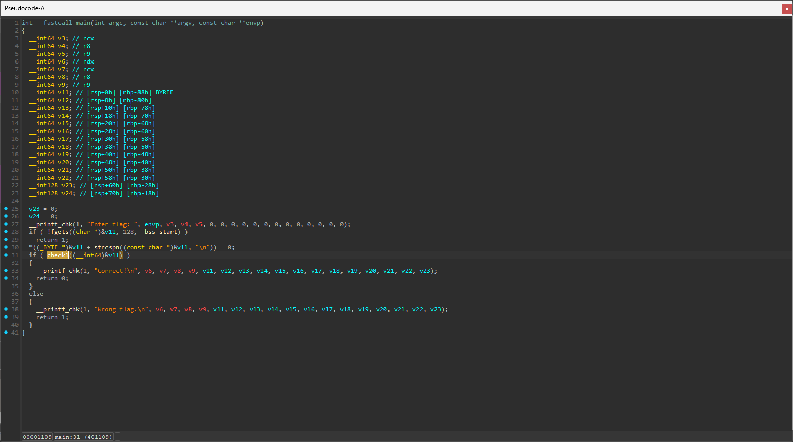

`check1` 함수의 반환값이 `1`이 되어야 한다.

<br>

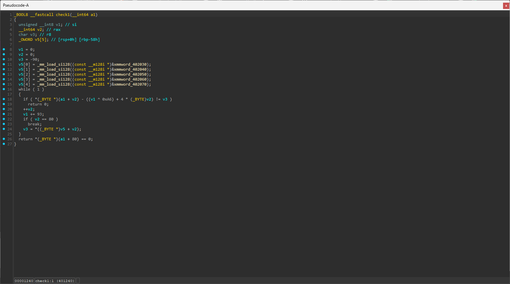

`if`문 안의 `*(_BYTE *)(a1 + v2) - ((v1 ^ 0xA6) + 4 * (_BYTE)v2) != v3` 이 식을 만족하지 않고, `v2`를 카운터로 사용할 때까지 `80`번 반복한다.

해당 식을 정리하면 `a1[v2] - (v1 ^ 0xA6) + 4 * v2 != v3`이 되는데, 구하기 위한 `a1` 배열을 남기고 나머지를 이항하면 `((v1 ^ 0xA6) + 4 * v2 + v3[v2])`가 알맞은 입력값이 된다.

<br>

cpp를 이용하여 출력하였다.

```cpp
#include <iostream>
using namespace std;

int main() {
    unsigned char v3[80] = {
        0xA6, 0x62, 0x55, 0xA8, 0x90, 0xAC, 0xDB, 0x0A,
        0xE5, 0x3B, 0x07, 0xDD, 0x09, 0x03, 0x8B, 0x49,
        0x8D, 0x38, 0x01, 0xCD, 0x26, 0xFF, 0xBC, 0x0A,
        0xEB, 0x2B, 0x31, 0x84, 0x5D, 0xD5, 0xBB, 0xE8,
        0xC1, 0x8D, 0xF1, 0xAC, 0x05, 0x0D, 0x76, 0x3B,
        0x9F, 0x6E, 0xDB, 0x74, 0x4D, 0xB1, 0xA0, 0xF0,
        0xC1, 0x05, 0x13, 0x77, 0x45, 0x7A, 0x20, 0x28,
        0x79, 0x80, 0xCB, 0x9E, 0xF9, 0xBF, 0x55, 0x21,
        0x4D, 0x17, 0x11, 0x5D, 0x21, 0x77, 0x8F, 0xD1,
        0xAA, 0x02, 0xE2, 0x7E, 0xFD, 0xAA, 0x15, 0x2C
    };

    int v1 = 0;
    for (int i = 0; i < 80; i++) {
        cout << static_cast<char>(((v1 ^ 0xA6) + 4 * i + v3[i]) & 0xFF);
        v1 += 93;
    }

    return 0;
}
```

<br>

### Custom 2

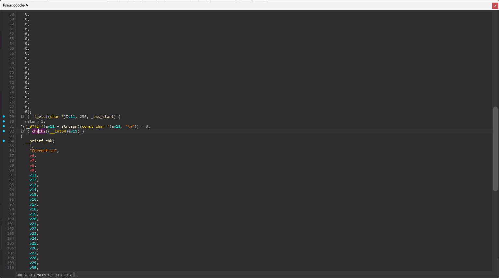

`check2` 함수의 반환값이 `1`이 되어야 한다.

<br>

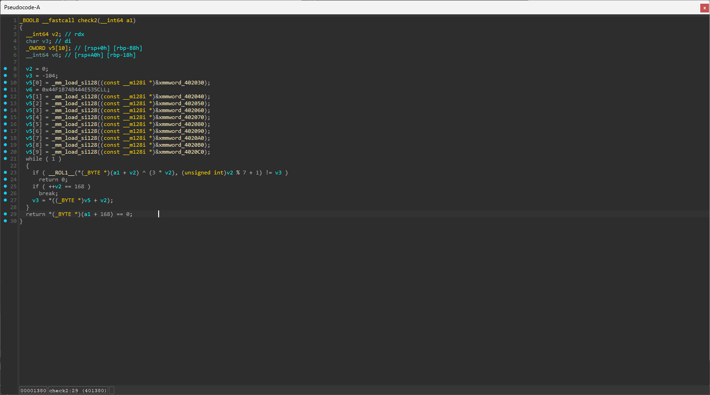

`__ROL1__(*(_BYTE *)(a1 + v2) ^ (3 * v2), (unsigned int)v2 % 7 + 1) != v3` 식이 `false`가 되어야 만족하고, `v2`를 카운터로 사용하여 `168`번 반복하게 된다.

따라서 이를 역으로 연산한 식인 `ror(data[i], v2 % 7 + 1) ^ (3 * v2)`이 알맞은 입력값이 된다.

<br>

cpp를 사용하여 코드를 작성하였다.

```cpp
#include <iostream>
using namespace std;

unsigned char ror(unsigned char x, int n) {
    return (x >> n) | (x << (8 - n));
}

int main() {
    unsigned char data[168] = {
        0x98, 0x89, 0xFB, 0xC6, 0xCF, 0x0E, 0xB4, 0x8E, 0x01, 0x0A, 0x27, 0x68, 0x53, 0xB2, 0xBC, 0x21,
        0x1B, 0x17, 0x89, 0xD6, 0xB5, 0xF2, 0xC4, 0x39, 0xB0, 0x21, 0x48, 0x85, 0x06, 0x44, 0x19, 0x93,
        0x64, 0x48, 0x95, 0x10, 0xEC, 0xD8, 0xE1, 0x87, 0xCF, 0x1F, 0x32, 0x8B, 0xB5, 0x6B, 0x5C, 0xFB,
        0xEB, 0xC9, 0xC7, 0xEF, 0xEA, 0x3B, 0x24, 0xFF, 0xF7, 0xA7, 0xF6, 0x3D, 0x5B, 0x7E, 0x65, 0xCF,
        0x1E, 0xB4, 0x1A, 0x15, 0x25, 0x4F, 0x6B, 0x1A, 0x04, 0xA8, 0x37, 0x2E, 0x45, 0x5B, 0x1A, 0xA5,
        0x7A, 0xF0, 0x23, 0x58, 0x77, 0xE6, 0xBB, 0xF5, 0x69, 0x52, 0xBB, 0xE6, 0x98, 0x7B, 0x96, 0xCF,
        0x56, 0xB0, 0xAC, 0x2D, 0x2A, 0x85, 0xAA, 0x58, 0xB7, 0xDA, 0x35, 0x29, 0xC0, 0x41, 0x4B, 0x16,
        0x0E, 0x99, 0x33, 0xB3, 0xA4, 0x47, 0xAB, 0x0E, 0x6D, 0xF1, 0x02, 0x46, 0xC7, 0x27, 0x1E, 0x7C,
        0x46, 0x8E, 0x3C, 0x7B, 0xE5, 0xCF, 0xFB, 0xBF, 0x1F, 0x9D, 0x7E, 0x79, 0xEF, 0x97, 0x06, 0x4F,
        0xFC, 0xE1, 0xE8, 0xB5, 0x3A, 0x4F, 0xEA, 0x91, 0xE3, 0x7D, 0xF7, 0x62, 0x9C, 0x18, 0x5D, 0xE1,
        0x5C, 0x53, 0x4E, 0x44, 0x4B, 0xB7, 0xF1, 0x44
    };

    for (int i = 0; i < 168; i++) {
        cout << static_cast<char>(ror(data[i], i % 7 + 1) ^ ((3 * i) & 0xFF));
    }

    return 0;
}
```

<br>

### Custom 3

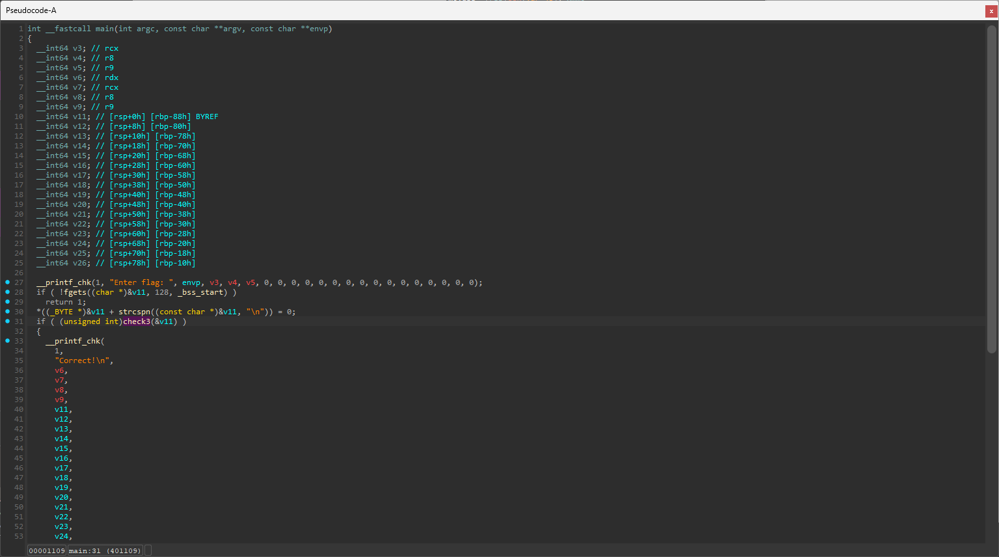

`check3` 함수에서 `1`이 반환되어야 함을 알 수 있다.

<br>

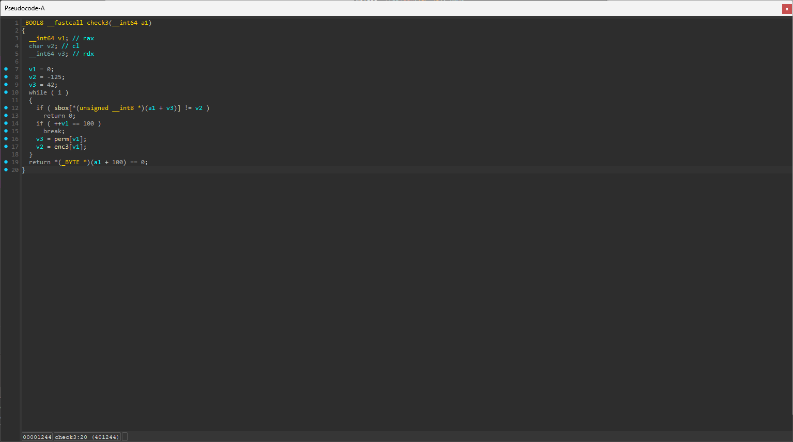

`sbox[*(unsigned __int8 *)(a1 + v3)] != v2` 이 식을 만족하는 값을 찾아야 하는데, `v1`을 카운터로 사용하여 `v1`이 `100`이 될 때까지 반복한다.

<br>

이 식을 정리하면 `sbox[a1[v3]] != v2`이 되는데, 무차별 대입으로 `sbox[j] = enc3[i]`가 만족하는 값을 찾으면, `j`의 값이 `a1[perm[i]]`이기 때문에, `a1[perm[i]]` 값에 `j`를 저장하면 `a1` 배열을 구할 수 있다.


```cpp
#include <iostream>
using namespace std;

unsigned char sbox[256] = {
    0x98, 0x89, 0xFB, 0xC6, 0xCF, 0x0E, 0xB4, 0x8E, 0x01, 0x0A, 0x27, 0x68, 0x53, 0xB2, 0xBC, 0x21,
    0x1B, 0x17, 0x89, 0xD6, 0xB5, 0xF2, 0xC4, 0x39, 0xB0, 0x21, 0x48, 0x85, 0x06, 0x44, 0x19, 0x93,
    0x64, 0x48, 0x95, 0x10, 0xEC, 0xD8, 0xE1, 0x87, 0xCF, 0x1F, 0x32, 0x8B, 0xB5, 0x6B, 0x5C, 0xFB,
    0xEB, 0xC9, 0xC7, 0xEF, 0xEA, 0x3B, 0x24, 0xFF, 0xF7, 0xA7, 0xF6, 0x3D, 0x5B, 0x7E, 0x65, 0xCF,
    0x1E, 0xB4, 0x1A, 0x15, 0x25, 0x4F, 0x6B, 0x1A, 0x04, 0xA8, 0x37, 0x2E, 0x45, 0x5B, 0x1A, 0xA5,
    0x7A, 0xF0, 0x23, 0x58, 0x77, 0xE6, 0xBB, 0xF5, 0x69, 0x52, 0xBB, 0xE6, 0x98, 0x7B, 0x96, 0xCF,
    0x56, 0xB0, 0xAC, 0x2D, 0x2A, 0x85, 0xAA, 0x58, 0xB7, 0xDA, 0x35, 0x29, 0xC0, 0x41, 0x4B, 0x16,
    0x0E, 0x99, 0x33, 0xB3, 0xA4, 0x47, 0xAB, 0x0E, 0x6D, 0xF1, 0x02, 0x46, 0xC7, 0x27, 0x1E, 0x7C,
    0x46, 0x8E, 0x3C, 0x7B, 0xE5, 0xCF, 0xFB, 0xBF, 0x1F, 0x9D, 0x7E, 0x79, 0xEF, 0x97, 0x06, 0x4F,
    0xFC, 0xE1, 0xE8, 0xB5, 0x3A, 0x4F, 0xEA, 0x91, 0xE3, 0x7D, 0xF7, 0x62, 0x9C, 0x18, 0x5D, 0xE1,
    0x5C, 0x53, 0x4E, 0x44, 0x4B, 0xB7, 0xF1, 0x44
};

unsigned char perm[100] = {
    0x2A, 0x29, 0x5B, 0x09, 0x41, 0x32, 0x01, 0x46, 0x0F, 0x4E, 0x49, 0x0A, 0x37, 0x38, 0x48, 0x2D,
    0x30, 0x5C, 0x4C, 0x25, 0x1E, 0x15, 0x20, 0x60, 0x50, 0x31, 0x53, 0x1A, 0x57, 0x21, 0x08, 0x2F,
    0x3B, 0x3F, 0x4A, 0x2C, 0x62, 0x34, 0x55, 0x0C, 0x24, 0x17, 0x27, 0x28, 0x12, 0x42, 0x3D, 0x3C,
    0x07, 0x22, 0x63, 0x2E, 0x02, 0x33, 0x10, 0x26, 0x3A, 0x44, 0x16, 0x3E, 0x18, 0x05, 0x06, 0x43,
    0x52, 0x13, 0x4F, 0x2B, 0x5A, 0x14, 0x00, 0x5F, 0x39, 0x5D, 0x35, 0x59, 0x19, 0x47, 0x54, 0x4D,
    0x40, 0x1D, 0x1B, 0x58, 0x61, 0x04, 0x36, 0x4B, 0x0B, 0x45, 0x56, 0x0D, 0x11, 0x1C, 0x1F, 0x23,
    0x5E, 0x03, 0x0E, 0x51
};

unsigned char enc3[128] = {
    0x83, 0x67, 0x34, 0x06, 0x94, 0x3C, 0xDB, 0x83, 0x34, 0x3C, 0xE4, 0x3C, 0x34, 0x49, 0x9A, 0x2B,
    0x6B, 0x9A, 0x6B, 0x9D, 0x3C, 0x6A, 0x53, 0x0D, 0x6B, 0x60, 0xDD, 0x35, 0x18, 0x45, 0x53, 0xDB,
    0x34, 0x18, 0x69, 0xC5, 0x1A, 0x53, 0xE4, 0x9A, 0xCB, 0x3B, 0xCB, 0xCB, 0x35, 0x07, 0xA6, 0xB4,
    0xCB, 0x6E, 0x09, 0x69, 0xC7, 0x64, 0xC7, 0x3C, 0x83, 0x53, 0xA5, 0x69, 0xEC, 0x03, 0xF9, 0x06,
    0x93, 0x18, 0x6A, 0xDD, 0xFB, 0x35, 0xCF, 0xF6, 0x59, 0x08, 0x5E, 0x2B, 0x59, 0xDD, 0x9A, 0x60,
    0xDF, 0xC3, 0x06, 0xC5, 0x55, 0x41, 0xE4, 0xDB, 0x67, 0xA1, 0xE4, 0x69, 0x59, 0xDF, 0x18, 0x3B,
    0xA1, 0x64, 0xFB, 0xA6, 0x00, 0x00, 0x00, 0x00, 0x00, 0x00, 0x00, 0x00, 0x00, 0x00, 0x00, 0x00,
    0x00, 0x00, 0x00, 0x00, 0x00, 0x00, 0x00, 0x00, 0x00, 0x00, 0x00, 0x00, 0x00, 0x00, 0x00, 0x00
};

unsigned char a1[256];

int main() {

    for (int i = 0; i < 100; i++) {
        char v3 = perm[i];
        char v2 = enc3[i];

        for (int j = 0; j < 256; j++) {

            if (sbox[j] == v2) {
                a1[v3] = j;
            }
        }
    }

    for (int i = 0; i < 100; i++) {
        cout << static_cast<char>(a1[i]);
    }

    return 0;
}
```