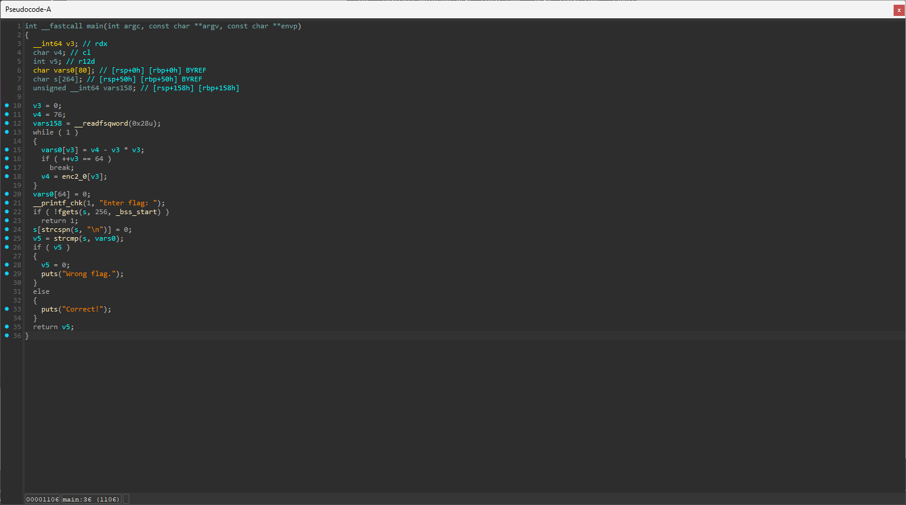
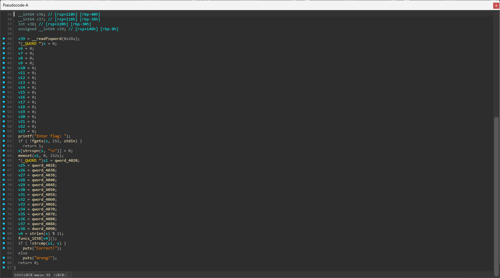
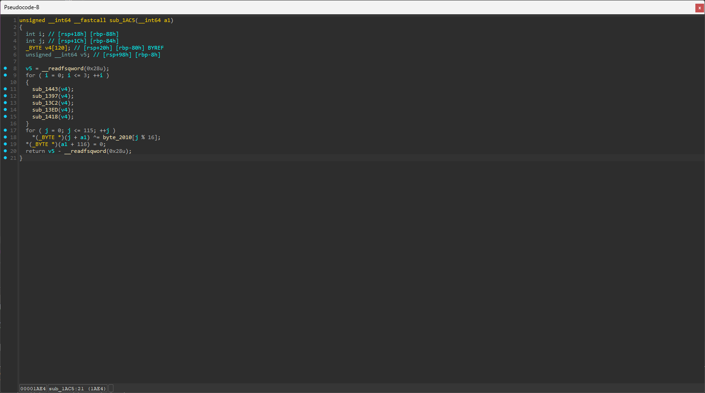

## CTFd 문제 풀이 정리

### Custom 2



디컴파일된 `main` 함수를 보면 입력받은 값인 `s`와 암호화된 값인 `vars0`을 비교하는 것을 확인할 수 있다.

<br>

그런데 입력받은 값이 암호화되는 것이 아니라 암호화된 값과 입력받은 값을 비교하는 것이라, 암호화된 값이 플래그인 것인데, 이렇게 되면 플래그가 동적으로 생성되기 때문에 `gdb`로 확인할 수 있다.

<br>

```
pwndbg> b __printf_chk
Breakpoint 1 at 0x10f0
pwndbg> r
Starting program: /home/t43w00/Documents/Layer7/Reversing/R7/challenge2(2)
[Thread debugging using libthread_db enabled]
Using host libthread_db library "/lib/x86_64-linux-gnu/libthread_db.so.1".

Breakpoint 1, ___printf_chk (flag=1, format=0x555555556004 "Enter flag: ") at ./debug/printf_chk.c:25
warning: 25     ./debug/printf_chk.c: No such file or directory
LEGEND: STACK | HEAP | CODE | DATA | WX | RODATA
───────────────────────────────────────────────────────────────────[ REGISTERS / show-flags off / show-compact-regs off ]───────────────────────────────────────────────────────────────────
 RAX  0
 RBX  0x7fffffffdfe8 —▸ 0x7fffffffe278 ◂— '/home/t43w00/Documents/Layer7/Reversing/R7/challenge2(2)'
 RCX  0xfffff17d
 RDX  0x40
 RDI  1
 RSI  0x555555556004 ◂— 'Enter flag: '
 R8   0
 R9   0x7ffff7fca380 (_dl_fini) ◂— endbr64
 R10  0x7fffffffdbe0 ◂— 0x800000
 R11  0x203
 R12  1
 R13  0
 R14  0x555555557d98 (__do_global_dtors_aux_fini_array_entry) —▸ 0x5555555552a0 (__do_global_dtors_aux) ◂— endbr64
 R15  0x7ffff7ffd000 (_rtld_global) —▸ 0x7ffff7ffe2e0 —▸ 0x555555554000 ◂— 0x10102464c457f
 RBP  0x7fffffffdd50 ◂— 'Layer7{V2luZG93IHNlYXRzIGFzIHRoZSBwbGFuZSBzdGFydHMgbGVhdmluJw==}'
 RSP  0x7fffffffdd48 —▸ 0x555555555169 (main+105) ◂— lea r12, [rsp + 0x50]
 RIP  0x7ffff7ed8960 (__printf_chk) ◂— endbr64
────────────────────────────────────────────────────────────────────────────[ DISASM / x86-64 / set emulate on ]────────────────────────────────────────────────────────────────────────────
 ► 0x7ffff7ed8960 <__printf_chk>       endbr64
   0x7ffff7ed8964 <__printf_chk+4>     push   rbp
   0x7ffff7ed8965 <__printf_chk+5>     mov    rbp, rsp                        RBP => 0x7fffffffdd40 —▸ 0x7fffffffdd50 ◂— 'Layer7{V2luZG93IHNlYXRzIGFzIHRoZSBwbGFuZSBzdGFydHM...'
   0x7ffff7ed8968 <__printf_chk+8>     sub    rsp, 0xd0                       RSP => 0x7fffffffdc70 (0x7fffffffdd40 - 0xd0)
   0x7ffff7ed896f <__printf_chk+15>    mov    qword ptr [rbp - 0xa0], rdx     [0x7fffffffdca0] <= 0x40
   0x7ffff7ed8976 <__printf_chk+22>    mov    qword ptr [rbp - 0x98], rcx     [0x7fffffffdca8] <= 0xfffff17d
   0x7ffff7ed897d <__printf_chk+29>    mov    qword ptr [rbp - 0x90], r8      [0x7fffffffdcb0] <= 0
   0x7ffff7ed8984 <__printf_chk+36>    mov    qword ptr [rbp - 0x88], r9      [0x7fffffffdcb8] <= 0x7ffff7fca380 (_dl_fini) ◂— endbr64
   0x7ffff7ed898b <__printf_chk+43>    test   al, al                          0 & 0     EFLAGS => 0x246 [ cf PF af ZF sf IF df of ]
   0x7ffff7ed898d <__printf_chk+45>  ✔ je     __printf_chk+79             <__printf_chk+79>
    ↓
   0x7ffff7ed89af <__printf_chk+79>    mov    rax, qword ptr fs:[0x28]        RAX, [0x7ffff7d9e768] => 0x6228d2d69f191400
─────────────────────────────────────────────────────────────────────────────────────────[ STACK ]──────────────────────────────────────────────────────────────────────────────────────────
00:0000│ rsp 0x7fffffffdd48 —▸ 0x555555555169 (main+105) ◂— lea r12, [rsp + 0x50]
01:0008│ rbp 0x7fffffffdd50 ◂— 'Layer7{V2luZG93IHNlYXRzIGFzIHRoZSBwbGFuZSBzdGFydHMgbGVhdmluJw==}'
02:0010│+008 0x7fffffffdd58 ◂— '2luZG93IHNlYXRzIGFzIHRoZSBwbGFuZSBzdGFydHMgbGVhdmluJw==}'
03:0018│+010 0x7fffffffdd60 ◂— 'HNlYXRzIGFzIHRoZSBwbGFuZSBzdGFydHMgbGVhdmluJw==}'
04:0020│+018 0x7fffffffdd68 ◂— 'GFzIHRoZSBwbGFuZSBzdGFydHMgbGVhdmluJw==}'
05:0028│+020 0x7fffffffdd70 ◂— 'SBwbGFuZSBzdGFydHMgbGVhdmluJw==}'
06:0030│+028 0x7fffffffdd78 ◂— 'SBzdGFydHMgbGVhdmluJw==}'
07:0038│+030 0x7fffffffdd80 ◂— 'HMgbGVhdmluJw==}'
───────────────────────────────────────────────────────────────────────────────────────[ BACKTRACE ]────────────────────────────────────────────────────────────────────────────────────────
 ► 0   0x7ffff7ed8960 __printf_chk
   1   0x555555555169 main+105
   2   0x7ffff7dcb1ca __libc_start_call_main+122
   3   0x7ffff7dcb28b __libc_start_main+139
   4   0x555555555225 _start+37
────────────────────────────────────────────────────────────────────────────────────────────────────────────────────────────────────────────────────────────────────────────────────────────
pwndbg> x/s $rbp
0x7fffffffdd50: "Layer7{V2luZG93IHNlYXRzIGFzIHRoZSBwbGFuZSBzdGFydHMgbGVhdmluJw==}"
pwndbg>
```

암호화가 끝나고 나서 호출되는 `__printf_chk`에 중단점을 걸고 실행하면 스택 프레임에서 플래그를 확인할 수 있다.

<br>

### Custom 3



`main` 함수를 확인해보면 `s1`에 저장된 값과 입력받은 `s`를 비교하는 것을 알 수 있다.

<br>

따라서 `s1`의 저장된 값을 입력하면 `Correct`가 출력된다.

```
Layer7/Reversing/R7
❯ ls
challenge3  flag

Layer7/Reversing/R7
❯ cat flag
�����撫"wt���HtI ���ל���XUBd0Ϧ����ҸWgBY#���ש�Ѳ{Y]_Z��������~RId␦�������G&@

Layer7/Reversing/R7
❯ ./challenge3 < flag
Enter flag: Correct!
```

<br>



근데 플래그는 아니고, `funcs_1E5B`를 보면 `sub_1AC5` 함수를 제외하고 다 같은 함수이고, `sub_1AC5` 함수만 조금 다른 것을 알 수 있는데, 이 함수는 `strlen(s) % 11;`가 `8`일 때 호출된다.

<br>

따라서 이 수상한 함수를 보면 위 4개 함수는 쓸데없는 함수고, 마지막 `xor` 연산만 해주면 플래그가 나온다.

```cpp
#include <bits/stdc++.h>
using namespace std;

long long v2[15];

unsigned char *ptr = (unsigned char*)v2;
unsigned char tmp;

unsigned char bytes[16] = {
  0x10, 0x1F, 0x2E, 0x3D, 0x4C, 0x5B, 0x6A, 0x79, 0x88, 0x97, 0xA6, 0xB5, 0xC4, 0xD3, 0xE2, 0xF1
};

int main(void) {

    v2[0] = 0x2F116C3E58577E5C;
    v2[1] = 0xA89691BDD6D6FFCF;
    v2[2] = 0x1D0D0E2164497448;  
    v2[3] = 0xAB92E683FCCAFFCF;  
    v2[4] = 0x20050904741E7722;
    v2[5] = 0xAB85B89CD7C1C6D0;
    v2[6] = 0x30106A1B64425558;
    v2[7] = 0xB8D2BBF6EFD6A6CF;
    v2[8] = 0x231E190F59426757;
    v2[9] = 0xB2D1EAA9D7D4D5DB;
    v2[10] = 0x185A190F5F5D597B;
    v2[11] = 0x928A81F7D6C1C2CF;
    v2[12] = 0x1A1D19146449527E;
    v2[13] = 0x9485B4F6ECCEAEE5;
    v2[14] = 0x401F2647;
    
    for (int i = 0; i <= 115; ++i) {
          ptr[i] ^= bytes[i % 16];
    }

    for (int i = 0; i <= 115; ++i) {
      cout << ptr[i];
    }

    return 0;
}
```

<br>

사실 `funcs_1E5B[v4]();`에 인자가 없어서 정상적인 방법으로는 풀이가 불가능하지만, 인자로 `s1`이 있다고 생각하고 풀이했다.