## CTFd 문제 풀이 정리

### Custom 1

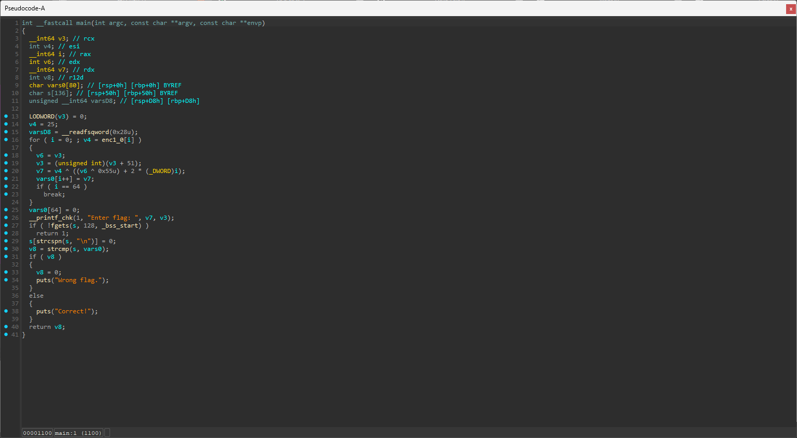

디컴파일된 `main` 함수의 코드를 보면 플래그를 동적으로 생성하고, 사용자에게 입력받은 값을 비교하는 것을 확인할 수 있다.

<br>

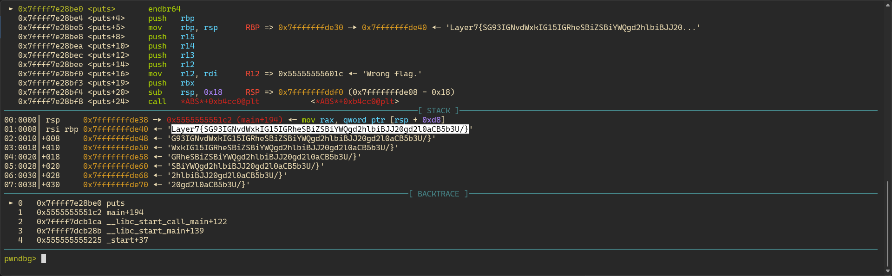

`gdb`를 이용하여 플래그를 생성한 위치에서 스택을 확인하여 플래그를 획득하였다.

<br>
<br>

### Custom 2

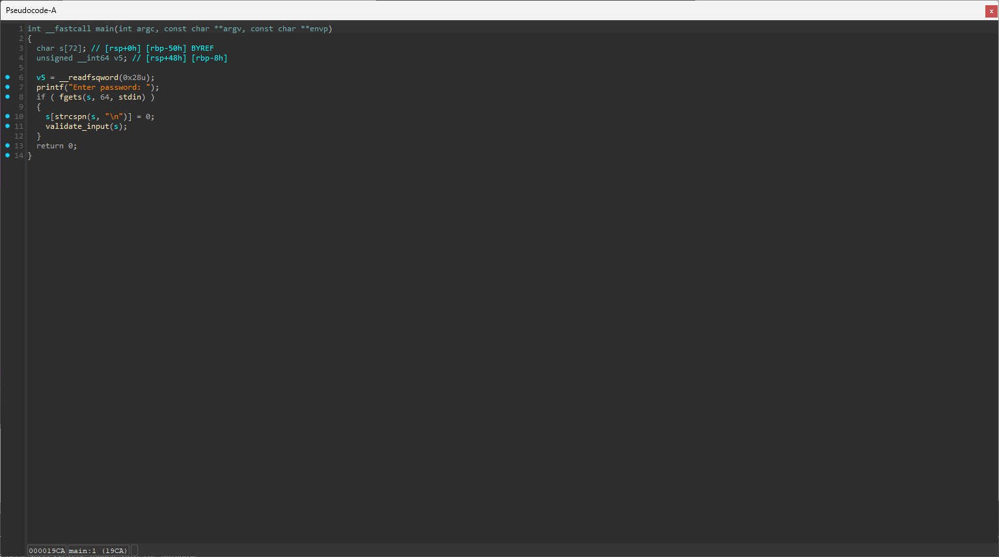 
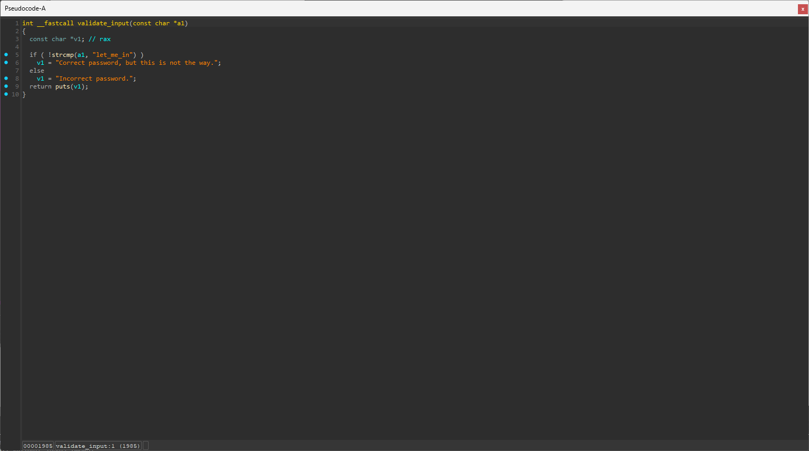

디컴파일된 코드를 보면, 플래그와 관련된 출력이나 연산이 없다는 것을 알 수 있다.

<br>

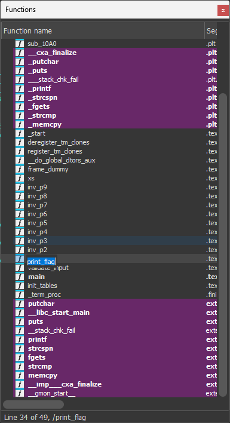

함수 목록에서 `print_flag`라는 이름의 함수를 확인할 수 있었는데, 이를 `gdb`를 이용하여 실행해보았다.

<br>

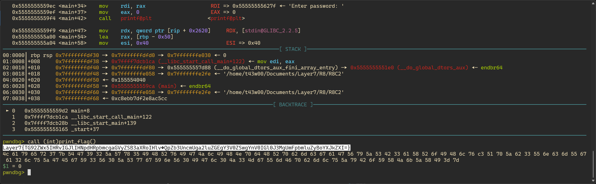

플래그처럼 보이는 문자열이 나왔는데 중간에 unprintable char가 있다. 플래그 안의 값이 `base64`로 인코딩된 형식처럼 보였다. printable char를 대입하여 각각 디코딩해서 정상적인 문장을 찾아보았다.

<br>

```python
import base64

encoded = "TG92ZWx5IHRvIGJlIHNpdHRpbmcgaGVyZSB3aXRoIHlv�QpZb3UncmUga2luZGEgY3V0ZSwgYnV0IGl0J3MgUmFpbmluZyBoYXJkZXI="

for i in range(0x30, 0x7A):

    try:
        encoded = encoded[:44] + chr(i) + encoded[45:]
        decoded = base64.b64decode(encoded.encode('ascii'))
        print(chr(i), '\t', decoded)

    except:
        print(end='')
```

<br>

```md
0        b"Lovely to be sitting here with yo\xd1\nYou're kinda cute, but it's Raining harder"
1        b"Lovely to be sitting here with yo\xd5\nYou're kinda cute, but it's Raining harder"
2        b"Lovely to be sitting here with yo\xd9\nYou're kinda cute, but it's Raining harder"
3        b"Lovely to be sitting here with yo\xdd\nYou're kinda cute, but it's Raining harder"
4        b"Lovely to be sitting here with yo\xe1\nYou're kinda cute, but it's Raining harder"
5        b"Lovely to be sitting here with yo\xe5\nYou're kinda cute, but it's Raining harder"
6        b"Lovely to be sitting here with yo\xe9\nYou're kinda cute, but it's Raining harder"
.
.
↓ ↓ ↓ ↓ ↓ ↓ ↓ ↓ ↓ ↓ ↓ ↓ ↓ ↓ ↓ ↓ ↓ ↓ ↓ ↓ ↓ ↓ ↓ ↓ ↓ ↓ ↓ ↓ ↓ ↓ ↓ ↓ ↓ ↓ ↓ ↓ ↓ ↓ ↓ ↓ ↓ ↓ ↓ ↓ ↓ ↓ 
d        b"Lovely to be sitting here with you\nYou're kinda cute, but it's Raining harder"
↑ ↑ ↑ ↑ ↑ ↑ ↑ ↑ ↑ ↑ ↑ ↑ ↑ ↑ ↑ ↑ ↑ ↑ ↑ ↑ ↑ ↑ ↑ ↑ ↑ ↑ ↑ ↑ ↑ ↑ ↑ ↑ ↑ ↑ ↑ ↑ ↑ ↑ ↑ ↑ ↑ ↑ ↑ ↑ ↑ ↑ 
.
.
u        b"Lovely to be sitting here with yo\xb9\nYou're kinda cute, but it's Raining harder"
v        b"Lovely to be sitting here with yo\xbd\nYou're kinda cute, but it's Raining harder"
w        b"Lovely to be sitting here with yo\xc1\nYou're kinda cute, but it's Raining harder"
x        b"Lovely to be sitting here with yo\xc5\nYou're kinda cute, but it's Raining harder"
y        b"Lovely to be sitting here with yo\xc9\nYou're kinda cute, but it's Raining harder"
```

`d`가 가장 적절해보인다. 따라서 해당 unprintable char를 `d`로 바꿔주었더니, 플래그 제출에 성공하였다.

<br>

---

<br>

## Dreamhack Reverse Engineering 학습

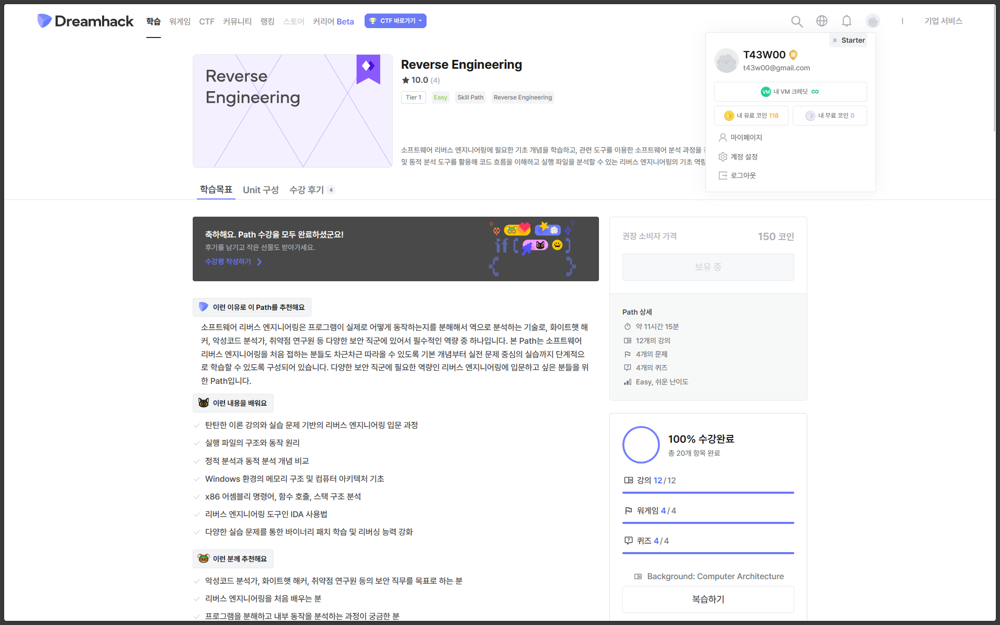

<br>

---

<br>

## Dreamhack 워게임 풀이

### legacyopt

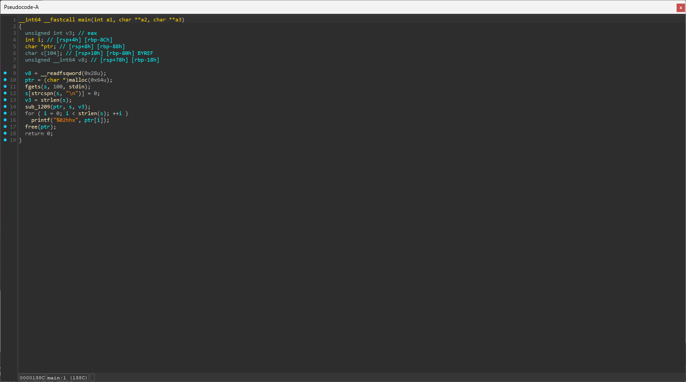

디컴파일된 코드를 보니, 사용자에게 입력을 받아 `sub_1209` 함수를 통해 연산을 한 뒤 출력을 하는 것 같다.

문제 파일에는 `output.txt` 파일이 포함되어 있는데, 이를 통해 역연산하여 입력값을 구하면 될 것 같다.

```
220c6a33204455fb390074013c4156d704316528205156d70b217c14255b6ce10837651234464e
```

<br>

`sub_1209` 함수는 아래와 같다.

```c
unsigned __int64 __fastcall sub_1209(_BYTE *a1, char *a2, int a3)
{
  int v3; // eax
  int v4; // edx
  char *v5; // rax
  char v6; // cl
  _BYTE *v7; // rax
  char *v8; // rax
  char v9; // cl
  _BYTE *v10; // rax
  char *v11; // rax
  char v12; // cl
  _BYTE *v13; // rax
  char *v14; // rax
  char v15; // cl
  _BYTE *v16; // rax
  char *v17; // rax
  char v18; // cl
  _BYTE *v19; // rax
  char *v20; // rax
  char v21; // cl
  _BYTE *v22; // rax
  char *v23; // rax
  char v24; // cl
  _BYTE *v25; // rax
  char *v26; // rax
  char v27; // cl
  unsigned __int64 result; // rax
  int v32; // [rsp+20h] [rbp-4h]

  v3 = a3 + 7;
  v4 = a3 + 14;
  if ( v3 < 0 )
    v3 = v4;
  v32 = v3 >> 3;
  switch ( a3 % 8 )
  {
    case 0:
      goto LABEL_4;
    case 1:
      goto LABEL_11;
    case 2:
      goto LABEL_10;
    case 3:
      goto LABEL_9;
    case 4:
      goto LABEL_8;
    case 5:
      goto LABEL_7;
    case 6:
      goto LABEL_6;
    case 7:
      while ( 1 )
      {
        v8 = a2++;
        v9 = *v8;
        v10 = a1++;
        *v10 = v9 ^ 0x66;
LABEL_6:
        v11 = a2++;
        v12 = *v11;
        v13 = a1++;
        *v13 = v12 ^ 0x44;
LABEL_7:
        v14 = a2++;
        v15 = *v14;
        v16 = a1++;
        *v16 = v15 ^ 0x11;
LABEL_8:
        v17 = a2++;
        v18 = *v17;
        v19 = a1++;
        *v19 = v18 ^ 0x77;
LABEL_9:
        v20 = a2++;
        v21 = *v20;
        v22 = a1++;
        *v22 = v21 ^ 0x55;
LABEL_10:
        v23 = a2++;
        v24 = *v23;
        v25 = a1++;
        *v25 = v24 ^ 0x22;
LABEL_11:
        v26 = a2++;
        v27 = *v26;
        result = (unsigned __int64)a1++;
        *(_BYTE *)result = v27 ^ 0x33;
        if ( --v32 <= 0 )
          break;
LABEL_4:
        v5 = a2++;
        v6 = *v5;
        v7 = a1++;
        *v7 = v6 ^ 0x88;
      }
      break;
    default:
      result = (unsigned int)(a3 % 8);
      break;
  }
  return result;
}
```

코드를 보면 switch-case문을 통해 `a3 % 8`에 해당하는 case로 분기하는 것을 알 수 있는데, `output.txt`가 39byte이므로, `case 7`(39 % 8)으로 분기하는 것을 알 수 있다.

<br>

따라서 입력받은 값에 `case 7`부터 시작해서 순서대로 `[0x66, 0x44, 0x11, 0x77, 0x55, 0x22, 0x33, 0x88]` 값들과 xor 연산을 반복해주는 것이다.

<br>

Python으로 역연산하여 입력값을 구하는 코드를 작성하였다.

```py
output = "220c6a33204455fb390074013c4156d704316528205156d70b217c14255b6ce10837651234464e"
data = bytes.fromhex(output)
key = [0x66, 0x44, 0x11, 0x77, 0x55, 0x22, 0x33, 0x88]

for i in range(len(data)):
  print(chr(data[i] ^ key[i % 8]), end="")
```

<br>

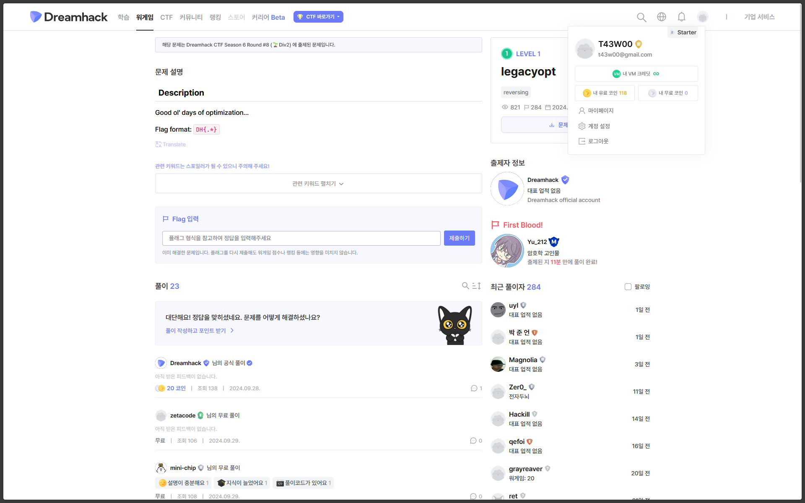

<br>
<br>

### Recover

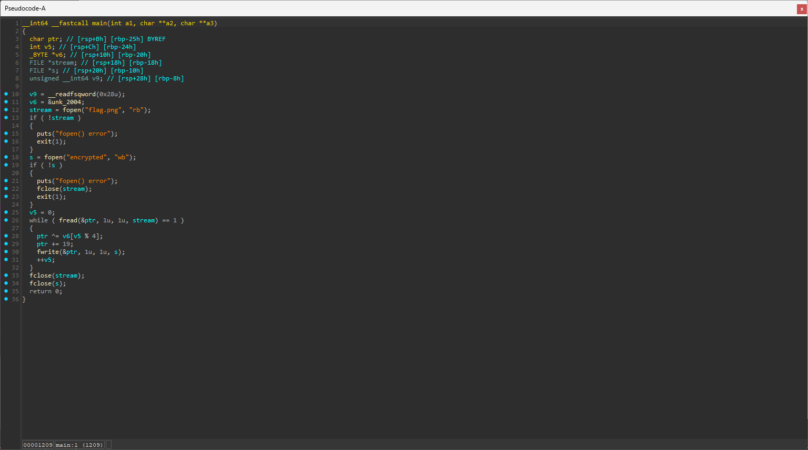

디컴파일된 코드를 보면 `flag.png` 파일을 읽어와 1byte씩 xor 및 더하기 연산을 해주는 것을 확인할 수 있다.

<br>

Python으로 역연산하여 `flag.png`를 복호화하는 코드를 작성하였다.

```py
with open("./encrypted", "rb") as f:
    data = f.read()

key = [0xDE, 0xAD, 0xBE, 0xEF, 0x00]
decrypted = []

for i in range(len(data)):
    decrypted.append(((data[i] - 19) ^ key[i % 4]) & 0xFF)

with open("flag.png", "ab") as f:
    f.write(bytes(decrypted))
```

<br>

복호화된 `flag.png` 열어보면 플래그를 확인할 수 있다.

<br>

---

<br>

## Reversing.kr 문제 풀이

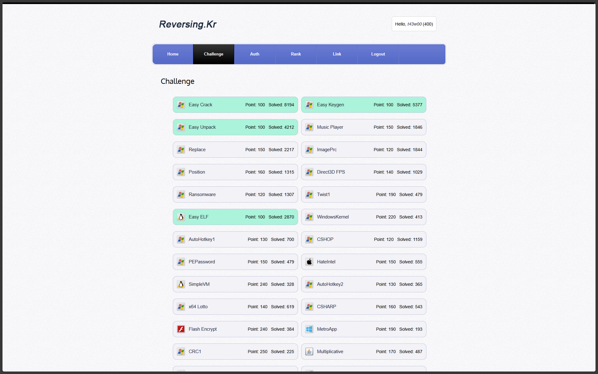

<br>

### Easy Crack

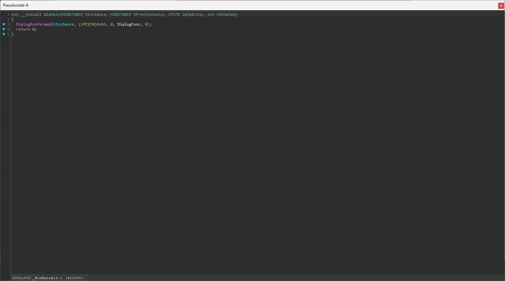

디컴파일된 코드를 확인해보면, Windows API로 만든 GUI 프로그램이기 때문에 `WinMain` 함수를 확인할 수 있다.

<br>

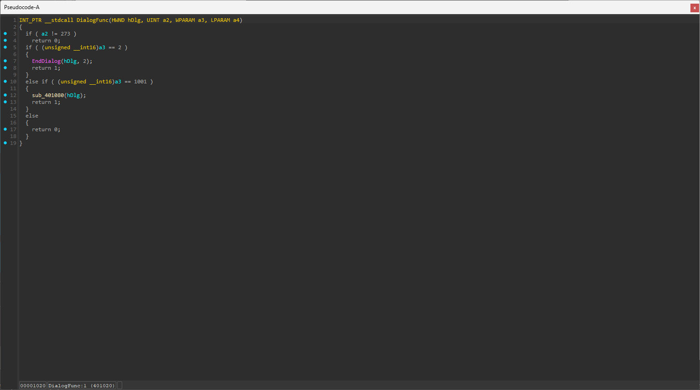

`DialogFunc` 함수를 확인해보면 종료 조건과 아래는 어떤 함수를 호출해주는 것을 볼 수 있다.

<br>

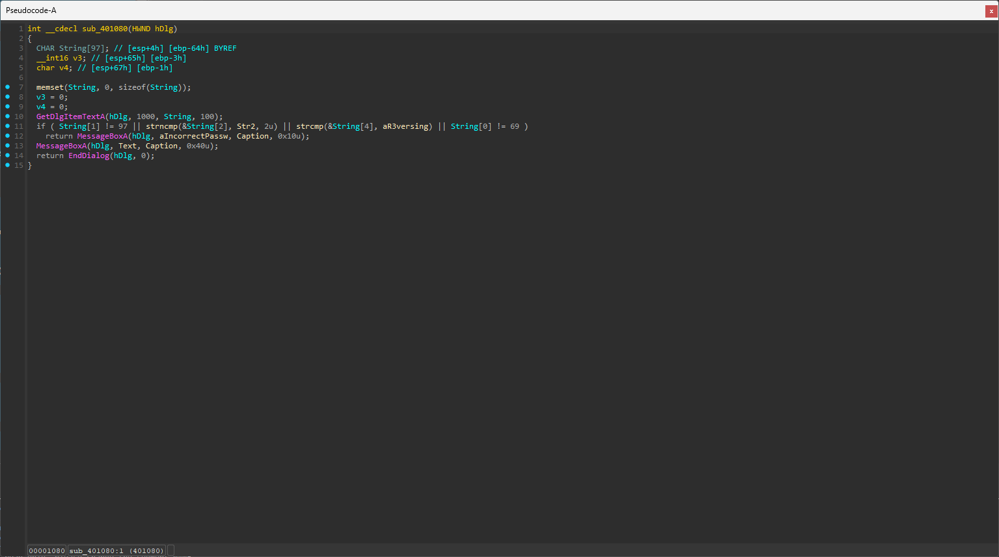

확인해보면 조건문을 만족하면 `MessageBoxA` 함수를 `aIncorrectPassw`를 인자로 반환한다.

따라서 조건문을 만족하지 않도록 하는 `String` 값을 구해야한다.

<br>

```
String[1] != 97                 // a
strncmp(&String[2], Str2, 2u)   // Str2 : 5y
strcmp(&String[4], aR3versing)  // aR3versing : R3versing
String[0] != 69                 // 69 : E
```

따라서 `String`의 값은 "Ea5yR3versing"이다.

<br>

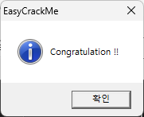

<br>

### Easy Keygen

Find the Name when the Serial is 5B134977135E7D13

해당 시리얼의 이름을 알아내야 하는 것 같다.

<br>

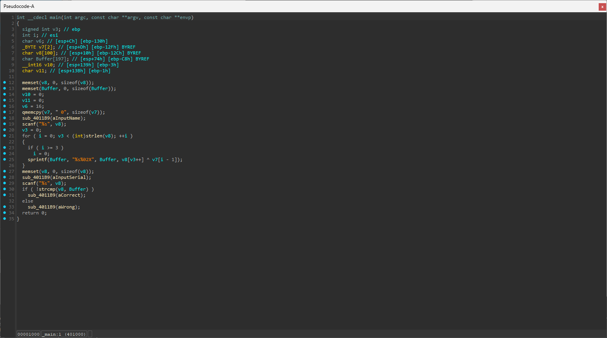

디컴파일된 코드를 확인해보면 `v8`에 이름을 입력받고, 이 값을 이용해 `Buffer`에 `v8[v3++] ^ v7[i - 1]` 값을 Hex 문자열 형태로 저장한다.

다음으로 `v8`에 시리얼을 입력받아, 이를 `Buffer`와 비교하여 같으면 `Correct`를 호출하게 된다.

시리얼 값을 알고 있기 때문에 이를 바탕으로 이름을 역연산하여 구할 수 있다.

<br>

```py
Serial = [0x5B, 0x13, 0x49, 0x77, 0x13, 0x5E, 0x7D, 0x13]

v7 = [0x10, 0x20, 0x30] # v6, v7 두 배열을 인덱스를 한 칸 미뤄서 하나의 배열로 사용.
# v6 = v7[-1] = 16 = 0x10
# v7 = " 0", ' ' = 0x20, '0' = 0x30

for i in range(len(Serial)):
    print(chr(Serial[i] ^ v7[i % 3]), end="")
```
<br>

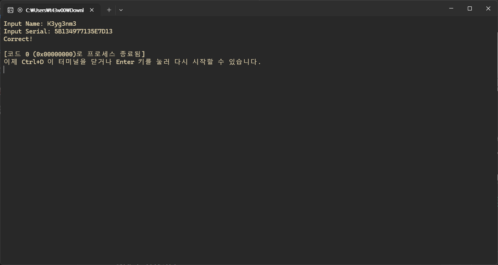

<br>
<br>

### Easy Unpack

Find the OEP

ex) 00401000

<br>

문제 풀이 전, 언팩(Unpack)이란 압축되거나 암호화된, 즉 Packed 파일에서 동적으로 원래 파일로 압축을 해제하거나 복호화하여 실행하는 것을 말한다. 프로그램 실행 중에 암호화된 프로그램이 동적으로 복호화되기 때문에 정적 분석으로는 프로그램을 분석할 수 없다.

<br>

문제에서 OEP를 구하라고 하는데, OEP는 Original Entry Point의 약자로, 언패킹이 된 후의 엔트리 포인트를 말한다.

동적 분석으로 실행하다보면 엔트리 포인트를 찾을 수 있을 것이다.

<br>

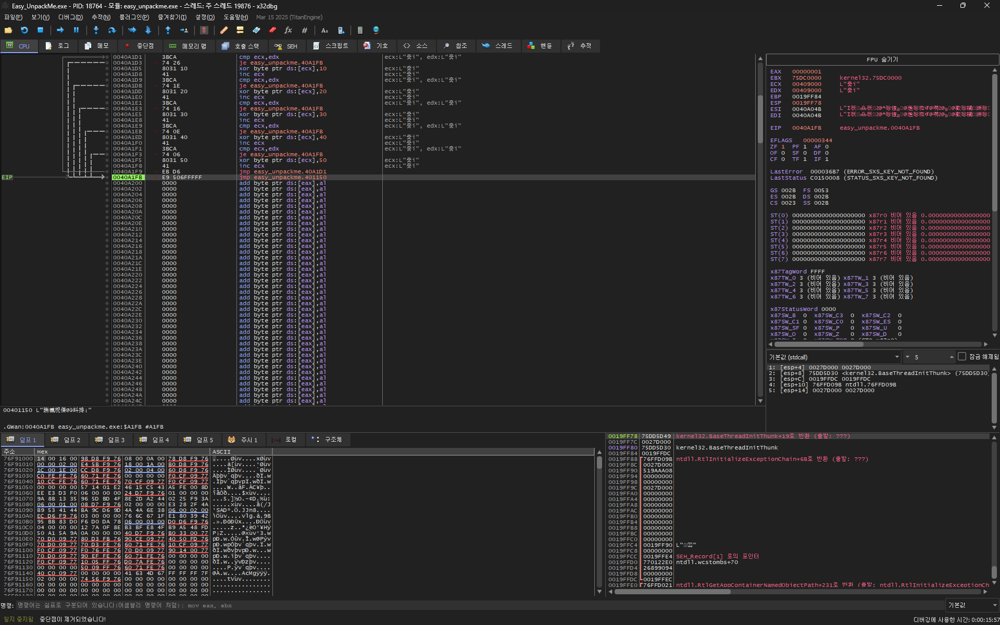

`x32dbg`로 계속해서 한 줄씩 실행하다 보면, 위와 같이 다른 주소로 실행 흐름이 바뀌는 것을 확인할 수 있다.

<br>

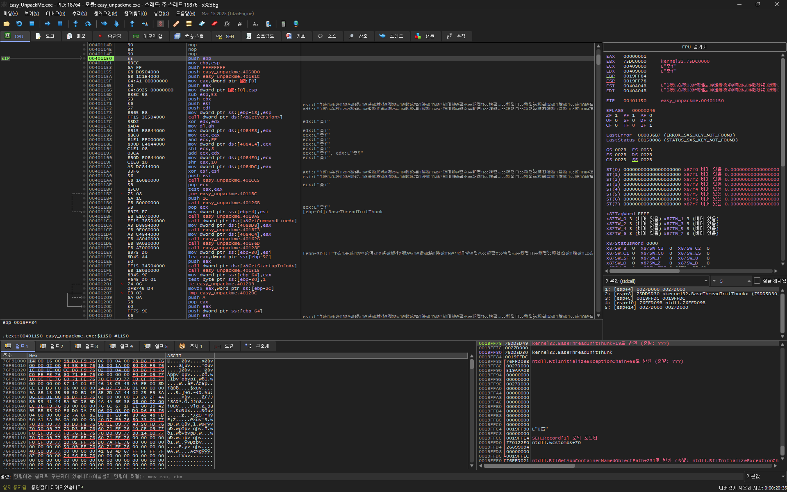

해당 주소를 확인해보면 함수 프롤로그와 `GetVersion`, `GetCommandLineA`와 같은 API 호출 등을 확인할 수 있는데, 이를 통해 이 주소가 엔트리 포인트임을 알 수 있다.

<br>

따라서 OEP는 `00401150`이다.

<br>
<br>

### Easy ELF

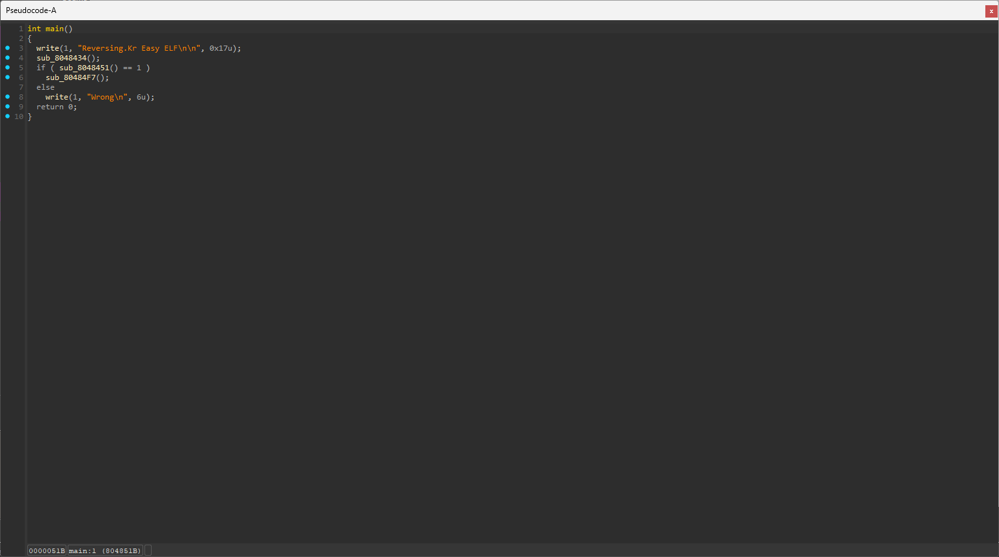 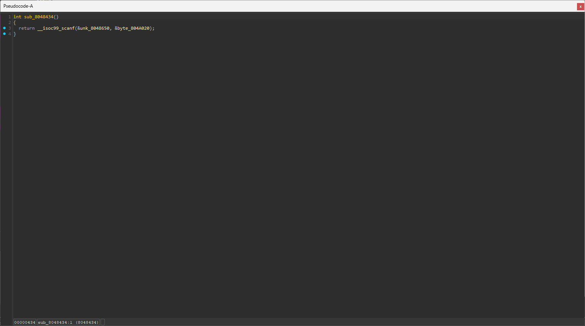

디컴파일된 코드를 확인해보면, `sub_8048434` 함수는 scanf()이고 `sub_8048451` 함수의 반환값에 따라 결과가 달라지는 것을 알 수 있다.

<br>

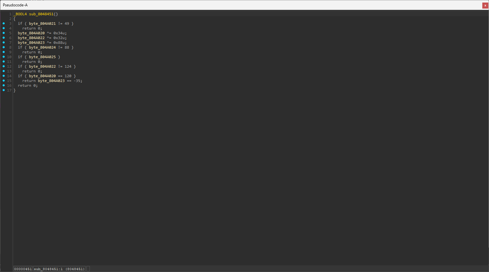

`sub_8048451` 함수를 확인해보면, 입력을 받아온 값을 xor 연산을 한 뒤 특정 값과 비교하여 같으면 1을 반환 시키는 것으로 보인다.

<br>

Python으로 역연산하여 입력값을 구하는 코드를 작성하였다.

```py
bytes = [120 ^ 0x34, 49, 124 ^ 0x32dbg, (-35 ^ 0x88) & 0xFF, 88, 1]

for i in range(len(bytes)):
    print(chr(bytes[i]), end="")
```
