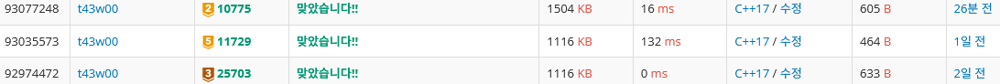
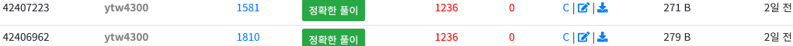

## 수업 내용 정리

### 포인터란?

변수 : 자신의 자료형에 맞는 값을 저장

포인터 변수 : 기존과 달리, 메모리 주소를 저장
 - 메모리 주소 : 실제 컴퓨터에 저장되는 메모리 영역을 구분 짓는 값

### 포인터를 사용하는 이유

변수명이 같아도 함수마다 다른 메모리에 별도의 저장 공간을 확보.
-> 포인터를 사용하여 다른 함수에서도 사용할 수 있도록 함.

### 메모리 구조

메모리 공간을 네 가지로 분류.

- 코드 영역 (code section)
소스 코드 저장

- 데이터 영역 (data section)
전역, 정적 변수 저장

- 힙 영역 (heap section)
동적 할당 변수 저장

- 스택 영역 (stack section)
지역 변수, 매개 변수 저장

#### 전역 변수

프로그램의 어디서든 접근 가능한 변수 (데이터 영역에 저장)

프로그램 시작과 동시에 메모리에 할당.

#### 지역 변수

프로그램에서 특정 블록에서만 접근할 수 있는 변수. (스택 영역에 저장)

함수가 실행될 때마다 메모리에 할당. 함수 종료 시 메모리에서 해제.

### 포인터 연산자

`*` : 역참조 연산자로, 메모리에 저장된 값에 접근할 수 있음.
`&` : 주소 연산자로, 변수의 메모리 주소를 가져옴.

### 동적 메모리 할당이란?

프로그램 실행 중 원하는 크기 만큼 메모리를 할당하여 사용.

### 동적 메모리 할당 함수

`malloc()` : 인자값 크기만큼 메모리 할당

`free()` : 메모리 할당한 변수 해제

---

## 백준 문제 정리

25703*
재귀 함수 : 11729*



### 25703 | 포인터 공부

[문제 링크](https://www.acmicpc.net/problem/25703)

#### 문제

용모는 오늘 객체지향프로그래밍1 시간에 포인터에 대해 배웠다. 포인터란, 프로그래밍 언어에서 다른 변수, 혹은 그 변수의 메모리 공간주소를 가리키는 변수를 의미한다.

C/C++에서 포인터는 (자료형) *(변수명)으로 선언할 수 있으며 값은 &(이미 선언된 변수명)으로 지정할 수 있다. 이때 변수 선언에서 '*' 기호는 이 변수가 포인터임을 의미하고, '&' 기호는 변수의 메모리 주소값을 의미한다.

예를 들어, int형 변수 a에 대한 포인터 ptr을 다음과 같이 선언할 수 있다. 이때 ptr은 a가 저장된 메모리의 주소를 가리키고 있다.

```c
int a;
int *ptr = &a;
```

또한 포인터의 포인터를 선언하는 식으로 다중 포인터를 선언하는 것이 가능하다. int형 변수 a에 대해 4중 포인터를 만들려 하는 경우 다음과 같이 코드를 작성해야 한다. 이중 포인터인 ptr2는 a의 포인터인 ptr의 주소를, 삼중 포인터인 ptr3는 이중 포인터인 ptr2의 주소를 가리키는 식으로 특정 변수에 대해 다중 포인터를 끝없이 선언할 수 있다.

```c
int a;
int *ptr = &a;
int **ptr2 = &ptr;
int ***ptr3 = &ptr2;
int ****ptr4 = &ptr3;
```

용모는 int형 변수 a에 대해 N중 포인터를 선언하는 코드를 작성할 때 필요한 변수 선언문들을 작성해야 하는 과제를 받았다. 이때 위 다중 포인터 선언 예시와 같이 각 포인터 변수의 이름은 "ptr", "ptr2", ..., "ptrN" (N은 수)이 되어야 하고, 코드 형식은 위 예시와 동일해야 한다.

하지만 공부가 너무 싫고 게임을 너무나 좋아했던 용모는 코드를 치는 시간이 아까웠기 때문에 과제의 코드를 대신 출력해주는 프로그램을 작성하고 게임을 하러 가기로 하였다.

용모가 작성할 프로그램을 여러분도 작성해보자.

#### 풀이

특정한 패턴이 없는 1 ~ 3번 줄까지는 그대로 출력하고, 나머지 줄부터는 반복문을 통해 포인터 중첩 정도 만큼 별을 출력하도록 하였다.

#### 코드

```c
#include <stdio.h>

int main() {
    
    int n;
    
    scanf("%d", &n);
    
    for (int i = 0; i <= n; i++) {
        switch (i) {
            case 0:
                printf("int a;\n");
                break;
            case 1:
                printf("int *ptr = &a;\n");
                break;
            case 2:
                printf("int **ptr2 = &ptr;");
                break;
            default:
                printf("\nint ");
                for (int j = 0; j < i; j++) {
                    printf("*");
                }
                printf("ptr%d = &ptr%d;", i, i - 1);
        }
    }

    return 0;
}
```

---

### 11729 | 하노이 탑 이동 순서

[문제 링크](https://www.acmicpc.net/problem/25703)

#### 문제 

세 개의 장대가 있고 첫 번째 장대에는 반경이 서로 다른 n개의 원판이 쌓여 있다. 각 원판은 반경이 큰 순서대로 쌓여있다. 이제 수도승들이 다음 규칙에 따라 첫 번째 장대에서 세 번째 장대로 옮기려 한다.

1. 한 번에 한 개의 원판만을 다른 탑으로 옮길 수 있다.
2. 쌓아 놓은 원판은 항상 위의 것이 아래의 것보다 작아야 한다.

이 작업을 수행하는데 필요한 이동 순서를 출력하는 프로그램을 작성하라. 단, 이동 횟수는 최소가 되어야 한다.

#### 풀이

`n`개의 원판을 목적지 기둥으로 옮기는 메인 아이디어는 `n - 1`개의 원판을 중간 기둥으로 옮긴 다음에 목적지 기둥으로 옮기는 것이다. 이를 재귀 함수로 구현하였다.

따라서 `hanoi()` 함수를 보면, `hanoi(n - 1, from, to, via);` 코드를 통해 `n - 1`개의 원판을 세 번째 기둥을 보조 기둥으로 이용하여 두 번째 기둥으로 옮기고, 

`printf("%d %d\n", from, to);` 코드를 통해 가장 큰 원판을 세 번째 기둥으로 옮기고, 

`hanoi(n - 1, via, from, to);` 함수를 통해 두 번째 기둥으로 옮긴 `n - 1` 개의 원판을 세번째 기둥으로 옮기도록 하였다.

#### 코드

```c
#include <stdio.h>

void hanoi(int n, int from, int via, int to) {
    
    if (n == 1) {
        printf("%d %d\n", from, to);
        return;
    }
    
    hanoi(n - 1, from, to, via);
    printf("%d %d\n", from, to);
    hanoi(n - 1, via, from, to);
}

int main() {

    int n, sum = 1;

    scanf("%d", &n);

    for (int i = 0; i < n; i++) {
        sum *= 2;
    }

    printf("%d\n", sum - 1);

    hanoi(n, 1, 2, 3);

    return 0;
}
```

---

## 코드업 문제 정리

1810*, 1581*



---

### 1810 | 부분 문자열

[문제 링크](https://codeup.kr/problem.php?id=1810)

#### 문제

어떤 문자열에서 부분문자열을 추출하여 출력하는 프로그램을 작성하시오.

단 배열 대신 동적메모리 할당방법을 사용하시오.

#### 풀이

`str`이라는 변수의 포인터에 100byte 크기의 메모리 공간을 할당한 뒤, 문자열과 두 정수를 입력받아 두 정수 사이의 인덱스 만큼 출력하도록 하였다.

#### 코드

```c
#include <stdio.h>
#include <stdlib.h>

int main() {
    
    char *str = malloc(100);
    int a, b;
    
    scanf("%s %d %d", str, &a, &b);
    
    for (int i = a; i <= b; i++) {
        printf("%c", str[i - 1]);
    }
    
    free(str);
    
    return 0;
}
```

---

### 1581 | swap 함수 만들기

[문제 링크](https://codeup.kr/problem.php?id=1581)

#### 문제

이 문제는 두 변수의 값을 바꾸는 함수를 구현하는 문제입니다.

다음 조건을 참고해서 함수 본체만 작성해서 제출하시기 바랍니다.

함수명 : myswap

매개 변수(parameter) : 정수형 포인터 변수 변수 2개(매개변수를 반드시 int∗로 사용)

반환 형(return type) : 없음(void)

함수 내용 : 첫 번째 포인터가 가리키는 변수의 값이 두 번째 포인터가 가리키는 변수의 값보다 클 경우 두 값을 서로 바꾼다.

#### 풀이

두 변수의 포인터를 인자로 받아 첫 번째 값이 더 크다면 역참조를 통해 두 주소의 값을 서로 바꿔주었다.

#### 코드
```c
#include <stdio.h>

void myswap(int* a, int* b) {
    
    int tmp = 0;
    
    if (*a > *b) {
        tmp = *a;
        *a = *b;
        *b = tmp;
    }
}
main()
{
    int a, b;
    scanf("%d%d", &a, &b);
    myswap(&a, &b);
    printf("%d %d", a, b);
}
```

---

## 창작 문제

### 문제


### 풀이

입력받은 `N`의 크기 만큼 메모리를 할당하여 배열을 선언하였다. 정렬 알고리즘을 통해 크기 순으로 정렬하고, 반복문을 통해 `i`번째 값과 `i + 1`번째 값이 다른 경우만 출력되게 하여 중복을 방지하였다.

### 코드

```c
#include <stdio.h>
#include <stdlib.h>

int main() {

    int N;

    scanf("%d", &N);

    int *arr = (int *) malloc(N * sizeof(int));

    for (int i = 0; i < N; i++) {
        scanf("%d", arr + i);
    }

    for (int i = 0; i < N - 1; i++) {
        for (int j = i + 1; j < N; j++) {
            if (*(arr + i) > *(arr + j)) {
                int tmp = *(arr + i);
                *(arr + i) = *(arr + j);
                *(arr + j) = tmp;
            }
        }
    }

    for (int i = 0; i < N; i++) {
        if (*(arr + i) != *(arr + i + 1)) {
            printf("%d ", *(arr + i));
        }
    }

    return 0;
}
```

---

## 10775 | 공항 (협력 과제)

[문제 링크](https://www.acmicpc.net/problem/10775)

### 문제

오늘은 신승원의 생일이다.

박승원은 생일을 맞아 신승원에게 인천국제공항을 선물로 줬다.

공항에는 G개의 게이트가 있으며 각각은 1에서 G까지의 번호를 가지고 있다.

공항에는 P개의 비행기가 순서대로 도착할 예정이며, 당신은 i번째 비행기를 1번부터 gi (1 ≤ gi ≤ G) 번째 게이트중 하나에 영구적으로 도킹하려 한다. 비행기가 어느 게이트에도 도킹할 수 없다면 공항이 폐쇄되고, 이후 어떤 비행기도 도착할 수 없다.

신승원은 가장 많은 비행기를 공항에 도킹시켜서 박승원을 행복하게 하고 싶어한다. 승원이는 비행기를 최대 몇 대 도킹시킬 수 있는가?

### 풀이

풀이 시작 전 `union-find` 알고리즘이 사용된다는 정보를 알고 학습 후에 풀이하였습니다.

게이트 개수인 `G`를 입력받아, 그 값 만큼 `parent` 배열의 각 인덱스를 `i`로 초기화 해주었다.

이후 `gi`를 입력받아, `find()` 함수를 통해 `gi`와 가장 가까운 값을 반환하도록 하였고, `Union()` 함수를 통해 이전 노드와 연결되도록 하여 도킹을 구현하였다.

따라서 만약 같은 값의 `gi`가 입력되면 이전 노드의 값이 반환될 것이고, 그 경우를 카운트하여 `find(gi)`의 값이 0이면(도킹할 수 있는 게이트가 없을 때) 반복을 멈추고 출력하도록 하였다.

### 코드 

```c
#include <stdio.h>

int parent[100001];

int find(int x) {
    if (parent[] == x) return x;
    return parent[x] = find(parent[x]);
}

void Union(int a, int b) {
    a = find(a);
    b = find(b);
    parent[a] = b;
}

int main() {
    int G, P, gi;
    scanf("%d %d", &G, &P);

    for (int i = 0; i <= G; i++) {
        parent[i] = i;
    }

    int cnt = 0;
    for (int i = 0; i < P; i++) {
        scanf("%d", &gi);

        int D = find(gi);
        if (D == 0) break;

        Union(D, D - 1);
        cnt++;
    }

    printf("%d\n", cnt);

    return 0;
}
```