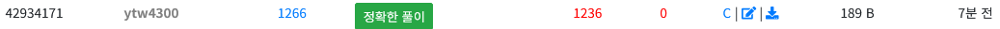

## 수업 내용 정리

### 메모리 구조

프로그램을 실행하려면 메모리에 프로그램이 로드되어야 한다.

메모리에는 프로그램에서 용도에 따라 사용되는 공간을 5가지 영역으로 나눌 수 있다.

---
#### text 영역
- 프로그램의 실제 코드(기계어)가 저장되는 영역이다. 
- 메모리의 가장 낮은 주소에 저장된다.
- 프로그램이 종료될 때까지 메모리에 저장된다.
<br>

#### data 영역
- **GVAR**(초기화된 전역 변수와 정적 변수)이 저장되는 영역이다.
- 프로그램이 종료될 때까지 메모리에 저장된다.
<br>

#### bss 영역
- **초기화되지 않은** 전역 변수나 정적 변수들이 저장되는 영역이다.
- 프로그램 실행 시 그 값이 0으로 초기화된다.
- 실행 파일에 저장되지 않는다.
<br>

#### heap 영역
- 동적으로 할당되는 메모리 영역이다.
- 선입선출(FIFO, First In First Out) 방식이다.
- 런타임 시 크기가 결정된다.
<br>

#### stack 영역
- 함수 호출과 지역 변수 선언 시에 사용되는 영역이다.
- 함수마다 스택 프레임이 생성되며 함수 반환 시 소멸된다.
- 후입선출(LIFO, Last In First Out) 구조이다.
<br>

---
### 컴파일

전처리 -> 컴파일 -> 어셈블리 -> 링킹

#### gcc

`-S` : 어셈블리어 파일로 컴파일  
`-c` : 오브젝트 파일로 컴파일  
`-o` : 실행 파일로 컴파일

---
### 인터프리터

소스 코드 -> 토큰 -> AST


#### Lexer

소스 코드를 받아 식을 식별자, 상수, 연산자 등으로 나누어 토큰으로 반환한다.

```Python
# 예시
x = 7 - 3 + 1
```

위 코드에서는 `x`는 식별자, `=`, `-`, `+`는 연산자, `7`, `3`, `1`은 상수가 된다.
<br>

---

#### Parser

Lexer로 나눈 토큰들을 추상 구문 트리(AST) 형태로 만든다.

위 식을 예로 들자면, 식별자 `x`, 대입 연산자 `=`, 연산식 중에서 연산식을 연산하는 값들을 연산자의 자식으로 나타내어 트리 형태로 만든다.

파이썬으로는 아래와 같이 나타낼 수 있다.

```Python
import ast
code = """
x = 7 - 3 + 1
"""

tree = ast.parse(code)
print(ast.dump(tree))
```

---

## Codeup 문제 정리



### 1266 | n개의 수의 합

[문제 링크](https://codeup.kr/problem.php?id=1266)

### 문제

수의 개수  n이 주어지고, 그 다음 줄에 무작위로 n개의 정수가 입력된다.

n개의 수의 합을 출력하시오.

### 풀이 

반복문을 통해 n개의 수를 입력받아 총합을 출력하였다.

### 코드

```c
#include <stdio.h>

int main() {
	int n, num, sum = 0;
	scanf("%d", &n);

	for (int i = 0; i < n; i++) {
		scanf("%d", &num);
		sum += num;
	}

	printf("%d", sum);
	return 0;
}
```

### 컴파일

```
gcc -o test test.c
```

`gcc`의 `-o` 옵션을 사용하여 `test`라는 이름의 실행 파일로 컴파일 해주었다.