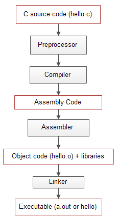
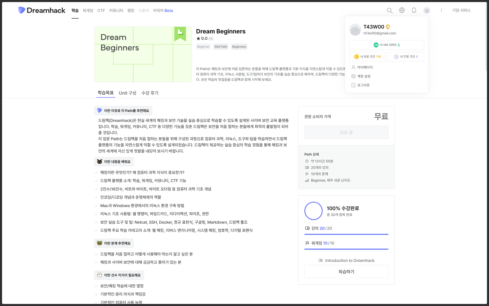

## 수업 내용 정리

### 메모리 구조

프로그램을 실행하려면 메모리에 프로그램이 로드되어야 한다.

메모리에는 프로그램에서 용도에 따라 사용되는 공간을 5가지 영역으로 나눌 수 있다.


---
#### text 영역
- 프로그램의 실제 코드(기계어)가 저장되는 영역이다. 
- 메모리의 가장 낮은 주소에 저장된다.
- 프로그램이 종료될 때까지 메모리에 저장된다.

<br>

#### data 영역
- **GVAR**(초기화된 전역 변수와 정적 변수)이 저장되는 영역이다.
- 프로그램이 종료될 때까지 메모리에 저장된다.

<br>

#### bss 영역
- **초기화되지 않은** 전역 변수나 정적 변수들이 저장되는 영역이다.
- 프로그램 실행 시 그 값이 0으로 초기화된다.
- 실행 파일에 저장되지 않는다.

<br>

#### heap 영역
- 동적으로 할당되는 메모리 영역이다.
- 선입선출(FIFO, First In First Out) 방식이다.
- 런타임 시 크기가 결정된다.

<br>

#### stack 영역
- 함수 호출과 지역 변수 선언 시에 사용되는 영역이다.
- 함수마다 스택 프레임이 생성되며 함수 반환 시 소멸된다.
- 후입선출(LIFO, Last In First Out) 구조이다.

<br>

---
### 컴파일



C언어에서의 컴파일은 전처리 과정에서 주석과 띄어쓰기를 제외한 뒤, 필요한 헤더 파일을 소스 코드로 복사하여 전처리된 파일인 `.i` 확장자 파일로 만든다.

이후 전처리된 파일을 저수준 언어인 어셈블리어로 변환한다. 이 과정을 컴파일이라고 하며, `.s` 확장자를 사용한다.

다음으로 저수준 언어인 어셈블리어를 기계어로 변환하는 과정을 거친다. CPU가 읽고 해석할 수 있는 오브젝트 파일로 변환되며, `.o` 확장자를 사용한다.

마지막으로, 오브젝트 파일과 프로그램 실행에 필요한 라이브러리 파일들을 결합하여 실행 파일로 만든다. 이 과정을 링킹이라고 하며, 실행 파일의 경우 운영체제나 아키텍쳐에 따라 다르다.

<br>

이 과정을 요약해보자면 아래와 같다.

> 전처리 -> 어셈블리 -> 컴파일 -> 링킹

---

#### gcc

`-S` : 어셈블리어 파일로 컴파일  
`-c` : 오브젝트 파일로 컴파일  
`-o` : 실행 파일로 컴파일

---

### 인터프리터

인터프리터는 크게 Lexer와 Parser로 구성된다.

Lexer에는 파이썬 코드가 입력되어 식별자, 상수, 연산자 등의 토큰으로 구별하여 Parser가 이를 AST라는 분석 트리를 생성한다.

#### Lexer

소스 코드를 받아 식을 식별자, 상수, 연산자 등으로 나누어 토큰으로 반환한다.

```Python
# 예시
x = 7 - 3 + 1
```

위 코드에서는 `x`는 식별자, `=`, `-`, `+`는 연산자, `7`, `3`, `1`은 상수가 된다.
<br>

---

#### Parser

Lexer로 나눈 토큰들을 추상 구문 트리(AST) 형태로 만든다.

위 식을 예로 들자면, 식별자 `x`, 대입 연산자 `=`, 연산식 중에서 연산식을 연산하는 값들을 연산자의 자식으로 나타내어 트리 형태로 만든다.


<br>

아래 파이썬 코드를 통해 확인해볼 수 있다.

```Python
import ast
code = """
x = 7 - 3 + 1
"""

tree = ast.parse(code)
print(ast.dump(tree))

# output : Module(body=[Assign(targets=[Name(id='x', ctx=Store())], value=BinOp(left=BinOp(left=Constant(value=7), op=Sub(), right=Constant(value=3)), op=Add(), right=Constant(value=1)))], type_ignores=[])
```

---

## Codeup 문제 정리


### 1266 | n개의 수의 합

[문제 링크](https://codeup.kr/problem.php?id=1266)

### 문제

수의 개수  n이 주어지고, 그 다음 줄에 무작위로 n개의 정수가 입력된다.

n개의 수의 합을 출력하시오.

### 풀이 

반복문을 통해 n개의 수를 입력받아 총합을 출력하였다.

### 코드

```c
#include <stdio.h>

int main() {
	int n, num, sum = 0;
	scanf("%d", &n);

	for (int i = 0; i < n; i++) {
		scanf("%d", &num);
		sum += num;
	}

	printf("%d", sum);
	return 0;
}
```

### 컴파일

#### 전처리

```
~/Documents/Coding via C v13.3.0-gcc
❯ gcc -E test.c -o test.i
```

`gcc`의 `-E` 옵션을 사용하여 전처리 파일을 생성하였다.

<br>

확인해보면 헤더 파일에서 가져온 함수들이 보이고, 맨 아래에는 내가 작성한 코드가 있는 것을 확인할 수 있다.

```c
...

extern int getc_unlocked (FILE *__stream) __attribute__ ((__nonnull__ (1)));
extern int getchar_unlocked (void);
# 600 "/usr/include/stdio.h" 3 4
extern int fgetc_unlocked (FILE *__stream) __attribute__ ((__nonnull__ (1)));
# 611 "/usr/include/stdio.h" 3 4
extern int fputc (int __c, FILE *__stream) __attribute__ ((__nonnull__ (2)));
extern int putc (int __c, FILE *__stream) __attribute__ ((__nonnull__ (2)));

...

# 3 "test.c"
int main() {
 int n, num, sum = 0;
 scanf("%d", &n);

 for (int i = 0; i < n; i++) {
  scanf("%d", &num);
  sum += num;
 }

 printf("%d", sum);
 return 0;
}
...
```

#### 어셈블리

```
~/Documents/Coding via C v13.3.0-gcc
❯ gcc -S test.i -o test.s
```

`gcc`의 `-S` 옵션을 사용하여 어셈블리 파일을 생성하였다.

<br>

확인해보면 전처리된 파일에 비해 짧고 간단한 형태인 어셈블리어로 변환된 것을 확인할 수 있다.

```s
        .file   "test.c"
        .text
        .section        .rodata
.LC0:
        .string "%d"
        .text
        .globl  main
        .type   main, @function
main:
.LFB0:
        .cfi_startproc
        endbr64
        pushq   %rbp
        .cfi_def_cfa_offset 16
        .cfi_offset 6, -16
        movq    %rsp, %rbp
        .cfi_def_cfa_register 6
        subq    $32, %rsp
        movq    %fs:40, %rax
        movq    %rax, -8(%rbp)
        xorl    %eax, %eax
        movl    $0, -16(%rbp)
        leaq    -24(%rbp), %rax
        movq    %rax, %rsi
        leaq    .LC0(%rip), %rax
        movq    %rax, %rdi
        movl    $0, %eax
        call    __isoc99_scanf@PLT
        movl    $0, -12(%rbp)
        jmp     .L2
.L3:
        leaq    -20(%rbp), %rax
        movq    %rax, %rsi
        leaq    .LC0(%rip), %rax
        movq    %rax, %rdi
        movl    $0, %eax
        call    __isoc99_scanf@PLT
        movl    -20(%rbp), %eax
        addl    %eax, -16(%rbp)
        addl    $1, -12(%rbp)
.L2:
        movl    -24(%rbp), %eax
        cmpl    %eax, -12(%rbp)
        jl      .L3
        movl    -16(%rbp), %eax
        movl    %eax, %esi
        leaq    .LC0(%rip), %rax
        movq    %rax, %rdi
        movl    $0, %eax
        call    printf@PLT
        movl    $0, %eax
        movq    -8(%rbp), %rdx
        subq    %fs:40, %rdx
        je      .L5
        call    __stack_chk_fail@PLT
.L5:
        leave
        .cfi_def_cfa 7, 8
        ret
        .cfi_endproc
.LFE0:
        .size   main, .-main
        .ident  "GCC: (Ubuntu 13.3.0-6ubuntu2~24.04) 13.3.0"
        .section        .note.GNU-stack,"",@progbits
        .section        .note.gnu.property,"a"
        .align 8
        .long   1f - 0f
        .long   4f - 1f
        .long   5
0:
        .string "GNU"
1:
        .align 8
        .long   0xc0000002
        .long   3f - 2f
2:
        .long   0x3
3:
        .align 8
4:
```

#### 컴파일

```
~/Documents/Coding via C v13.3.0-gcc
❯ gcc -c test.s -o test.o
```

`gcc`의 `-c` 옵션을 사용하여 오브젝트 파일을 생성하였다.

<br>

확인해보면 기계어 형태로 이루어진 바이너리 파일임을 확인할 수 있다.

```
❯ cat test.o
��UH��H�� dH�%(H�E�1��E�H�E�H��H�H�Ǹ��E��%H�E�H��H�H�Ǹ��E�E�E��E�9E�|ӋE��H�H�Ǹ��H�U�dH+%(t���%dGCC: (Ubuntu 13.3.0-6ubuntu2~24.04) 13.3.0GNU�zRx
```

<br>

`hexdump`를 통해 실제 기계어로도 확인할 수 있다.

```
❯ hexdump test.o
0000000 457f 464c 0102 0001 0000 0000 0000 0000
0000010 0001 003e 0001 0000 0000 0000 0000 0000
0000020 0000 0000 0000 0000 03a0 0000 0000 0000
0000030 0000 0000 0040 0000 0000 0040 000e 000d
0000040 0ff3 fa1e 4855 e589 8348 20ec 4864 048b
0000050 2825 0000 4800 4589 31f8 c7c0 f045 0000
0000060 0000 8d48 e845 8948 48c6 058d 0000 0000
0000070 8948 b8c7 0000 0000 00e8 0000 c700 f445
0000080 0000 0000 25eb 8d48 ec45 8948 48c6 058d
0000090 0000 0000 8948 b8c7 0000 0000 00e8 0000
00000a0 8b00 ec45 4501 83f0 f445 8b01 e845 4539
00000b0 7cf4 8bd3 f045 c689 8d48 0005 0000 4800
00000c0 c789 00b8 0000 e800 0000 0000 00b8 0000
00000d0 4800 558b 64f8 2b48 2514 0028 0000 0574
00000e0 00e8 0000 c900 25c3 0064 4700 4343 203a
00000f0 5528 7562 746e 2075 3331 332e 302e 362d
0000100 6275 6e75 7574 7e32 3432 302e 2934 3120
0000110 2e33 2e33 0030 0000 0004 0000 0010 0000
0000120 0005 0000 4e47 0055 0002 c000 0004 0000
0000130 0003 0000 0000 0000 0014 0000 0000 0000
0000140 7a01 0052 7801 0110 0c1b 0807 0190 0000
0000150 001c 0000 001c 0000 0000 0000 00a7 0000
0000160 4500 100e 0286 0d43 0206 0c9e 0807 0000
0000170 0000 0000 0000 0000 0000 0000 0000 0000
0000180 0000 0000 0000 0000 0001 0000 0004 fff1
0000190 0000 0000 0000 0000 0000 0000 0000 0000
00001a0 0000 0000 0003 0001 0000 0000 0000 0000
00001b0 0000 0000 0000 0000 0000 0000 0003 0005
00001c0 0000 0000 0000 0000 0000 0000 0000 0000
00001d0 0008 0000 0012 0001 0000 0000 0000 0000
00001e0 00a7 0000 0000 0000 000d 0000 0010 0000
00001f0 0000 0000 0000 0000 0000 0000 0000 0000
0000200 001c 0000 0010 0000 0000 0000 0000 0000
0000210 0000 0000 0000 0000 0023 0000 0010 0000
0000220 0000 0000 0000 0000 0000 0000 0000 0000
0000230 7400 7365 2e74 0063 616d 6e69 5f00 695f
0000240 6f73 3963 5f39 6373 6e61 0066 7270 6e69
0000250 6674 5f00 735f 6174 6b63 635f 6b68 665f
0000260 6961 006c 0000 0000 002c 0000 0000 0000
0000270 0002 0000 0003 0000 fffc ffff ffff ffff
0000280 0039 0000 0000 0000 0004 0000 0005 0000
0000290 fffc ffff ffff ffff 0050 0000 0000 0000
00002a0 0002 0000 0003 0000 fffc ffff ffff ffff
00002b0 005d 0000 0000 0000 0004 0000 0005 0000
00002c0 fffc ffff ffff ffff 007b 0000 0000 0000
00002d0 0002 0000 0003 0000 fffc ffff ffff ffff
00002e0 0088 0000 0000 0000 0004 0000 0006 0000
00002f0 fffc ffff ffff ffff 00a1 0000 0000 0000
0000300 0004 0000 0007 0000 fffc ffff ffff ffff
0000310 0020 0000 0000 0000 0002 0000 0002 0000
0000320 0000 0000 0000 0000 2e00 7973 746d 6261
0000330 2e00 7473 7472 6261 2e00 6873 7473 7472
0000340 6261 2e00 6572 616c 742e 7865 0074 642e
0000350 7461 0061 622e 7373 2e00 6f72 6164 6174
0000360 2e00 6f63 6d6d 6e65 0074 6e2e 746f 2e65
0000370 4e47 2d55 7473 6361 006b 6e2e 746f 2e65
0000380 6e67 2e75 7270 706f 7265 7974 2e00 6572
0000390 616c 652e 5f68 7266 6d61 0065 0000 0000
00003a0 0000 0000 0000 0000 0000 0000 0000 0000
*
00003e0 0020 0000 0001 0000 0006 0000 0000 0000
00003f0 0000 0000 0000 0000 0040 0000 0000 0000
0000400 00a7 0000 0000 0000 0000 0000 0000 0000
0000410 0001 0000 0000 0000 0000 0000 0000 0000
0000420 001b 0000 0004 0000 0040 0000 0000 0000
0000430 0000 0000 0000 0000 0268 0000 0000 0000
0000440 00a8 0000 0000 0000 000b 0000 0001 0000
0000450 0008 0000 0000 0000 0018 0000 0000 0000
0000460 0026 0000 0001 0000 0003 0000 0000 0000
0000470 0000 0000 0000 0000 00e7 0000 0000 0000
0000480 0000 0000 0000 0000 0000 0000 0000 0000
0000490 0001 0000 0000 0000 0000 0000 0000 0000
00004a0 002c 0000 0008 0000 0003 0000 0000 0000
00004b0 0000 0000 0000 0000 00e7 0000 0000 0000
00004c0 0000 0000 0000 0000 0000 0000 0000 0000
00004d0 0001 0000 0000 0000 0000 0000 0000 0000
00004e0 0031 0000 0001 0000 0002 0000 0000 0000
00004f0 0000 0000 0000 0000 00e7 0000 0000 0000
0000500 0003 0000 0000 0000 0000 0000 0000 0000
0000510 0001 0000 0000 0000 0000 0000 0000 0000
0000520 0039 0000 0001 0000 0030 0000 0000 0000
0000530 0000 0000 0000 0000 00ea 0000 0000 0000
0000540 002c 0000 0000 0000 0000 0000 0000 0000
0000550 0001 0000 0000 0000 0001 0000 0000 0000
0000560 0042 0000 0001 0000 0000 0000 0000 0000
0000570 0000 0000 0000 0000 0116 0000 0000 0000
0000580 0000 0000 0000 0000 0000 0000 0000 0000
0000590 0001 0000 0000 0000 0000 0000 0000 0000
00005a0 0052 0000 0007 0000 0002 0000 0000 0000
00005b0 0000 0000 0000 0000 0118 0000 0000 0000
00005c0 0020 0000 0000 0000 0000 0000 0000 0000
00005d0 0008 0000 0000 0000 0000 0000 0000 0000
00005e0 006a 0000 0001 0000 0002 0000 0000 0000
00005f0 0000 0000 0000 0000 0138 0000 0000 0000
0000600 0038 0000 0000 0000 0000 0000 0000 0000
0000610 0008 0000 0000 0000 0000 0000 0000 0000
0000620 0065 0000 0004 0000 0040 0000 0000 0000
0000630 0000 0000 0000 0000 0310 0000 0000 0000
0000640 0018 0000 0000 0000 000b 0000 0009 0000
0000650 0008 0000 0000 0000 0018 0000 0000 0000
0000660 0001 0000 0002 0000 0000 0000 0000 0000
0000670 0000 0000 0000 0000 0170 0000 0000 0000
0000680 00c0 0000 0000 0000 000c 0000 0004 0000
0000690 0008 0000 0000 0000 0018 0000 0000 0000
00006a0 0009 0000 0003 0000 0000 0000 0000 0000
00006b0 0000 0000 0000 0000 0230 0000 0000 0000
00006c0 0034 0000 0000 0000 0000 0000 0000 0000
00006d0 0001 0000 0000 0000 0000 0000 0000 0000
00006e0 0011 0000 0003 0000 0000 0000 0000 0000
00006f0 0000 0000 0000 0000 0328 0000 0000 0000
0000700 0074 0000 0000 0000 0000 0000 0000 0000
0000710 0001 0000 0000 0000 0000 0000 0000 0000
0000720
```

#### 링킹

```
~/Documents/Coding via C v13.3.0-gcc
❯ gcc test.o -o test
```

`gcc`의 `-o` 옵션을 사용하여 실행 파일을 생성하였다.

<br>

실행해보면 잘 실행되는 것을 확인할 수 있다.

```
~/Documents/Coding via C v13.3.0-gcc
❯ ./test
4
1
2
3
4
10
```

---

## Dreamhack Beginners 학습

