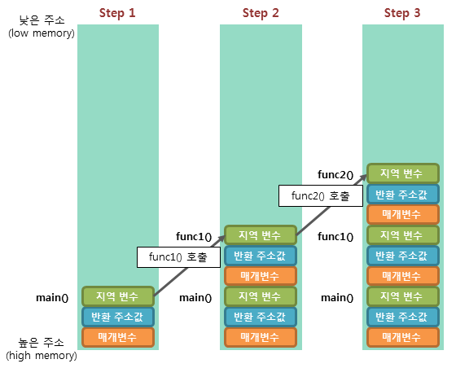

## 수업 내용 블로그 정리

<br>

### 리버싱이란?

리버싱은 리버스 엔지니어링(Reverse Engineering)의 약자로, RCE(Reverse Code Engineering)라고도 부른다.

말 그대로 역으로 엔지니어링을 하는 행위이다. 컴퓨터에서 엔지니어링이라고 하면 프로그램을 **개발**하는 것이라고 할 수 있는데, 개발을 역으로 하면 완성된 프로그램을 **해체**하고 **분석**하여 프로그램의 이해를 목표로 하는 행위이다.

#### 분석 방법

리버스 엔지니어링에서는 분석하는 방법을 크게 두 가지로 나눌 수 있다.

- 정적 분석 : 프로그램 파일의 기계어나 디스어셈블된 어셈블리어, 혹은 디컴파일된 의사 코드를 통해 코드를 분석한다. 소스 코드를 보고 프로그램의 동작을 이해하는 것과 비슷하다고 할 수 있다.

- 동적 분석 : 프로그램을 실행하여 레지스터나 프로세스의 메모리 등을 통해 분석한다. 디버깅과 같은 작업이 이에 해당한다.

<br>

--- 

<br>

### x86-64 아키텍처란?

먼저 아키텍처는 명령어를 처리하는 CPU의 구조를 말하며, 용도에 따라 여러 종류가 있다.

|   |x86|x86-64|ARM|ARM64|
|---|---|---|---|---|
|레지스터 크기|32bit|64bit|32bit|64bit|
|레지스터 종류|eax, ebx|rax, rbx|R0 ~ R15|X0 ~ X30|
|용도|임베디드, 32비트 호환용|데스크탑, 노트북, 서버|저전력 임베디드 시스템, 스마트폰, 태블릿, IoT| 고성능 저전력 스마트폰, 노트북|


여기서 `x86-64` 아키텍처는 에뮬레이션 없이 `x86`을 지원하는 `64bit` 아키텍처이다. `x86` 아키텍처만 존재하던 시절에 `x86-64` 아키텍처의 등장으로 오랜 기간 동안 구형 프로그램의 호환을 유지할 수 있었다.

`x86-64` 아키텍처를 사용하는 프로세서는 대표적으로 Intel과 AMD의 프로세서가 있다.

<br>

#### WORD란?

위에서 아키텍처를 레지스터 크기에 따라 분류하였는데, 이 레지스터 크기, 즉 CPU가 한 번에 처리할 수 있는 데이터의 크기를 `WORD`라고 한다.

하지만 자료형을 나타내는 `WORD`는 전통적으로 초기 컴퓨터의 레지스터 크기인 `16bit`, 즉 `2byte`를 나타낸다.

`WORD`의 2배, 4배 크기를 나타내는 `DWORD`, `QWORD` 또한 존재한다.

<br>

#### Registers

64비트와 32비트 모두 용도는 같기 때문에 혼동을 방지하기 위해 prefix는 생략하였다.

<br>

##### 범용 레지스터

말 그대로 범용적으로 사용하는 레지스터이다. 주로 사용되는 용도가 있다.

- AX (Accumulator Register) : 산술 및 논리 연산에 주로 사용되며, 함수의 반환값을 저장한다.
- BX (Base Register) : 메모리 주소 계산에 주로 사용된다.
- CX (Counter Register) : 반복적인 연산에서 루프 제어를 사용할 때 카운터로 사용된다.
- DX (Data Register) : 큰 수의 곱셈과 나눗셈에서 AX 레지스터를 보조하여 사용된다.
- DI (Destination Index) : 문자열 처리나 배열의 인덱스로 사용되며, 문자열 복사나 비교에서 대상의 인덱스를 가리킨다.  
- SI (Source Index) : 문자열 처리나 배열의 인덱스로 사용되며, 문자열 복사나 비교에서 원본 데이터를 가리킨다.

<br>

##### 포인터 레지스터

말 그대로 특정 메모리의 위치를 카리키는 포인터 역할을 하는 레지스터이다.

- SP (Stack Pointer) : 스택의 최상단(가장 낮은 주소)을 가리킨다.
- BP (Base Pointer) : 스택의 최하단(가장 높은 주소)을 가리킨다.
- IP (Instruction Pointer) : 다음에 실행될 명령어의 주소를 가리킨다.

<br>

##### 세그먼트 레지스터

세그먼트에 접근하기 위한 레지스터이다.

- CS (Code Segment) : 코드 영역을 가리킨다.
- DS (Data Segment) : 데이터 영역을 가리킨다.
- SS (Stack Segment) : 스택 영역을 가리킨다.
- ES (Extended Segment) : 추가적인 영역으로 문자열이나 데이터를 처리할 때 사용한다.
- GS (General Segment) : 일반적으로 사용되는 세그먼트 레지스터로, 주로 스레드에 관련된 데이터가 저장된다.
- FS (Frame segment) : 스택 프레임을 관리하는 데 사용되며, 함수 호출 시 스택 구조를 처리할 때 주로 사용된다.

<br>

##### 플래그 레지스터

산술 연산 결과의 상태를 저장하거나 외부 인터럽트나 데이터의 흐름을 관리하는 레지스터이다.

<br>

###### 상태 플래그

- ZF (Zero Flag) : 연산 결과가 0일 때 설정된다.
- CF (Carry Flag): Unsigned overflow가 발생할 때 설정된다.
- OF (Overflow Flag) : Signed overflow가 발생할 때 설정된다.
- SF (Sign Flag) : 연산 결과의 부호 비트와 같게 설정된다.
- AF (Auxiliary Flag) : 연산 결과의 하위 4bit에 Unsigned overflow가 발생할 때 설정된다.
- PF (Parity Flag) : 연산 결과의 1인 비트의 합이 짝수일 때 설정된다.

<br>
 
###### 컨트롤 플래그

- TF (Trap Flag) : 명령어를 한 줄 실행할 때마다 인터럽트를 발생시킨다. (예로 디버거의 `한 줄씩 실행` 등에서 사용된다.)
- IF (Interrupt enable Flag) : 1일 때는 외부 인터럽트가 무시되고, 0일 때는 외부 인터럽트를 받아들인다. (외부 인터럽트는 사용자의 키보드 입력과 같은 하드웨어의 신호를 의미한다.)
- DF (Direction Flag) : 0일 때는 데이터 주소를 가리키는 레지스터의 값이 증가하고, 1일 때는 감소한다.

    이해가 잘 안 되어서 찾아보았더니 아래와 같이 쓰인다고 한다. 디버깅 할 때 자주 보았던 것 같다.

```s
CLD         ; DF = 0
MOVSB       ; [ES:DI] ← [DS:SI], SI++, DI++

STD         ; DF = 1
MOVSB       ; [ES:DI] ← [DS:SI], SI--, DI--
```

<br>

---

<br>

## 어셈블리어로 출력 반복문 작성

### 코드

```s
section .data                       ; 데이터 영역에 초기화된 전역 변수 저장
        msg db "Hello Layer7", 0xA  ; 출력할 문자열과 개행 문자 (0xA : '\n') 저장
        len equ $ - msg             ; 문자열 길이 저장 (= 현재 주소 - 문자열 주소)

section .text                       ; 텍스트 영역에 실행할 코드 저장
        global _start               ; 시작 함수 선언

_start:                             ; _start 함수 코드 시작
        mov cl, 12                  ; 카운터에 12 저장
        call print                  ; print 함수 호출
        mov eax, 1                  ; 첫 번째 인자 설정 (1 : sys_exit)
        xor ebx, ebx                ; 두 번째 인자 설정 (0 : EXIT_SUCCESS)
        int 0x80                    ; 시스템 호출

print:                              ; print 함수 코드 시작
        push ecx                    ; 카운터 스택에 저장
        mov eax, 4                  ; 첫 번째 인자 설정 (4 : sys_write)
        mov ebx, 1                  ; 두 번째 인자 설정 (1 : stdout)
        mov ecx, msg                ; 세 번째 인자 설정 (출력할 문자열)
        mov edx, 14                 ; 네 번째 인자 설정 (문자열 길이)
        int 0x80                    ; 시스템 호출

        pop ecx                     ; 스택에 저장한 카운터 복구
        loop print                  ; 카운터 1 감소 및 0이 될 때 까지 반복
        ret                         ; 반환
```

### 풀이

대부분의 내용은 주석으로 작성하였기에 필요한 일부만 풀이하였다.

1. `$`는 현재 코드의 주소를 의미한다. `$ - msg`는 msg 문자열의 바로 다음 줄인 현재 코드의 주소에서 문자열의 주소를 빼서 문자열의 길이를 구할 수 있다.

2. 시스템 호출은 `System Call Table`을 참조하여 각각의 인자를 찾아서 작성하였다.

3. `print` 함수를 호출할 때 `ecx`를 스택에 저장하고 시스템 호출 뒤에 다시 복구한 이유는 `print` 함수를 호출하면서 세 번째 인자로 `ecx`가 쓰이기 때문에 카운트 된 값은 스택에 저장해두었다.

<br>

---

<br>

## x86-64 함수 호출 규약이란?

함수를 호출할 때 인자를 전달하는 방식에 대한 약속이다.

크게 세 가지로 나눌 수 있고, 64bit에서는 오로지 하나의 함수 호출 규약만 지원한다.

<br>

### __cdecl

C declaration의 약자로, C언어에서 기원한 호출 규약이다.

C언어에서 사용되며, 인자를 역순으로 스택에 저장한다.

함수 호출이 반환되면 **호출자**(해당 함수를 호출한 함수)가 스택에서 인자들을 제거하여 Stack Pointer를 원상복구 시킨다.

<br>

### __stdcall

Win32 API, C++ 등의 표준 규약이다.

인자를 역순으로 스택에 저장한다.

함수 호출이 반환되면 **피호출자**(호출된 함수)가 스택에서 인자들을 제거하여 Stack Pointer를 원상복구 시킨다.

<br>

### __fastcall

표준화된 규약이 아니라서 컴파일러에 따라 처리가 다르다.

첫 번째와 두 번째 인자는 각각 `ECX`, `EDX`에 저장하고 나머지는 역순으로 스택에 저장한다.

함수 호출이 반환되면 **호출자**(해당 함수를 호출한 함수)가 스택에서 인자들을 제거하여 Stack Pointer를 원상복구 시킨다.

<br>

---

<br>

## 함수 프롤로그 및 에필로그란?

함수에서의 프롤로그와 에필로그는 각각 함수의 시작 전과 함수의 반환 전 스택 프레임을 설정해주는 것을 말한다. 

<br>

### 스택 프레임이란?

함수가 호출될 때 생성되고, 반환될 때 해제되는 공간으로, 함수마다의 스택 영역을 구분한다.

스택 프레임에는 다음과 같은 값들이 저장된다.

- RET (RETurn address)
- SFP (이전 함수의 Base Pointer)
- 지역 변수 및 인자



<br>

### 함수 프롤로그

```
push ebp        ; 호출 전 함수의 Base Pointer를 스택에 저장
mov ebp, esp    ; Base Pointer를 Stack Pointer 값으로 저장
```

위와 같이 스택 프레임을 생성할 때 설정하는 과정을 프롤로그라고 한다.

Stack Pointer


<br>

### 함수 에필로그

```
leave
ret
```

위와 같이 스택 프레임을 복구하고 반환하는 과정을 에필로그라고 한다.

<br>

`leave`와 `ret` 명령어가 내부적으로 실행하는 명령어는 아래와 같다.

```
mov esp, ebp    ; Stack Pointer를 Base Pointer(Frame Pointer)로 복구
pop ebp         ; 해당 함수 호출 전 Base Pointer 복구
pop eip         ; RET eip에 저장
jmp eip         ; RET로 이동
```

<br>

### 정리

프롤로그에서 기존 Base Pointer를 스택에 저장한 뒤 Base Pointer를 Stack Pointer로 설정한다.

함수가 진행됨에 따라 Stack Pointer가 감소하면서 Base Pointer부터 낮은 주소에 값이 쌓이게 된다.

함수 진행 중 함수가 호출되면 감소된 Stack Pointer가 Base Pointer가 되고 그 주소부터 다시 낮은 주소로 값이 쌓인다.

따라서 호출 전 함수의 값들은 사라지지 않고 새로운 스택 프레임이 생성된다.

에필로그에서는 자라난 스택을 원래 Stack Pointer 위치를 새 스택 프레임의 포인터로 복구하면서 다음 명령어로 이동한다.
