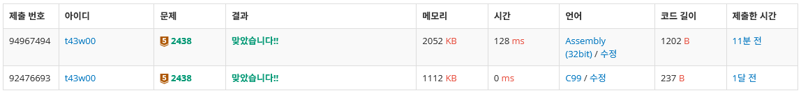
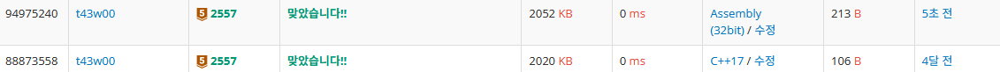
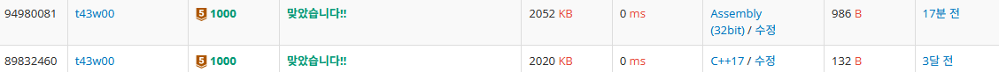
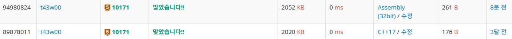
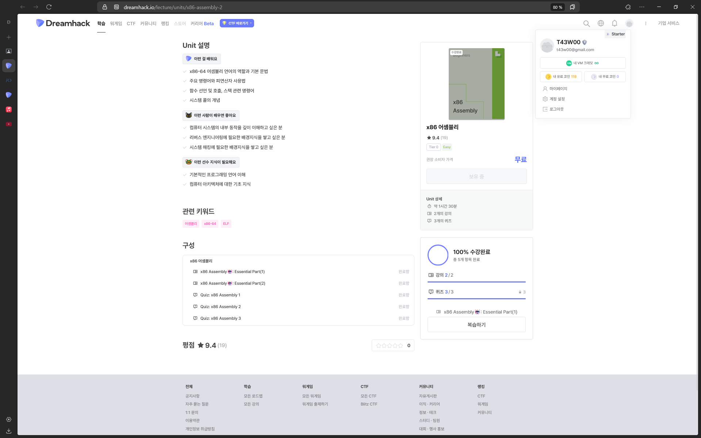

## 수업 내용 정리

### Calling Convention 

호출 규약은 함수를 호출할 때 인자를 전달하는 방식이다.

호출 규약은 여러 가지가 있는데, 아키텍처마다도 다르다.

`x86` : 스택을 사용하여 인자를 전달한다. 예로는 `cdecl`, `stdcall`, `fastcall` 등이 있다.

`x64` : 인자로 레지스터를 사용하는 경우가 많고, 인자가 많은 경우에는 스택을 사용한다. 예로는 `SYSV`, `MSCV` 등이 있다.

<br>

### cdecl (x86)


cdecl에서는 함수가 호출되면 인자를 스택에 저장하고, RET를 저장한 뒤 함수 주소로 이동하게 된다. 함수 종료시 Caller로 이동 후 스택을 정리한다.

RET가 스택에 저장되므로 BOF 공격에 이용될 수 있다.

<br>

### stdcall (x64)

Win32API에서 사용되는 호출 규약으로, Callee가 스택을 정리하기 때문에 안정성이 높지만 가변 인자를 사용할 수 없다.

<br>

### fastcall (x86)

cdecl과 다르게 fastcall은 인자 2개까지는 `ECX`와 `EDX`에 저장해서 전달할 수 있다. 나머지는 스택을 이용해 전달한다.

<br>

### SYSV (x64)

리눅스에서 사용되는 호출 규약으로 스택은 16byte씩 저장된다. 

<br>

---

<br>

## 백준 5문제 선택 풀이 후 x86asm으로 풀이

<br>

### 2438 | 별 찍기 - 1



<br>

#### 문제

[문제 링크](https://www.acmicpc.net/problem/2438)

첫째 줄에는 별 1개, 둘째 줄에는 별 2개, N번째 줄에는 별 N개를 찍는 문제

<br>

#### Clang 코드

```c
#include <stdio.h>

int main() {

  int n;

  scanf("%d", &n);

  for (int i = 0; i < n; i++) {
    for (int j = 0; j <= i; j++) {
      putchar('*');
    }
    putchar('\n');
  }

  return 0;
}
```

#### 풀이

이중 반복문으로 간단히 구현할 수 있다. 외부 반복문에서는 개행을 출력하고 내부 반복문에서는 별을 출력하도록 하였다.

<br>

#### x86asm 코드

```s
section .data
        star db '*'
        newline db 0x0A
        num db 4 dup(0)

section .text
        global main

main:
        call read
        call str_to_int
        call main_
        mov eax, 0
        ret

read:
        mov eax, 3
        mov ebx, 0
        mov ecx, num
        mov edx, 4
        int 0x80

str_to_int:
        xor ecx, ecx
        mov esi, num
        call .loop      
        ret

.loop:
        movzx edx, byte [esi]
        sub edx, 0x30
        imul ecx, ecx, 10
        add ecx, edx
        inc esi
        cmp byte[esi], 0x0A
        jne .loop
        ret
        
main_:
        xor eax, eax
        call .loop
        ret
        
.loop:
        push ecx
        inc eax
        mov ecx, eax
        push eax
        call .loop_
        call print_newline
        pop eax
        pop ecx
        loop .loop
        ret

.loop_:
        push ecx
        call print_star
        pop ecx
        loop .loop_
        ret

print_star:
        mov eax, 4
        mov ebx, 1
        mov ecx, star
        mov edx, 1
        int 0x80
        ret

print_newline:
        mov eax, 4
        mov ebx, 1
        mov ecx, newline
        mov edx, 1
        int 0x80
        ret
```

#### 풀이

`data section`에는 출력할 별과 개행 문자, 숫자를 입력받을 버퍼(3자리 + 개행 문자 = 4byte)를 선언해주었다.

백준 온라인 저지에서는 `main` 함수에서 `0`이 반환되어야 정상적으로 종료되기 때문에 시작 함수를 `main`으로 선언하였다.

`main` 함수에서는 `read`, `str_to_int`, `main_` 순으로 호출한 뒤 `eax`에 0을 저장하여 반환하였다. (`return 0;`)

`read` : `sys_read()`를 호출하여 입력받은 숫자(문자열)를 `num`에 저장하였다.

`str_to_int` : 입력받은 문자열을 숫자로 변환하는 함수를 구현하였다. `esi`에 `num`의 포인터를 저장해두고 한 바이트씩 가져와 `0x30`을 빼서 원래 숫자 값을 구하고 `10`을 곱해 저장하는 것을 개행 문자까지 반복하였다.

`main_` : 외부 반복문에서는 `ecx`를 카운터로 사용하여 `num` 만큼 내부 반복문을 호출하고 개행 문자를 출력하는 것을 반복하였다. 내부 반복문에서는 `eax`를 카운터로 사용하여 `ecx`에 복사한 뒤 별을 반복하여 출력하도록 하였다.

<br>

### 2557 | Hello World



<br>

#### 문제

[문제 링크](https://www.acmicpc.net/problem/2557)

Hello World!를 출력하시오.

<br>

#### Clang 코드

```c
#include <stdio.h>

int main() {
        printf("Hello World!");
        return 0;
}
```

#### 풀이

"Hello World!"를 출력하였다.

<br>

#### x86asm 코드

```s
section .data
        msg db "Hello World!"

section .text
        global main

main:
        mov eax, 4
        mov ebx, 1
        mov ecx, msg
        mov edx, 12
        int 0x80

        mov eax, 0
        ret
```
#### 풀이

`msg` 변수에 "Hello World!"를 저장하고 `sys_write`를 호출하여 출력하였다.

<br>

### 1000 | A+B



#### 문제

[문제 링크](https://www.acmicpc.net/problem/1000)

두 정수 A와 B를 입력받은 다음, A+B를 출력하는 프로그램을 작성하시오.

#### Clang 코드

```c
#include <stdio.h>

int main() {
    int a, b;
    
    scanf("%d %d", &a, &b);
    printf("%d", a + b);
    
    return 0;
}
```

<br>

#### 풀이

`a`와 `b`를 입력받아 합을 출력하였다.

<br>

#### x86asm 코드

```s
section .data
        num db 3 dup(0)
        buf db 2 dup(0)

section .text
        global main
        
main:
        call read
        call main_

        mov eax, 0
        ret

read:
        mov eax, 3
        mov ebx, 0
        mov ecx, num
        mov edx, 3
        int 0x80
        ret

main_:
        movzx eax, byte [num]
        movzx ecx, byte [num+2]
        add eax, ecx
        sub eax, 0x60        

        cmp eax, 10
        jae .tmp

        add eax, 0x30
        mov byte [buf], 0
        mov byte [buf+1], al
        
        mov esi, buf
        inc esi
        
        call print2
        ret

.tmp:
        add eax, 0x26
        mov byte [buf], 0x31
        mov byte [buf+1], al
        
        call print1
        ret

print1:
        mov eax, 4
        mov ebx, 1
        mov ecx, buf
        mov edx, 2
        int 0x80
        ret
        
print2:
        mov eax, 4
        mov ebx, 1
        mov ecx, esi
        mov edx, 1
        int 0x80
        ret
```

<br>

#### 풀이

`main` 함수에서 `read` 함수와 `main_` 함수를 호출하였다.

`read` : `sys_read()`를 호출하도록 하였다.

`main_` : 입력받은 3 바이트짜리 버퍼에서 첫 번째 바이트와 마지막 바이트를 가져와 더해주었다. 만약 10 이상이면 두 자리로 바꾸어 출력하고 아니면 한 자리만 출력하도록 하였다.

<br>

### 10171 | 고양이



#### 문제

[문제 링크](https://www.acmicpc.net/problem/10171)

아래 예제와 같이 고양이를 출력하시오.

<br>

#### Clang 코드

```c
#include <stdio.h>

int main() {
    printf("\\    /\\\n )  ( ')\n(  /  )\n \\(__)|\n");
    return 0;
}
```

#### 풀이

이스케이프 문자를 통해 특수 문자를 빠짐없이 출력하였다.

<br>

#### x86asm 코드

```s
section .data
        msg db "\    /\", 0x0A, " )  ( ')", 0x0A, "(  /  )", 0x0A, " \(__)|"

section .text
        global main

main:
        mov eax, 4
        mov ebx, 1
        mov ecx, msg
        mov edx, 32
        int 0x80

        mov eax, 0
        ret
```

#### 풀이

개행 문자를 추가하여 `sys_write`를 호출하였다.

<br>


### 

<br>

---

<br>

## Dreamhack x86-assembly-2 학습

