## One by One

```
Users/t43w00/Downloads via 🐍 v3.12.3
❯ strings One_by_One | grep {
Layer7{1f_u_p1ea2e_s01v3_but_s0_har6ly}
```

플래그가 하드 코딩 되어있다.

<br>

---

<br>

## What's real?

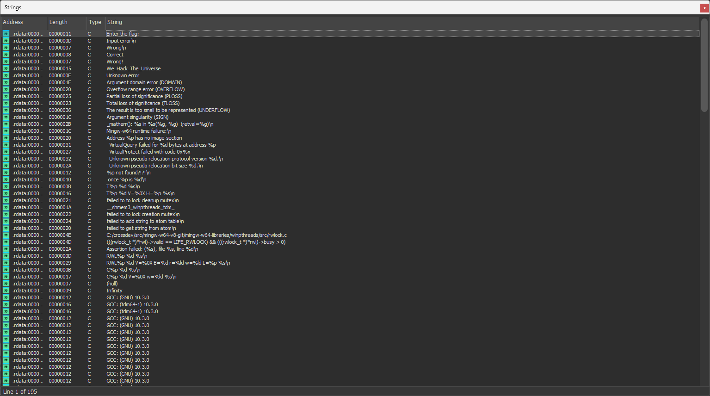

문자열들을 확인해보니까 `Wrong`과 `Correct`가 있다. 저 부분이 입력값을 검증하는 부분으로 보인다.

<br>
<br>

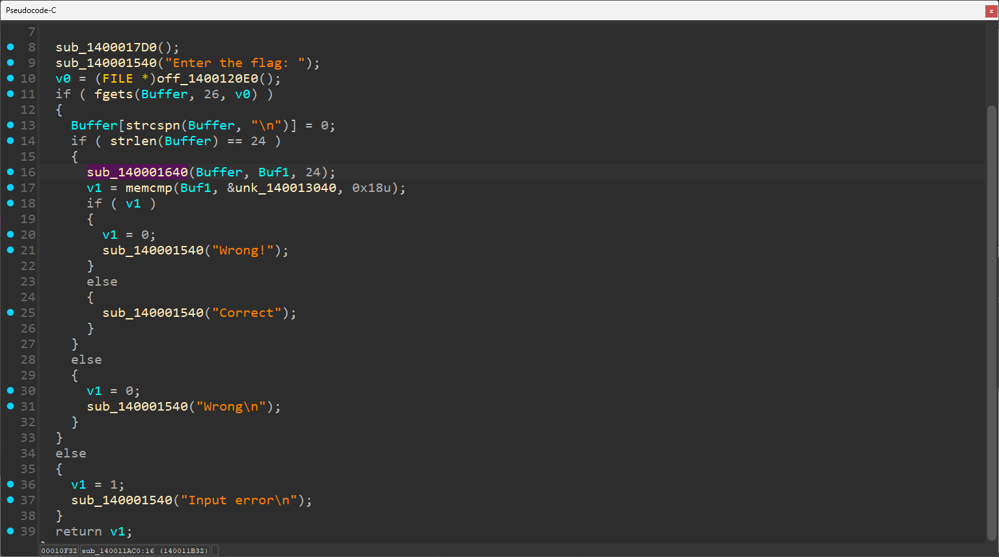

해당 부분을 보니 `sub_140001640` 함수에서 입력값을 암호화하여 비교하는 것 같다.

<br>
<br>

```c
void *__fastcall sub_140001640(__int64 a1, void *a2)
{
  void *v3; // rsp
  size_t v4; // r8
  int v5; // r10d
  __int64 v6; // r11
  int v7; // ebx
  __int64 v8; // r9
  char i; // al
  unsigned int v10; // eax
  __int64 v11; // rax
  __int64 v12; // rax
  _BYTE Src[48]; // [rsp+20h] [rbp+0h] BYREF

  v3 = alloca(sub_1400026C0());
  v7 = v4 - 1;
  if ( (int)v4 <= 0 )
  {
    if ( v7 <= 0 )
      return memcpy(a2, Src, v4);
  }
  else
  {
    v8 = 1;
    for ( i = 87; ; i = aWeHackTheUnive[v10 % 0x14] )
    {
      Src[v8 - 1] = *(_BYTE *)(v6 + v8 - 1) ^ i;
      v10 = v8++;
      if ( (_DWORD)v4 + 1 == v8 )
        break;
    }
    if ( v7 <= 0 )
      goto LABEL_9;
  }
  v11 = 0;
  do
  {
    Src[v11] += Src[v11 + 1];
    ++v11;
  }
  while ( v7 > (int)v11 );
  if ( v5 > 0 )
  {
LABEL_9:
    v12 = 0;
    do
    {
      Src[v12] = __ROR1__(Src[v12], 3);
      ++v12;
    }
    while ( v5 > (int)v12 );
  }
  return memcpy(a2, Src, v4);
}
```

코드를 보면 `a2`를 `Src`에 복사하고 `Src`를 연산 후 `a2`에 다시 복사한다. 따라서 `Src` 값의 변화를 보면 되겠다.

위 코드에서는 (`xor` 연산) -> (다음 바이트 더하기) -> (3비트 ROR) 순으로 진행되는데, 역으로 연산하여 플래그를 구할 수 있다.

<br>
<br>

Python으로 구현하였다.

```py
enc = [
   0xe3, 0x45, 0x6a, 0x08, 0xec, 0x8c, 0xc2, 0x4d,
   0x34, 0xee, 0xb4, 0x4e, 0x46, 0x2c, 0x0b, 0xee,
   0xf2, 0xcd, 0x4c, 0x2a, 0x0e, 0xab, 0xa7, 0xa6
]

key = "We_Hack_The_Universe"
res = [0] * 24

for i in range(24):
   res[i] = ((enc[i] << 3) | (enc[i] >> 5)) & 0xFF

for i in range(22, -1, -1):
   res[i] = (res[i] - res[i + 1]) & 0xFF

for i in range(24):
   if i == 0:
       res[i] = res[i] ^ 0x57
   else:
       res[i] = res[i] ^ ord(key[i % 20])

print(''.join(chr(c) for c in res))
```

<br>

---

<br>

## Layer7, Thief the monariza 

jpg 파일이 제공되었는데, 힌트가 파일 시그니쳐길래 HxD로 까봤더니 시그니쳐가 jpg의 시그니쳐가 아니라서 수정했더니 플래그가 나왔다.

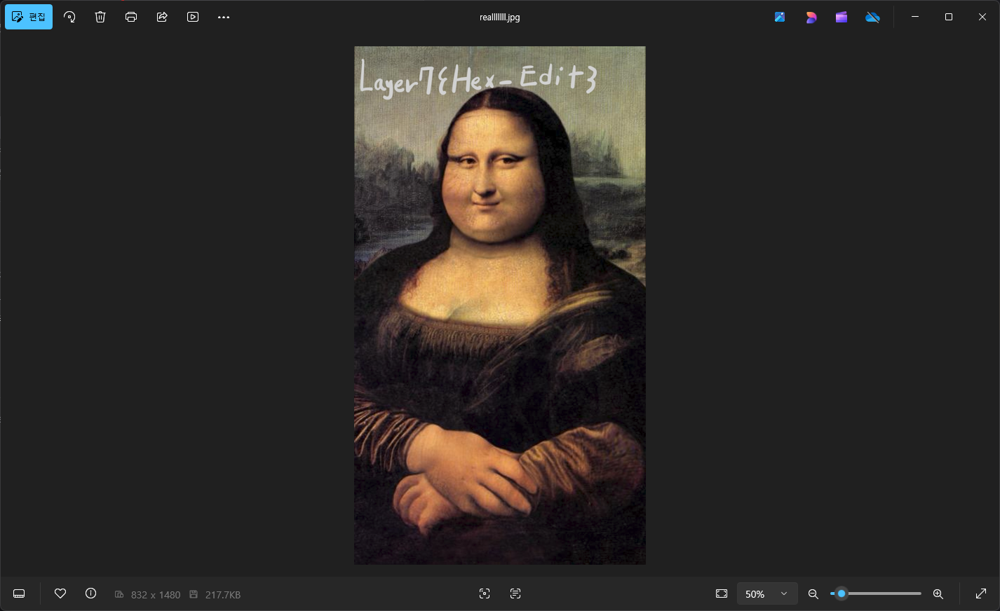

<br>

---

<br>

## YEKROX

제목이 XORKEY를 거꾸로 해서 그렇다고 한다.

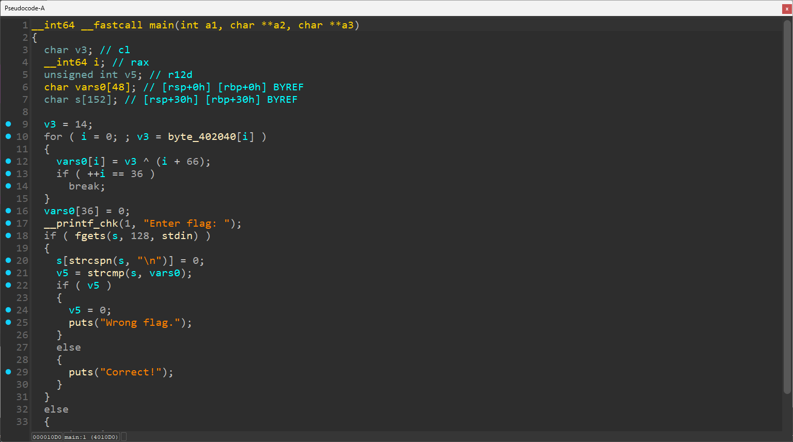

입력값을 XOR로 암호화해서 비교하는 것 같다.

<br>
<br>

```py
enc = [
    0x0e, 0x22, 0x3d, 0x20, 0x34, 0x70, 0x33, 0x20, 0x2d, 0x24, 0x13, 0x20, 0x21, 0x3b, 0x20, 0x3e, 0x3d, 0x3f,
    0x39, 0x2c, 0x33, 0x38, 0x36, 0x06, 0x3d, 0x3a, 0x25, 0x28, 0x30, 0x00, 0x15, 0x0f, 0x06, 0x06, 0x16, 0x18
]


for i in range(36):
    print(chr((i + 0x42) ^ enc[i]), end = '')
```

<br>

---

<br>

## Secret Present 

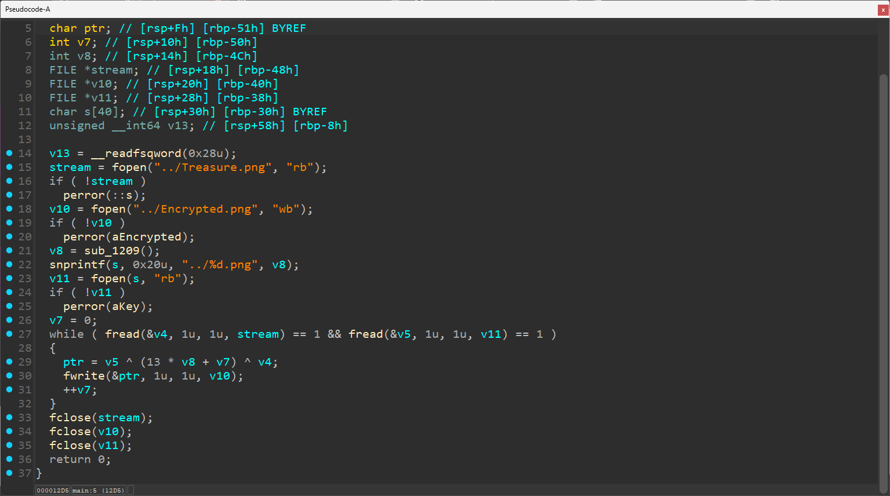

XOR 연산을 통해 파일을 암호화한다. 근데 이제 특정 키 파일을 통해서.

근데 이제 키 파일이 4개 뿐이다. 하나씩 해보면 되겠다.

```py
with open("./Encrypted.png", "rb") as encpng:
    enc = encpng.read()

with open("./3.png", "rb") as keypng:
    key = keypng.read()

dec = bytearray()

for i in range(len(enc)):
    res = (i + 3 * 13) & 0xFF
    og = (enc[i] ^ res ^ key[i]) & 0xFF
    dec.append(og)

with open("./dec.png", "wb") as decpng:
    decpng.write(dec)
```

3으로 했더니 됐다.

<br>

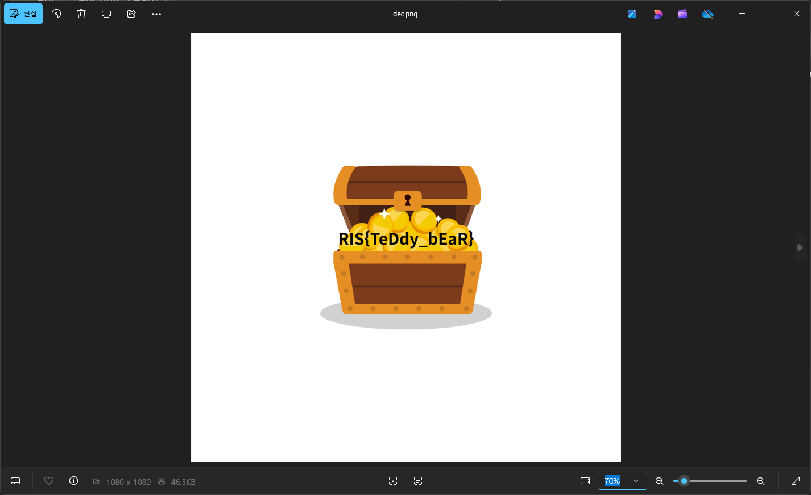

<br>

---

<br>

## XORING

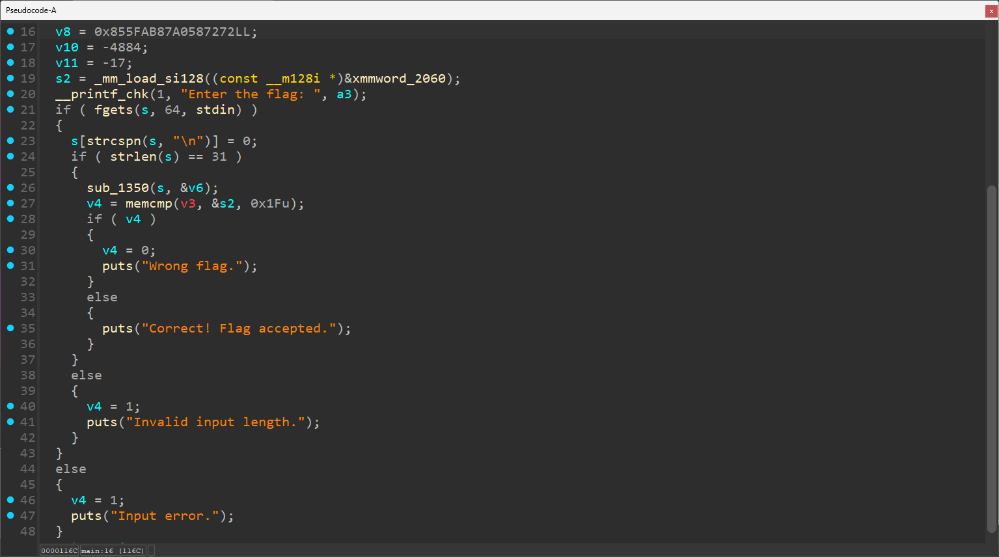

평범한 입력값 맞추는 문제같다. 

<br>
<br>

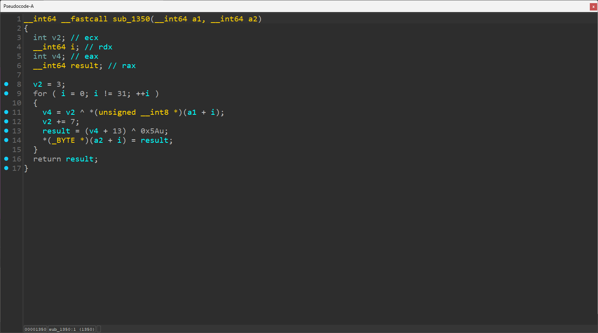

XOR 연산으로 암호화를 하나보다.

<br>
<br>

```py
enc = [
    0x06, 0x22, 0x2f, 0xd0, 0x20, 0x44, 0x39, 0x30, 0x2b, 0x67, 0x63,
    0x64, 0x12, 0x65, 0x73, 0x1a, 0x72, 0x72, 0x58, 0xa0, 0x87, 0xab,
    0x5f, 0x85, 0x81, 0x97, 0x8d, 0xec, 0xec, 0xec, 0xef
]

key = 3
for i in range(31):
    dec = (((enc[i] ^ 0x5a) - 0xd) ^ key) & 0xFF
    print(chr(dec), end = '')
    key = (key + 7) % 256
```

<br>

---

<br>

## How can i live without u 

```c
__int64 __fastcall main(int a1, char **a2, char **a3)
{
  int v3; // eax
  int v4; // edx
  int i; // eax
  char v6; // cl
  __int64 v7; // rdx
  size_t v8; // rax
  char *v9; // rdx
  char v10; // al
  __int64 j; // rax
  char *v12; // r8
  char *v13; // rdx
  int v14; // eax
  char v15; // cl
  char *v16; // rax
  int v17; // ecx
  int v18; // edx
  int v19; // esi
  __int64 k; // rsi
  int v21; // edx
  char v22; // al
  char v23; // al
  unsigned int v24; // r12d
  int v26; // [rsp+Ch] [rbp-1FCh]
  __int128 v27; // [rsp+10h] [rbp-1F8h] BYREF
  _BYTE v28[64]; // [rsp+20h] [rbp-1E8h] BYREF
  char s1[144]; // [rsp+60h] [rbp-1A8h] BYREF
  char s[280]; // [rsp+F0h] [rbp-118h] BYREF

  v3 = 0;
  v26 = 305419896;
  do
  {
    v4 = v3 ^ v26;
    v3 -= 1640531527;
    v26 = v4;
  }
  while ( v3 != -844395452 );
  for ( i = 0; i != 64; ++i )
  {
    v6 = i;
    v7 = i;
    v28[v7] = v6 ^ 0x5A;
  }
  __printf_chk(1, "Enter the flag: ");
  fflush(stdout);
  if ( fgets(s, 256, stdin) )
  {
    v8 = strcspn(s, "\n");
    v9 = (char *)&v27;
    s[v8] = 0;
    v10 = 0;
    v27 = 0;
    while ( 1 )
    {
      *v9++ = __ROL1__(~v10, 1) + 51;
      if ( v28 == v9 )
        break;
      v10 = *v9;
    }
    if ( strlen(s) != 144 )
      goto LABEL_23;
    for ( j = 0; j != 144; ++j )
      s1[j] = s[j];
    v12 = s1;
    v13 = s1;
    v14 = 0;
    do
    {
      v15 = v14;
      v14 += 23;
      *v13++ ^= v15 ^ 0x42;
    }
    while ( (_BYTE)v14 != 0xF0 );
    v16 = s1;
    v17 = 55;
    v18 = 19;
    do
    {
      *v16 += v18;
      v19 = v17;
      ++v16;
      v17 += v18;
      v18 = v19;
    }
    while ( s != v16 );
    for ( k = 0; k != 144; ++k )
      s1[k] = __ROL1__(s1[k], k % 7 + 1);
    v21 = 0;
    do
    {
      v22 = *v12++;
      v23 = v21 ^ v22;
      v21 += 3;
      *(v12 - 1) = v23 ^ 0xAA;
    }
    while ( s != v12 );
    v24 = memcmp(s1, &unk_402040, 0x90u);
    if ( v24 )
    {
LABEL_23:
      v24 = 1;
      __printf_chk(1, "Wrong!\n");
    }
    else
    {
      __printf_chk(1, "Yes\n");
    }
  }
  else
  {
    v24 = 1;
    __printf_chk(1, "Error reading input!\n");
  }
  return v24;
}
```

늘 먹던 맛이다. 진부하다.

<br>

```py
def ror(x, n):
    return (x >> n) | (x << (8 - n)) & 0xFF
    

target = [
    0xE8, 0x04, 0x56, 0x9D, 0x40, 0x31, 0xDD, 0x99, 0xD6, 0xAC, 0x77, 0x4B, 0xAD, 0xE5, 0xFB, 0xEA,
    0xDC, 0x9C, 0xF7, 0xF4, 0x55, 0xC4, 0xD8, 0x44, 0x23, 0x04, 0xAB, 0x74, 0xA6, 0x9C, 0xCE, 0x32,
    0x60, 0xF0, 0x03, 0x6F, 0x65, 0xD6, 0xC9, 0x91, 0xDE, 0x42, 0xEC, 0x71, 0xA3, 0xC5, 0xA8, 0x86,
    0x66, 0x69, 0x56, 0xCE, 0x77, 0x5F, 0xB0, 0x25, 0x05, 0x71, 0xD9, 0x35, 0x97, 0xEF, 0x90, 0x71,
    0x88, 0x12, 0xCA, 0x8A, 0x92, 0x64, 0x40, 0x88, 0x5E, 0xD3, 0x79, 0x82, 0xC2, 0x02, 0x18, 0xEB,
    0x10, 0x75, 0xDC, 0x27, 0x66, 0xDC, 0x7A, 0x39, 0x42, 0x4B, 0x32, 0x78, 0x9E, 0x2A, 0x46, 0xDD,
    0x94, 0x0D, 0xE6, 0x8D, 0x21, 0xC6, 0x9E, 0x67, 0x67, 0x80, 0xB5, 0x22, 0xEE, 0xB4, 0xE6, 0x76,
    0xC1, 0x95, 0x07, 0x69, 0x92, 0x59, 0x1B, 0x33, 0x83, 0xD0, 0xDD, 0x1C, 0xDE, 0x4E, 0x50, 0x43,
    0x52, 0xA5, 0x84, 0x8B, 0x8E, 0x41, 0x18, 0x25, 0x63, 0x9A, 0x78, 0x10, 0x8C, 0xA8, 0x60, 0xAB
]

s1 = target.copy()

v21 = 0
for i in range(144):
    s1[i] ^= 0xAA
    s1[i] ^= v21
    v21 = (v21 + 3) & 0xFF

for i in range(144):
    s1[i] = ror(s1[i], i % 7 + 1)

v17 = 55
v18 = 19
for i in range(144):
    s1[i] = (s1[i] - v18) & 0xFF
    v19 = v17
    v17 = (v17 + v18) & 0xFF
    v18 = v19

v14 = 0
for i in range(144):
    s1[i] ^= (v14 ^ 0x42) & 0xFF
    v14 = (v14 + 23) & 0xFF

print(''.join(chr(c) for c in s1))
```

<br>

---

<br>

## 가랏 피카츄!

피카피카 피카츄

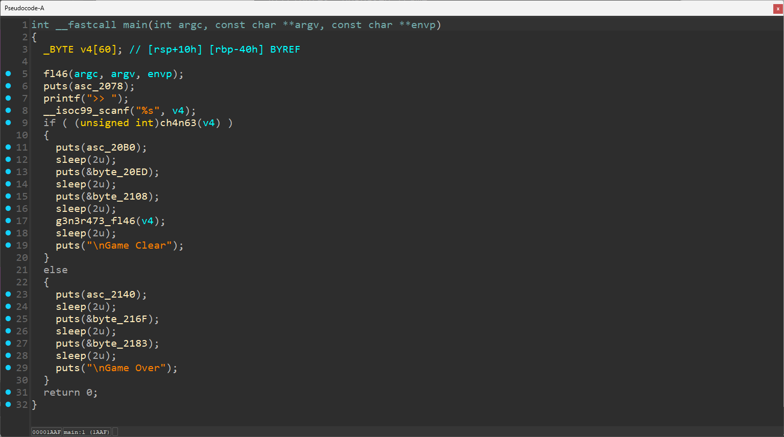

입력을 받고 `ch4n63` 함수의 반환값이 `ture`면 플래그가 출력된다.

<br>
<br>

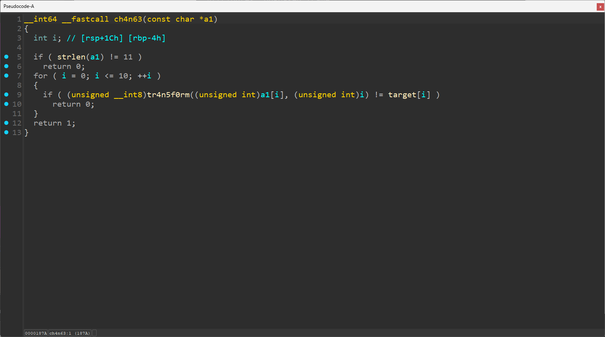

`ch4n63` 함수 보니까 `tr4n5f0rm` 함수의 반환값이 `target`이랑 같아야 한다.

<br>
<br>

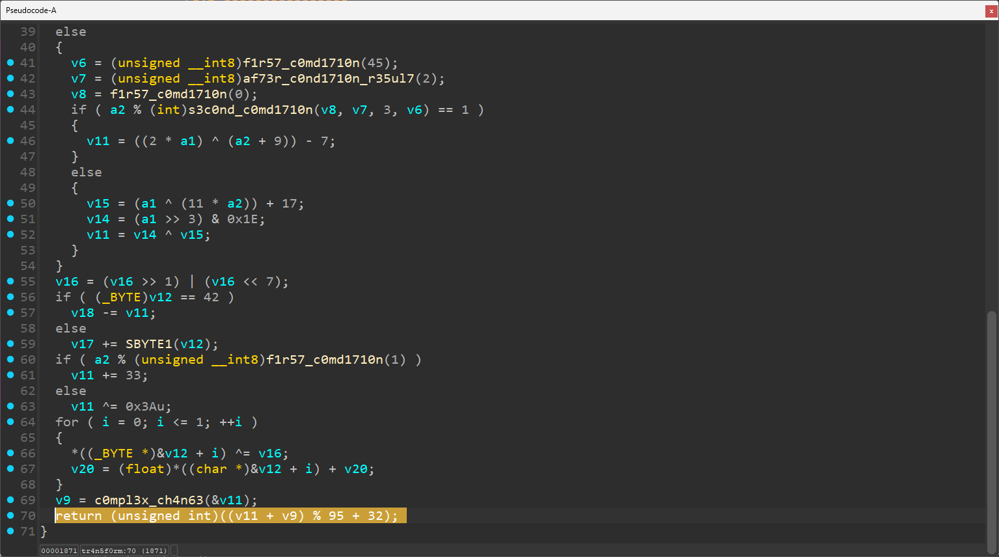

`tr4n5f0rm` 함수를 보면 반환값이 `(v11 + v9) % 95 + 32`이기 때문에 `v11`과 `v9`만 잘 추적해서 역으로 연산하면 될 것 같다.

<br>

`f1r57_c0md1710n` 함수는 그대로 구현해서 반환값을 구할 수 있고 `c0mpl3x_ch4n63` 함수는 실질적으로 연산되는 것이 없다.

<br>
<br>

```py
pikalang = "7V`vEQ8P?U0"
for i, ch in enumerate(pikalang):
   for c in range(32, 127):
       tmp = c
       if i % 3 == 0:
           tmp = ((tmp >> 1) + 3) ^ (i * 5)
       elif i % 3 == 1:
           tmp = ((tmp << 1) ^ (i + 9)) - 7
       else:
           t1 = ((tmp ^ (i * 11)) + 17)
           t2 = ((tmp & 0xF0) >> 3)
           tmp = t1 ^ t2
       if i % 2 == 0:
           tmp ^= 0x3A
       else:
           tmp += 0x21
       tmp = (tmp % 95) + 32
       if tmp == ord(ch):
           print(chr(c), end='')
           break
```

<br>
<br>

```
❯ ./pikachu
 　 　Ａ__Ａ
　　 (o・ω・)
/ヽヘし 　 !
＼/ヽｕ─ｕ'

피카츄를 위해 명령을 내려주세요!
>> Thund2rbDlt

피카츄의 공격은 지우에게 효과과 굉장했다!
지우가 쓰러졌다.
지우의 전리품인 Flag를 얻었다!
Flag: Layer7{ffffffff00001941FFFFE6BE}

Game Clear
```