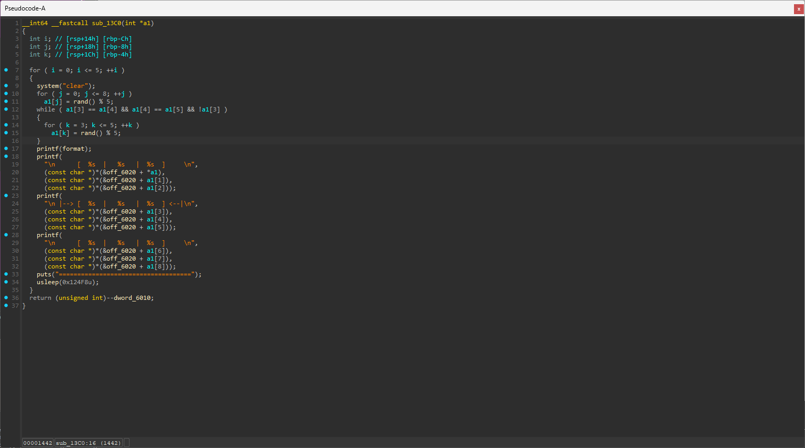
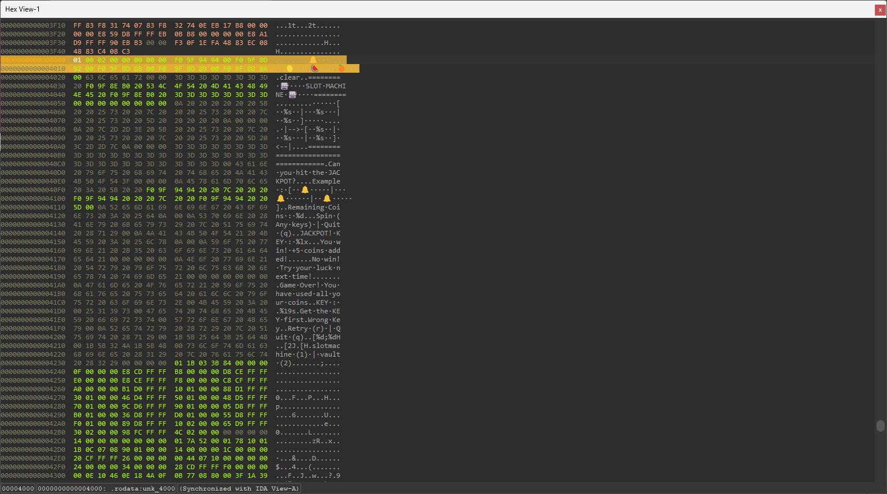
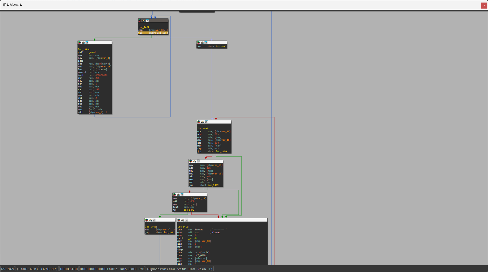
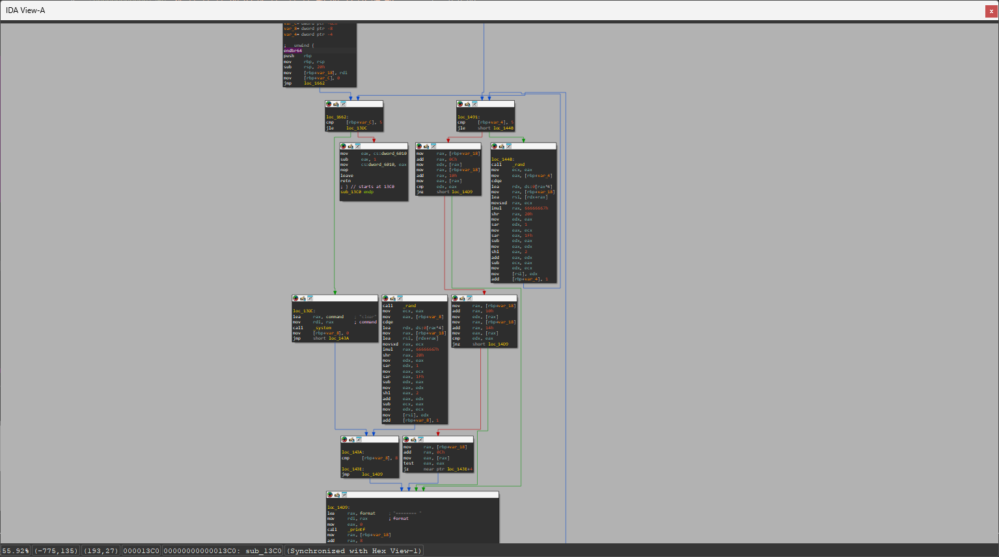
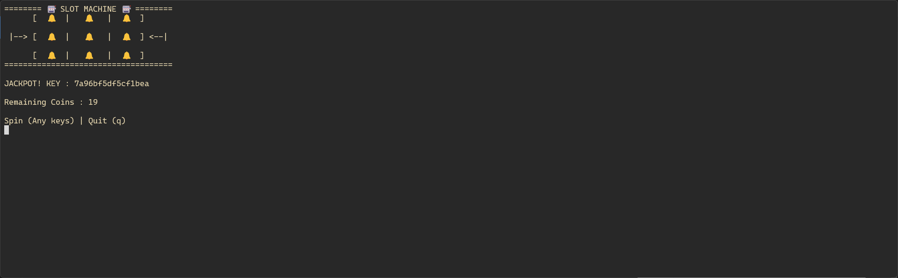

## 풀이

잭팟을 터뜨리려면 🔔 심볼이 3개 떠야한다.

   

심볼은 위 사진처럼 `rand()` 함수에 의해 결정이 되고, 만약 🔔 심볼이 3개가 뜬다면 `while` 문을 통해 다시 슬롯을 돌리기 때문에 일반적인 방법으로는 잭팟을 띄울 수 없다.

 

심볼이 선언된 배열을 보면 🔔 심볼이 0번 인덱스에 위치한 것을 알 수 있다.

 

따라서 `rand()` 함수를 거치지 않고 바로 결과를 출력하도록 분기문을 패치하면 `a1`에 아무 값도 들어가지 않았기 때문에 `0`이 되어 🔔 심볼이 고정적으로 나오게 된다.

 

잭팟에서 나온 키를 Vault에 입력하면 플래그가 출력되게 된다.